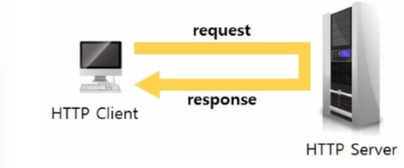

## WebSocket
- 기존의 단방향 HTTP 프로토콜과 호환되어 양방향 통신을 제공하기 위해 개발된 프로토콜.
- 일반 Socket 통신과 달리 HTTP 80 Port를 사용하므로 방화벽에 제약이 없으며 통상 `WebSocket` 으로 불린다.
- 접속까지는 HTTP 프로토콜을 이용하고, 그 이후 통신은 자체적인 `WebSocket`프로토콜을 통신하게 된다.

- 웹 소켓은 HTTP(Hyper Text Transfer Protocol)를 사용하는 네트워크 데이터 통신의 단점을 보완하는데 그 목적이 있다.  
HTTP를 다뤄본 적이 있다면, HTTP는 HTML 이라는 문서를 운반하기 위한 프로토콜로 다음과 같이 동작한다.
  
  
- 모든 HTTP를 사용하는 통신은 클라이언트가 먼저 요청을 보내고,  
그 요청에 따라 웹 서버가 응답하는 형태이며 웹 서버는 응답을 보낸 후 웹 브라우저와의 연결을 끊는다.
  - 양쪽이 동시에 보내는 것이 아니기 때문에 이러한 통신 방식을 반이중 통신(Half Duplex)라고 한다.
    
- 사실 HTTP만으로도 원하는 정보를 송수신할 수 있었지만, 인간의 욕심은 끝이 없기에 인터넷이 발전함에 따라 원하는 것이 다양해진다.
    - 클라이언트가 먼저 요청하지 않아도 서버가 먼저 데이터를 보내거나, 표준 TCP/IP 통신을 사용해 특정 서버와 통신을 하는 등 원하는 것이 늘어간다.
    - WebSocket이 존재하기 전에는 Polling 이나 Long Polling, Streaming 등의 방식으로 해결 했었다.
    
### Polling

- 클라이언트가 평범함 HTTP Request를 서버로 계속해 요청해 이벤트 내용을 전달받는 방식.
- 가장 쉬운 방식이지만 클라이언트가 지속적으로 Requst를 요청하기에 클라이언트 수가 많아지면 서버의 부담이 급증한다.  
- HTTP Request Connection을 맺고 끊는 것 자체가 부담이 많은 방식이고, 클라이언트에서 실시간 정도의 빠른 응답을 기대하기 어렵다.

### Long Polling

- 클라이언트에서 서버로 일단 HTTP Request를 요청한다.  
이 상태로 계속 기다리다가 서버에서 해당 클라이언트로 전달할 이벤트가 있다면 그 순간 Response 메시지를 전달하며 연결이 종료된다.
  - 곧 이어 클라이언트가 다시 HTTP Request를 요청해 서버의 다음 이벤트를 기다리는 방식.
- polling 보다 서버의 부담이 줄겠으나, 클라이언트로 보내는 이벤트들의 시간간격이 좁다면 polling과 별 차이 없게 되며, 다수의 클라이언트들에게 동시에 이벤트가 발생될 경우 서버의 부담이 급증한다.

### Streaming

- Long Polling과 마찬가지로  
  클라이언트 -> 서버로 HTTP Request를 요청한다.  
  서버 -> 클라이언트로 이벤트를 전달할 때 해당 요청을 해제하지 않고 필요한 메시지만 보내기 (Flush)를 반복하는 방식.  
  - Long Polling 과 비교하여 서버에 메시지를 보내지 않고도 다시 HTTP Request 연결을 하지 않아도 되어 부담이 경감된다고 한다.
    
### Web Socket

- 이처럼 HTTP 통신의 특징인 (연결-> 연결 해제 ) 때문에 효율이 많이 떨어지게 되고,  
웹 브라우저 말고 외부 플러그인이 항상 필요하게 되었다. 그래서 이런 상황을 극복하고자 2014년 HTML5에 웹 소켓을 포함하게 되었다.
  - 웹소켓은 클라이언트가 접속 요청을하고 웹 서버가 응답한 후 연결을 끊는 것이 아닌 Connection을 그대로 유지하고 클라이언트의 요청 없이도 데이터를 전송할 수 있는 프로토콜이다.
    - 프로토콜의 요청은 [ws://~]로 시작한다.
  
- 웹소켓은 HTTP 환경에서 전이중 통신 (Full Duplex, 2-way communication)을 지원하기 위한 프로토콜이며 RFC6455에 정의되어 있다.
- HTTP 프로토콜에서 HandShaking을 완료 한 후, HTTP로 작동하지만, HTTP와는 다른 방식으로 통신을 한다.

- WebSocket이 기존의 TCP Socket과 다른 점은 최초 접속이 일반 HTTP Request를 통해 HandShaking 과정을 통해 이뤄진다는 점이다.
- HTTP Request를 그대로 사용하기 때문에 기존의 80, 443포트로 접속을 하므로 추가 방화벽을 열지 않고도 양방향 통신이 가능하고, HTTP 규격인 CORS 적용이나 인증 등 과정을 기존과 동일하게 가져갈 수 있는 것이 장점이다.

- 웹소켓은 서비스를 동적으로 만들어 주지만,  
Ajax, Streaming, Long Polling 기술이 더 효과적일 경우도 있다.
  - 예로 변경 사항의 빈도가 자주 일어나지 않고, 데이터의 크기가 작은 경우 Ajax,Streaming, Long polling 기술이 더 효과적일 수 있다.
  즉 실시간성을 보장해야 하고, 변경 사항의 빈도가 잦다면, 또는 짧은 대기 시간, 고주파수 , 대용량의 조합인 경우 WebSocket이 좋은 해결책이 될 수 있다.
    
- 뉴스나 메일, SNS 피드는 동적으로 업데이틑 하는 것은 맞지만 몇 분 마다 업데이트 하는 것이 좋다.
  - 반면 협업, 게임, 금융 앱은 훨씬 더 실시간에 근접해야 한다.
  
#### Browser 별 지원 현황
|Browser|WebSocket|Streaming|Polling|
|------|----------|---------|-------|
|IE6,7 |no        |no       |jsonp-polling|
|IE8,9(cookies=no) |no        |xdr-streaming +| xdr-polling +|
|IE 8,9(cookies=yes)|no     | iframe-htmlfile|iframe-xhr-polling|
|IE10  | rfc6455|  xhr-streaming|xhr-polling|
|Chrome 6-13| hixie-76|xhr-streaming|xhr-polling|
|Chrome 14+ | hybi-10/ rfc6455|xhr-streaming|xhr-polling|
|Firefox <10| no | xhr-streaming|xhr-polling|
|Firefox 10+| hybi-10/rfc6455|xhr-streaming|xhr-polling|
|Safari5.x|hixie-76|xhr-streaming|xhr-polling|
|Safari6+|rfc6455|xhr-streaming|xhr-polling|
|Opera 10.70+|no |iframe-eventsource|iframe-xhr-polling|
|Opera 12.10+|rfc6455|xhr-streaming|xhr-polling|
|Konqueror|no|no|jsonp-polling|

### 웹소켓 접속 과정

- 접속 과정
  1. TCP/IP 접속 요청
  2. TCP/IP 접속 수락
  3. 웹 소켓 열기 핸드쉐이크 요청
  4. 웹소켓 열기 핸드쉐이크 수락
  5. 웹소켓 데이터 송/수신
- 웹 소켓을 이용하여 서버와 클라이언트가 통신을 하려면 먼저 웹소켓 접속 과정을 거쳐아 한다.
- 웹 소켓 접속 과정은 TCP/IP 접속 그리고 웹소켓 열기 HandShake 과정으로 나눌 수 있다.
- 웹 소켓도 TCP/IP 위에서 동작하므로, 서버와 클라이언트는 웹소켓을 사용하기 전에 서로 TCP/IP 접속이 되어 있어야 한다.
- TCP/IP 접속이 완료된 후 서버와 클라이언트는 웹소켓 열기 HandShake 과정을 시직한다.

#### 웹소켓 열기 HandShake
- 웹소켓 열기 핸드쉐이크는 클라이언트가 먼저 핸드셰이크 요청을 보내고 이에 대한 응답을 서버가 클라이어튼로 보내는 구조이다.
- 서버와 클라이언트는 HTTP 1.1 프로토콜을 사용하여 요청과 응답을 보낸다.
  - Request와 Response의 예시이다.
  
### HandShake Request
```http request
GET /chat HTTP/1.1
Host : server.gorany.org
Upgrade: websocket
Connection: : Upgrade
Sec-WebSocket-Key: dGhIlHNhbXBsZSBub25jZQ==
Origin: http://localhost:8080
Sec-WebSocket-Protocol: v10.stomp, v11stomp, my-team-custom 
Sec-WebSocket-Version: 13
```
|Header Name|div|Description|
|----------|----|-----------|
|GET | Require|요청 명령어는 GET을 사용해야 하며, HTTP버젼은 1.1이상이어야 한다|
|Host |Require|웹소켓 서버의 주소|
|Upgrade|Require|WebSocket 이라는 단어를 사용해야 한다. 대소문자는 구분 X|
|Connection | Require| Upgrade라는 단어를 사용해야 한다. 대소문자는 구분 X|
|Sec-WebSocket-Key|Require| 길이가 16Byte인 임의의 선택된 숫자를 base64 인코딩한 값이다.
|Origin| Require|클라이언트로 웹 브라우저를 사용하는 경우 필수 항목으로, 클라이언트의 주소|
|Sec-WebSocket-Version| Require|13을 사용한다.
|Sec-WebSocket-Protocol|Option| 클라이언트가 사용하고 싶은 하위 프로토콜 이름을 명시한다.|
|Sec-WebSocket-Extension|Option|클라이언트가 사용하고 싶은 추가 옵션을 기술한다.|

### HandShake Response

```http request
HTTP/1.1 101 Switching Protocol
Upgrade: websocket
Connection: Upgrade
Sec-WebSocket-Accept: s3pPLMBiTxaQ9kYGzzhZRbK+xOo=
```

|Header Name|div|Description|
|-----------|---|-----------|
|HTTP|require|HTTP 버젼은 1.1이며, 클라이언트로부터 요청이 이상이 없는 경우 101을 상태코드로 사용한다.|
|Upgrade|Require|WebSocket이라는 단어를 사용해야 한다. 대소문자는 구분 X|
|Connection|Require|Upgrade라는 단어를 사용해야 한다. 대소문자는 구분 X|
|Sec-WebSocket-Accept|Require|클라이언트로부터 받은 Sec-WebSocket-Key를 사용하여 게산된 값이다.|
|Sec-WebSocket-Protocol|Option| 서버에서 서비스 하는 하위 프로토콜을 명시한다. 클라이언트가 요청하지 않는 하위 프로토콜을 명시하면 HandShake는 실패한다. |
|Sec-WebSocket-Extension|Option|서버가 사용하는 추가 옵션을 기술한다. 클라이언트가 요청하지 않는 추가 옵션을 명시하면 HandShake는 실패한다.|

- 위 테이블에 명시된 헤더 중 필수는 반드시 사용해야 하며, 특정한 값이 명시된 헤더는 그 값만을 사용해야 한다.
------------

