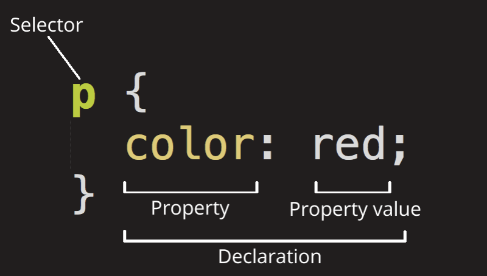

# CSS

CSS : Cascading Style Sheets는 HTML이나 XML(XML의 방언인 SVG,XHTML 포함)로 작성된 문서의 표시 방법을 기술하기 위한 스타일 시트 언어이다.

- CSS는 오픈웹의 핵심 언어중 하나이다.
- [W3C 명세](https://www.w3.org/Style/CSS/#specs) 가 다양한 브라우저의 표준으로 작동한다.
- 이전에는 CSS1, CSS2, CSS3 처럼 버젼을 붙였지만, CSS4로 올라가지는 않는다.
- W3C에서 CSS명세 버젼을 올리지 않고 주기적으로 [CSS 명세 안정판](https://www.w3.org/TR/css/) 의 스냅샷을 생성하기로 했다.
- CSS는 프로그래밍 언어나 마크업(markup)언어도 아닌 Style Sheet 언어라고 정의된다.

1. 외부 CSS 파일 참조

```html

<link href="styles/style.css" rel="stylesheet" type="text/css">
```

위의 참조 링크 태그를 `<head>`,`</head>` 태그 사이에 입력한다.

2. CSS rule set 전체 구조를 rule set이라 부른다.

아래 CSS 코드를 보면

```css
P {
    color: red;
}
```  



JS에서 처럼 선택자(`selector`)와 선언(`color :red`),속성(`color`), 속성 값(`RED`)으로 이루어진 것을 확인할 수 있다.

- 각 rule set(셀렉터로 구분)은 반드시 ({})로 감싸주어야 한다.
- 각각의 선언 안에, 각 속성을 해당 값과 구분하기 위해 콜론(:)을 사용해야 한다.
- 각각의 rule set 안에 각 선언을 그 다음 선언으로부터 구분하기 위해 세미콜론(;)을 사용해야만 한다.

```css
P {
    color: red;
    width: 500px;
    border: 1px solid black;
}
```

- 여러 요소 선택하기

```css
p, li, h1 {
    color: red;
}
```

## 선택자의 여러 종류

|선택자이름|선택하는것|예시|
|-------|------|-----|
|요소선택자(때에 따라 태그 또는 타입 선택자라 불림)|특정 타입의 모든 HTML요소|p `<p>`를 선택|
|아이디 선택자|특정 아이디를 가진 페이지의 요소(주언지 HTML 페이지에서 ,아이디당 딱 하나의 요소만 허용.)|#my-id   `<p id="my-id">` 또는 `<a id="my-id">`를 선택|
|클래스 선택자|특정 클래스를 가진 페이지의 요소( 한 페이지에 클래스가 여러번 나타날 수 있다.) |.my-class      `<p class=my-class">`를 선택|
|속성 선택자|특정 속성을 갖는 페이지의 요소.|img[src]     ``를 선택하지만 ``는 선택 안함|
|수도(Pseudo)클래스 선택자|특정 요소이지만 특정 상태에 있을때, 예를 들면, hover over상태일 때. | a:hover `<a>`를 선택하지만, 마우스 포인터가 링크 위에 있을 때만 선택함.|

- 선택자 목록

```css
h1 {
    color: blue;
}

.special {
    color: blue;
}
```

위와 같이 항목이 두개 이상인 경우 규칙이 모든 갭려 선택자에 적용되도록 개별 선택자를 결합하는 것을 ___선택자 목록___ 이라고 한다.  
`<h1>`에 대해 동일한 CSS와 `special` `class`를 결합하여 개별 선택자를 만든다면 아래와 같다.

```css
h1, .special {
    color: blue;
}
```

혹은 라인을 좀 더 명시적이게 변경하여 표기해준다면

```css
h1,
.special {
    color: blue;
}
```

- 선택자를 그룹화할때, 선택자가 유요하지 않은 경우에는 전체 규칙이 무시된다.  
  아래서 코드로 확인해보면 잘못된 `class` 선택자 규칙이 무시되고 `<h1>`은 여전히 스타일이 지정된다.

```css
h1 {
    color: blue;
}

..special {
    color: blue;
}
```

그러나 결합시 전체 규칙이 유요하지 않은 것으로 간주되어 `<h1>` 또는 `class`가 스타일 지정되지 않는다.

```css
h1, ..special {
    color: blue;
}
```

- 선택자의 유형
    - Type, class 및 ID 선택자
      ```css
      h1{   }
      ```  
      또한 `class`를 대상으로 하는 선택자가 포함된다.
      ```css
      .box {  }
      ```  
      또는 ID:
      ```css
      #unique{   }
      ```
    - Type, class 및 ID 선택자 이 선택자 그룹은 요소에 특정 속성이 있는지에 따라 요소를 선택하는 다른 방법을 제공합니다.
      ```css
      a[title] { }
      ```
      또는 특정 값을 가진 속성의 있는지에 따라 요소를 선택하는 다른 방법 제공.
      ```css
      a[href="https://example.com"]{  }
      ```
    - Pseudo-classes 및 psedo-elements  
      이 선택자 그룹에는 요소의 특정 상태를 스타일링하는 pseudo-classes가 포함된다.  
      예를 들어 `:hover` pseudo-class는 마우스 포인터에 의해 요소를 가리킬 때만 요소를 선택한다.
      ```css
      a:hover { }
      ```
    - 또한 요소 자체가 아닌 요소의 특정 부분을 선택하는 pseudo-elements도 포함된다.  
      예를 들어 `::first-line`은 항상 `<span>`이 첫 번째 형식의 라인을 감싸는 것처럼 작동하여, 요소 내부의 첫 번째 텍스트 라인(아래의 경우 `<p>`)을 선택한다.
      ```css
      p::first-line { }
      ```
    - 결합자 (Combinators)  
      최종 선택자 그룹은 문서 내의 요소를 대상으로 하기 위해 다른 선택자를 결합합니다.  
      예를 들어 다음은 자식 결합자 (`>`)를 사용하여 `<article>`요소의 자식인 단락을 선택한다.
       ```css
      article > p {   }
      ```

## CSS 구성블록

- 계단식 및 상속, 사용 가능한 모든 선택자 유형, 단위 크기 조정, 배경 및 테두리 스타일 지정, 디버깅 등을 확인.
- 텍스트 스타일 및 CSS 레이아웃 같은 보다 구체적인 분야로 이동하기 전에 유능한 CSS를 작성하기 위한 도구를 제공.
- 계단식 및 상속 CSS가 hTMl 적용되는 방법과 충돌을 해결하는 방법을 제어하는 기본적인 개념.  
  ( ___계단식, 우선 순위 및 상속___ )

### 규칙충돌

CSS: Cascading Style Sheets 중에서 __Cascading__ 이 매우 중요하다.

어느 시점에서 요소에 적용이 되어야할 CSS가 작동하지 않는다면,  
일반적인 문제로는 동일한 요소에 적용할 수 있는 두 가지 규칙을 작성 했다는 것이다.  
***계단식(Cascade)*** 과 밀접하게 관련된 ***우선순위(Specificity)*** 개념은 그러한 충돌이 있을 때 적용되는 규칙을 제어하는 메커니즘이다.  
어떤 규칙에 따라 요소를 원하는 스타일로 만들지 못할수도 있으므로 이러한 메커니즘의 작동 방식을 이해해야 한다.

***상속(inheritance)*** 개념도 중요하다.  
기본적으로 일부 CSS 속성은 현재 요소의 부모 요소에 설정된 값을 상속하지만, 일부는 그렇지 않다.  
혹은 예상하지 못한 일부 동작이 발생할 수도 있다.

### 계단식 (Cascade)

스타일 시트 ___cascade___ 매우 간단한 수준에서는 CSS 규칙의 순서가 중요하다는 것을 의미한다.  
동일한 우선 순위를 갖는 두 규칙이 적용될 때, 후순에 나오는 규칙이 적용된다.

아래 코드에서 `<h1>`에 적용될 수 있는 두 가지 규칙이 있다.  
`<h1>`은 파란색으로 표시된다.  
이러한 규칙에는 동일한 선택자가 있고 동일한 고유성을 가지므로, 소스 순서의 후순위 규칙이 우선 적용된다.

```html
<h1>This is my heading.</h1>
```

```css
h1 {
    color: red;
}

h1 {
    color: blue;
}
```

### 우선순위 (Specificity)

우선 순위는 여러 규칙에 다른 선택자가 있지만, 여전히 동일한 요소에 적용될 수 있는 경우, 브라우저가 어떤 규칙을 적용할 지 결정하는 방법이다.  
기본적으로 선택자의 선택이 얼마나 구체적인지 측정한다.

- 요소 선택자(태그)는 덜 구체적이다. 페이지에 나타나는 해당 유형의 모든 요소를 선택하므로 점수가 낮다.
- class 선택자는 보다 구체적이다. 특정 `class` 속성 값이 있는 페이지의 요소만 선택하므로 점수가 높다.

시간 예제!  
아래에는 `<h1>`에 적용할 수 있는 두 가지 규칙이 있을때,  
`<h1>`은 빨간색으로 표시될 것이다.  `class`선택자는 규칙에 더 높은 우선 순위를 부여하기에 요소 선택자가 있는 규칙은 소스 순서에서 더 아래에 표시되더라도 적용된다.

```html
<h1 class="main-heading">This is my heading</h1>
```

```css
.main-heading {
    color: red;
}

h1 {
    color: blue;
}
```

### 상속 (Inheritance)

부모 요소에서 설정된 일부 CSS 속성 값은 자식 요소에 의해 상속되지만, 일부는 그렇지 않다.

예를 들어, 요소에 `color` 및 `font-family`를 설정하면,  
다른 색상 및 글꼴 값을 직접 적용하지 않는 한, 해당 요소 내부의 모든 요소에도 해당 색상 및 글꼴로 스타일이 지정된다.

```html
<p>As the body has been set to have a color of blue this is ingerited through the descendants.</p>
<p>We can change the color by targetting the element with a selector with a selector, such as this
    <span>span</span></p>
```

```css
body {
    color: blue;
}

span {
    color: yellow;
}
```

결과를 보자면 `<span>`에 따로 색상을 주지 않는다면 `<body>`의 자식요소들에도 모두 파란색글씨가 적용된다.  
하지만 그 밑에 있을지라도 `<span>`에 Yellow 색상을 주었기 때문에 `<span>` 요소에는 노란색 글씨가 적용된다.

***하지만 늘 상속이 되는 것은 아니다.***  
예를 들어 요소에 `width`를 50%로 설정하면, 모든 하위 항목의 너비가 부모 너비의 50%가 되지는 않는다.

### 작동 방식 이해하기

계단식 (Cacading), 우선순위 (Spcecitify), 상속 (Inheritance) 이 세가지 개념은 CSS가 어떤 요소에 적용되던지 간에 함께 제어한다.

#### 상속 이해하기

아래 코드 `<ul>`이 있으며, 그 안에 순서가 없는 두 가지 수준의 목록이 있다.  
외부 `<ul>`에 테두리, 패딩, 및 글꼴 색상을 지정했다.

색상은 직접 자식 항목 뿐만 아니라 간접 자식 항목(직접 자식`<li>`)및 첫번째 중첩 목록에 있는 자식 항목에도 적용된다.  
그런 다음 두 번째 중첩 목록에 `special` class를 추가하고 다른 색상을 적용했다, 그런 다음 자식을 통해 상속된다.

```html
<ul class="main">
    <li>Item One</li>
    <li>item Two
        <ul>
            <li>2.1</li>
            <li>2.2</li>
        </ul>
    </li>
    <li>Item Three
        <ul class="special">
            <li>3.1
                <ul>
                    <li>3.1.1</li>
                    <li>3.1.2</li>
                </ul>
            </li>
            <li>3.2</li>
        </ul>
    </li>
</ul>
```
```css
.main{
    color :rebeccapurple;
    border: 2px solid #ccc;
    padding: 1em;
}
.special {
    color: black;
    font-weight: bold;
}
```
결과를 확인해본다면  
너비 (위에서 언급한 것처럼), 마진, 패딩 및 테두리와 같은 것은 상속되지 않는다.  
만약 우리 목록의 자식들이 테두리를 물려받았다면, 모든 단일 목록과 목록 항목은 테두리를 얻어야한다.  
기본적으로 상속되는 속성과 그렇지 않은 속성은 대체로 상식선에서 생각해볼 수 있다.  

### 상속 제어하기
CSS는 상속을 제어하기 위한 4 가지 특수 범용 속성 값을 제공한다.  
모든 CSS 속성은 이러한 값을 허용한다.  
  
#### inherit
- 선택한 요소에 적용된 속성 값을 부모 요소의 속성 값과 동일하게 설정한다.  
사실상 이것이 ***상속에 영향을 미친다.***  
#### intial  
- 선택한 요소에 적용된 속성 값을 브라우저의 기본 스타일 시트에서 해당 요소의 해당 속성에 설정된 값과 동일하게 설정한다.  
브라우저의 기본 스타일 시트에서 값을 설정하지 않고 속성이 자연스럽게 상속되면 속성 값이 대신 `inherit` 되도록 설정된다.
#### unset  
- 속성을 natural 값으로 재설정한다.  
즉 속성이 자연적으로 상속되면 `inherit` 된 것처럼 작동하고 그렇지않으면 `initial`처럼 작동한다.  
상속값 (inherit) 존재 O 경우, 상속값 (inherit) 적용.  
상속값 (inherit) 존재 X 경우, 초기값 (initial) 적용.
- all 단축속성에 포함한 모든 속성에 사용 가능. 
- 버젼 : CSS3 ( IE제외한 주요 최신 브라우저 모두 지원)


#### 상속 예제
```html
<head>
    <style>
        body {
            color: green;
        }
        .my-class-1 a{
            color: inherit;
        }
        .my-class-2 a{
            color: initial;
        }
        .my-class-3 a{
            color: unset;
        }
    </style>
</head>

<ul>
    <li>Default <a href="#">link</a> color</li>
    <li class="my-class-1">Inherit the <a href="#">link</a>color</li>
    <li class="my-class-2">Reset the <a href="#">link</a>color</li>
    <li class="my-class-1">Unset the <a href="#">link</a>color</li>
    
</ul>
```  
  
#### 모든 속성 값 재설정

CSS 속기 속성을 `all`로 사용하면 이러한 상속 값 중 하나를 (거의) 모든 속성에 한 번에 적용할 수 있습니다.  
이 값은 상속 값 (`inherit`,`initial`,`unset` 또는 `revert`) 중 하나일 수 있습니다. 스타일에 대한 변경 사항을 취소하여 새로운 변경을 시작하기 전에 알려진 시작 지점으로 돌아갈 수 있는 편리한 방법이다.
```html
<head>
    <style>
        blockquote {
            background-color: red;
            border: 2px solid green;
        }
        .fix-this{
            all:unset;
        }
    </style>
</head>
<blockquote>
    <p>This blockquote is styled</p>
</blockquote>

<blockquote class="fix-this">
    <p>this blockquoute is not styled</p>
</blockquote>
```
  
  
### 계단식 이해하기 (Cascade)
요소에 CSS할당하거나 class를 만들지 여부, 이제 여러 요소를 스타일링 할 수 있는 경우,  
CSS에서 적용할 CSS 규칙을 어떻게 정의하는지 계단식(cascade)에 대한 설명

1. Importance
2. 우선 순위
3. 소스 순서

브라우저가 CSS를 정확히 적용하는 방법을 어떻게 파악하는지 아래부터 위로 살펴보자.

#### 소스 순서

정학히 동일한 가중치를 갖는 규칙이 두 개 이상인 경우, CSS 에서 마지막에 오는 규칙이 우선이다.  
요소 들중에서 마지막 요소가 우선이고 요소를 스타일링 할 때까지 초기 요소를 덮어 쓰는 규칙에 가깝다.

#### 우선 순위  
소스 순서가 중요하다는 사실을 이해하면, 어느 시점에서 규칙이 스타일 시트에서 나중에 나오지만 이전의 충돌하는 규칙이 적용되는 상황이 발생한다. 이는 ___이전 규칙이 더 높은 우선 순위___ 를 갖기 때문이다. 보다 구체적이기 때문에, 브라우저에서 요소를 스타일해야 하는 규칙으로 선택하고 있다.  
  
`class` 선택자는 요소 선택자보다 가중치가 높기 때문에,  `class`에 정의된 속성이 요소에 직접 적용된 속성보다 우선시 된다.

주목할 점은 ___"선택자 및 선택한 항목에 적용되는 규칙에 대해 생각하고 있지만, 덮어 쓰는 전체 규칙이 아니라 동일한 속성일 뿐이다."___ 라는것이다.  
  
아래 사항은 CSS에서 반복을 피하는 데 도움이 된다고 권장되는 사항들이다.  
1. 일반적인 방법은 기본 요소의 일반 스타일을 정의한다.
2. 다른 요소에 대한 `class`를 작성하는 것이다.  
   (예로 아래 스타일 시트에서 h2 제목에 대한 일반 스타일을 정의한 다음, 일부 속성과 값만 변경하는 `class`를 만들었다.) 처음에 정의된 값은 모든 표제에 적응 되면, 모든 구체적인 값은 class가 있는 표제에 적용된다.
```html
<head>
    <style>
        h2 {
            font-size: 2em;
            color: #000;
            font-family: Georgia,'Times New Roman',Times,Serif;
        }
        .small{
            font-size :1em;
        }
        .bright{
            color:rebeccapurple;
        }
    </style>
</head>

<h2>Heading woth no class</h2>
<h2 class="small">Heading with class of small</h2>
<h2 class="bright">Heading with class of bright</h2>
```  

  
  
#### 브라우저가 우선 순위(specificity)를 계산하는 방법
- `class` 선택자에 비해서 요소 선택자가 우선 순위가 낮아서 `class`가 덮어 쓸 수 있다.
- 기본적으로 포인트 단위 가치가 다른 유형의 선택자에 부여되며 이를 합산하면 특정 선택자의 가중치가 부여되고, 다른 잠재적 일치 항목에 대해 평가 할 수 있다.
- 선택자의 우선 순위는 4개의 다른 값 (또는 구성요소)을 사용하여 측정되며, 이는 4개의 열에서 Thousands,Hundreds,Tens 및 Ones 개의 단일 자릿수로 간주 될 수 있다.  
  1. Thousands : 선언이 인라인 스타일인 `style` 속성 안에 있으면, 열에서 1점을 얻는다. 이러한 선언에는 선택자가 없으므로 그 우선 순위는 항상 1000이다.
  2. Hundreds : 전체 선택자에 포함된 각 ID 선택자에 대해 이 열에서 1점을 얻는다.
  3. Tens : 이 선택란에서 전체 선택자 내에 포함된 각 class 선택자, 속성 선택자 또는 `pseudo-class`에 대해 이 열에서 1점을 얻는다.
  4. Ones : 이 항목에서 각 요소 선택자 또는 전체 선택자 내에 포함된 pseudo-element 에 대해 1점을 얻는다.

>참고 : 범용 선택자 (*), 결합자(+,>,~,''') 및 부정 pseudo-class(:not)는 우선 순위에 영향을 미치지 않는다.  
  
|선택자|Thousands|Hundreds|Tens|Ones|Total specificity|
|------|---------|---------|---------|-------|----------|
|h1|0|0|0|1|0001|
|h1 + p ::first-letter|0|0|0|3|0003|
|li > a[href*="en-US] > .inline-warning|0|0|2|2|0022|
|#identifier|0|1|0|0|0100|
|요소의 style 속성 안에 규칙이 있는 선택자가 없다.|1|0|0|0|1000|

```html
<head>
    <style>
        /* specificity : 0101 */
        #outer a {
            background-color: red;
        }
        /* specificity : 0201 */
        #outer #inner a {
            background-color: blue;
        }
        /* specificity : 0104 */
        #outer div ul li a{
            color: yellow;
        }
        /* specificity : 0113 */
        #outer div ul .nav a{
            color:white;
        }
        
        /* specificity : 0024 */
        div div li:nth-child(2) a:hover{
            borer : 10px solid black;
        }
        
        /* specificity : 0023 */
        div li:nth-child(2) a:hover{
            border: 10px dashed black;
        }
        
        /* specificity : 0033 */
        div div .nav:nth-child(2) a:hover{
            border : 10px double black;
        }
        
        a {
            display: inline-block;
            line-height : 40px;
            font-size : 20px;
            text-decoration: none;
            text-align: center;
            width: 200px;
            margin-bottom: 10px;
        }
        ul {
            padding: 0;
        }
        li {
            list-style-type: none;
        }
    </style>
</head>

<div id="outer" class="container">
    <div id="inner" class="container">
        <ul>
            <li class="nav"><a href="#">One</a></li>
            <li class="nav"><a href="#">Two</a></li>
        </ul>
    </div>
</div>
```

위의 코드 처음 7개 규칙만 관심이 있기에 각 규칙 앞에 주석에 우선순위 값을 포함시켰다.
- 처음 두 선택자는 링크의 배경색 스타일링을 놓고 경쟁한다.  두 번째 선택자는 추가 ID 선택자가 있기 때문에 이기고 배경색을 파란색으로 만든다. 우선 순위는 201vs  101이다.
- 세번 째와 네번째 선택자는 링크의 텍스트 생상 스타일링을 놓고 경쟁하고있다.  
두번째 선택자는 이기고 텍스트를 흰색으로 만든다.  
이유는 한 개의 요소 선택자가 더 적지만, 누락된 선택자는 10배의 가치가 있는 class 선택자로 교체되기 때문이다.  
그래서 승자의 우선 순위는 113 vs 104이다.
- 선택자 5-7은 마우스를 가져 가면 링크의 테두리 스타일을 놓고 경쟁한다.  
선택자 6은 23 vs 24의 우선 순위로 5점이 확실히 차이가 나고, 요소 선택자가 하나 더 적다.  
선택자 7은 5와 6을 모두 능가한다.  
5와 동일한 수의 자식 선택자가 있지만, 한 요소는 class 선택자로 교체된다. 따라서 우선 순위는 33 vs 23 및 24이다.

 #### !important
위의 모든 계산을 무효화는 데에 사용할 수 있는 특별한 CSS가 있지만 신중하게 사용해야한다.
바로 `!important` 인데 이것은 특정 속성과 가치를 가장 구체적으로 만들어 계단식(cacade)의 일반적인 규칙을 무시하는데 사용된다.

```html
<head>
    <style>
        #winning {
            background-color: red;
            border: 1px solid black;
        }
        .better{
            background-color: gray;
            border: none !important;
        }
        p {
            background-color: blue;
            color: white;
            padding: 5px;
        }
    </style>
</head>

<p class="better">This is a paragraph.</p>
<p class="better" id="winning">One selector to rule them all!</p>
```
1. `<p>`에 적용되어 있는
```css
background-color: blue;
color: white;
padding: 5px;
```
속성들이 `.better`class에 의해 순위가 밀려 표현되지 않고, `#winning`보다 class가 순위가 밀려 두번째 단락에서 밀렸지만 `!important`가 표기된 `border`속성에 관련해서는 순위가 또 후순위가 되면서 `border`에 관해서는 `.better`속성을 따르게 된다.  
  
`!important` 가 존재한다는 것을 아는 것이 도움이 되고 다른 개발자의 코드에서 발견했을 때 의미를 이해할 수 있다.  
하지만 반드시 필요한 경우가 아니면 사용을 권장하지 않고 있다.  
  
이유는 `!important` 계단식이 정상적으로 작동하는 방식을 변경시키기 때문이고, 그로 인해 문제가 생겼을때 문제해결을 하기가 어려워질 수 있기 때문이다.  
핵심 CSS module을 편집할 수 없는 CMS에서 작업할 때, 다른 방법으로는 재정의 할 수 없는 스타일을 재정의 하려는 경우에 사용할 수도 있다.  
그러나 ___사용을 피할 수 있으면 피해야 한다.___ 라고 권장된다.  
  
### 요약

---
충돌 선언은 다음 순서로 적용되며, 이후 선언은 이전 선언보다 우선시 한다.  
1. 사용자 에이전트 스타일 시트의 선언 (예. 다른 스타일이 설정되지 않은 경우 사용되는 브라우저의 기본 스타일).
2. 사용자 스타일 시트의 일반 선언 (사용자가 설정한 사용자 정의 스타일).
3. 작성자 스타일 시트의 일반적인 선언 (웹 개발자가 설정한 스타일).
4. 작성자 스타일 목록에서 중요한 선언.
5. 사용자 스타일 시트의 중요한 선언.  

웹 개발자의 스타일 시트는 사용자 스타일 시트를 재정의 하는것이 합리적이므로 디자인을 의도한대로 유지할 수 있지만, 사용자는 위에서 언급한 것처럼 웹 개발자 스타일을 재정의 해야 할 충분한 이유가 있다.