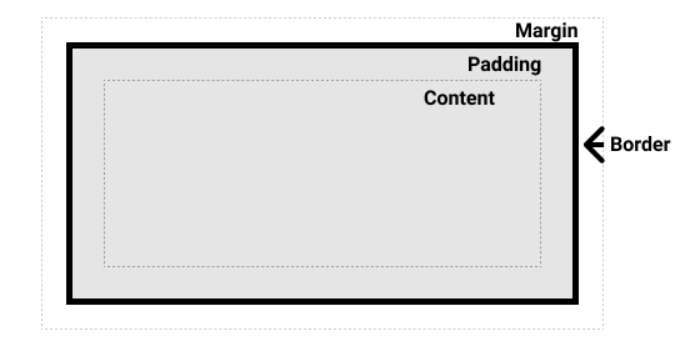
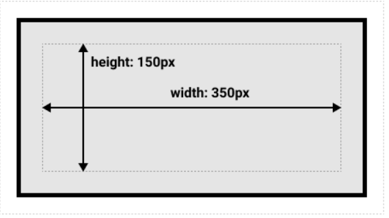
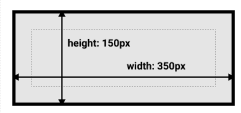
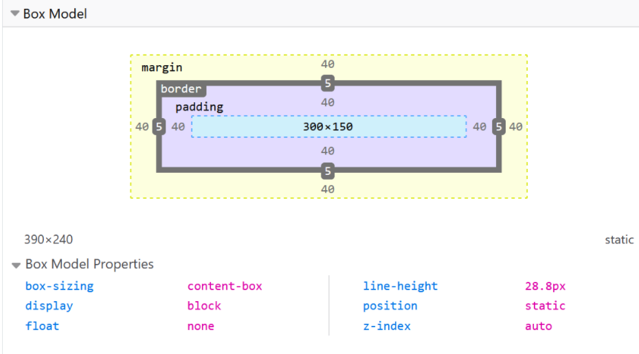
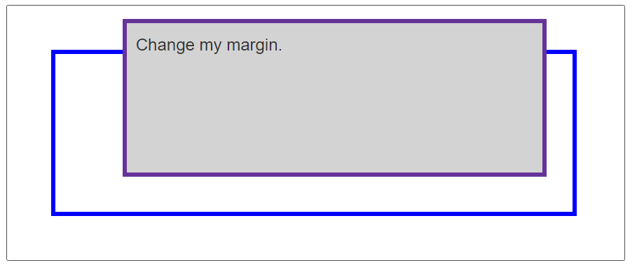

# CSS BoxModel

- CSS에 포함되는 모든 요소의 외장은 박스이다.

## 블록 및 인라인 박스

---
CSS의 두 가지 박스 유형

1. 블록박스
2. 인라인박스

각 특성은 박스가 페이지 대열 측면 및 페이지의 다른 박스와 관련하여 박스의 작동 방식을 나타낸다.

### 블록박스 특징

---

- 박스는 인라인(가로) 방향으로 연장되어 상위 콘테이너에서 사용 가능한 공간을 채운다.  
  (대부분의 경우 이것은 박스가 사용 가능한 공간을 100%로 채우면서 상위 콘테이너 너비만큼 된다는 의미.)
- 박스는 새 줄로 행갈이를 한다.
- width 와 height 속성은 존중된다.
- 패딩과 여백, 테두리로 인해 다른 요소들이 박스로부터 밀려난다.

디스플레이 유형을 인라인으로 변경하지 않는 한 머리글(`<h1>`,`<p>`)과 같은 요소는 모두 기본값으로 외부 디스플레이 유형을 `block`으로 사용한다.

### 인라인 특징

---

- 박스는 새 줄로 행갈이를 하지 않는다.
- width와 height 속성이 적용되지 않는다.
- 패딩과 여백, 테두리는 다른 인라인 박스들이 해당 박스로부터 멀어지게 하지 않는다.

링크용 `<a>`요소와 `<span>`, `<em>` 및 `<strong>`요소 모두 기본적으로 인라인으로 표시된다.

요소에 적용되는 박스 유형은 `block` 및 `inline`과 같은 `display` 속성 값으로 정의되며,  
아울러 그것은 `display`의 ___outer___ 값과 관련이 있다.

## 내부 및 외부 디스플레이 유형

---
CSS의 박스는 ___외부___ 디스플레이 유형을 가지며, 이는 박스가 블록인지 인라인인지를 자세히 설명한다.

그러나 박스에는 ___내부___ 디스플레이 유형도 있으며 해당 박스 내부의 요소가 배치되는 방법을 나타낸다.  
기본적으로 박스 내부의 요소는 ___일반 대열___ 로 배치되며, 이는 여타 블록 및 인라인 요소와 동일하게 동작한다.

그러나 `flex` 같은 `display`값을 사용해서 내부 디스플레이 유형을 변경할 수 있다.  
어떤 요소에 `display:flex;`를 설정하면  
외부 디스플레이 유형은 블록이지만,  
내부 디스플레이 유형은 `flex`(가변)으로 변경된다.  
이 박스의 직계 자식은 가변 항목이 되고, 가변박스 규격에 명시된 규칙에 따라 배치된다.
> [블록과 인라인 요소의 동작방식](https://developer.mozilla.org/ko/docs/Web/CSS/CSS_Flow_Layout/Block_and_Inline_Layout_in_Normal_Flow)

그러나 블록 및 인라인 레이아웃이 웹에서의 기본 동작 값이다.  
이것들을 일컬어서 ___normal flow___ (일반대열)이라고 한다.  
그렇게 부르는 까닭은 다른 지시 사항이 없으면 박스는 블록 또는 인라인 박스로 배치 된다.

## 서로 다른 디스플레이의 유형

```html

<head>
    <style>
        p,
        ul {
            border: 2px solid rebeccapurple;
            padding: .5em;
        }

        .block,
        li {
            border: 2px solid blue;
        }

        ul {
            display: flex;
            list-style: none;
        }

        .block {
            display: block;
        }
    </style>
</head>
<p>I am a paragraph, A short one.</p>
<ul>
    <li>Item One</li>
    <li>Item Two</li>
    <li>Item Three</li>
</ul>
<p>I am another paragraph. Some of the <span class="block">words</span> have been wrapped in a
    <span>span element</span></span></p>
```

위 코드에서 세 개의 서로 다른 HTML요소가 있으며, 모두 외부 디스플레이 유형이 `block`이다.  
첫번째 단락은 CSS에 테두리가 추가된 단락이다. 브라우저는 이걸 블록 박스로 렌더링 하므로 단락은 새 줄에서 시작하며 확보된 너비 전체까지 확장한다.

두번째는 `display:flex` 를 사용해 배치된 목록이다 .  
이 예제는 컨테이너 내부의 항목에 대해 가변 레이아웃을 수립하지만,  
목록 자체는 블록 박스이며 단락과 같이 전체 컨테이너 너비로 확장되어서 새 줄로 행갈이를 한다.

세번째는 블록 수준 단락을 하나 갖고 있으며 그 안에 두 개의 `<span>` 요소가 있다.  
이들 요소는 보통 `inline`이겠지만, 그 중 하나에 블록 클래스가 있다.  
그걸 미리 `display : block;`으로 설정되어 있다.

```html
<head>
    <style>
        p,
        ul {
            border: 2px solid rebeccapurple;
        }
        span,
        li {
          border : 2px solid blue;
        }
      ul {
        display : inline-flex;
        list-style: none;
        padding: 0;
      }
      .inline {
        display: inline;
      }
    </style>
</head>
<p>
    I am a paragraph. Some of the
    <span>words</span> have been wrapped in a
    <span>span element</span>
</p>
<ul>
    <li>Item One</li>
    <li>Item Two</li>
    <li>Item Three</li>
</ul>
<p class="inline">I am a paragraph. A short one.</p>
<p class="inline">I am a another paragraph. Also a short one.</p>
```
위 코드에서의  
첫 번째 단락에서 `<span>`은 기본값으로 인라인이므로 새 줄 행갈이를 강제하지 않습니다.  

`display:inline-flex`로 설정된 `<ul>`요소도 갖고 있지만, 이는 몇 가지 가변 항목 주변에 인랑니 박스를 생성한다.  

마지막으로 `display: inline`으로 설정된 두 단락이 있다.  
인라인 가변 컨테이너와 단락은 모두 하나의 라인에서 하나로 진행하고, 블록 수준 요소처럼 표시하기 위해 새 줄로 행갈이를 하지 않는다.

___`diplay: inline`부분을 `display:block` 으로, 또는 `display : inline-flex`를 `display: flex`로 디스플레이 모드 사이를 전환할 수 있습니다.___  

## CSS Box Model이란 무엇인가?

---
전체 CSS box Model은 블록 박스에 적용되며, 인라인 박스는 박스 모델에 정의된 일부 동작만 사용한다.  
CSS box Model은 페이지에서 볼 수 있는 박스를 생성하기 위해 박스의 서로 다른 부분인 여백, 테두리, 패딩 및 콘텐츠 등이 어떻게 함께 작동할 것인가를 정의한다.  
몇 가지 복잡성을 추가하기 위해 표준 및 대체 박스 모델이 있다.  
  
Box 의 구성
CSS 블록 박스 구성하기 위해 준비 사항 : 
- 콘텐츠 박스 : 콘텐츠가 표시되는 영역으로 그 크기는 `width` 와 `height` 같은 속성을 사용해서 정할 수 있다. 
- 패딩   박스 : 패딩은 콘텐츠 주변을 마치 공백처럼 자리 잡는다. 패딩의 크기는 `padding`과 관련 속성을 사용해 제어할 수 있다.
- 테두리 박스 : 테두리 박스는 콘첸츠와 패딩까지 둘러싼다. 테두리의 크기오 ㅏ스타일은 `border`와 관련되어 속성을 사용하여 제어할 수 있다.  
- 여백 박스 : 여백은 갖아 바깥 쪽 레이어로 콘첸츠와 패딩, 테두리를 둘러싸면서 해당 박스와 다른 요소 사이 공백 역할을 한다. 여백 박스의 크기는 `magin`과 관련된 속성을 사용하여 제어될 수 있다.


## 표준 CSS Box Model

---
표준 box model 에서 box에서 `width`, `height`를 부여하면 content box의 너비와 높이가 정의된다.    
그런 다음 패딩과 테두리는 박스의 너비와 높이에 추가되어 박스가 점유하는 전체 크기가 정해진다.  
  
박스의 `width` 와 `height`,`margin`과 `border`및 `padding` CSS 값이 다음과 같이 지정되어 있다고 간주한다.
```css
.box{
  width : 350px;
  height: 150px;
  margin: 25px;
  padding:25px;
  border:5px solid black;
}
```
표준 박스 모델을 사용하여 박스가 차지하는 공간은 실제로 너비 410px(35+25+25+5+5),높이210px (150+25+25+5+5)가 될것인데, 양쪽 패딩과 테두리는 콘텐츠 박스에 사용되는 너비에 더해진다.  
  
  

> 참고 : 여백은 박스의 실제 크기에 포함되지 않는다, 물론 여백은 박스가 페이지에서 차지하는 총 공간에 영향을 미치지만, 박스의 오뷔 공간에만 영향을 미친다. 박스의 영역은 테두리에서 멈추게 된다. 여백으로 확장되지 않는다.  
  
### 대체 CSS box Model
박스의 실제 크기를 얻기 위해 테두리와 패딩을 추가하는 것이 다소 불편하다고 생각할 수 있다.  
이러한 이유로 CSS 표준 박스 모델 이후 머지않아 대체 박스 모델이 도입된다.  
이 모델을 사용한다면 너비는 페이지에서 표시되는 박스 너비이므로 콘텐츠 영역 너비는 너비에서 패딩 및 테두리 너비를 뺀 너비 이다.  
CSS에 입력한 값 그대로 출력.  
  
기본 값으로 브라우저는 기본 박스모델을 사용한다. 요소에 대체 모델을 활성화 하려면 거기에 `box-sizing: border-box`를 설정하여 그렇게 할 수 있다.  
이렇게 하면 당신이 설정한 크기에 따라 정의된 영역만큼 테두리 박스가 점유하도록 브라우저에 전달할 수 있다.
```css
.box{
  box-sizing: border-box;
}
```  
모든 요소가 대체 박스 모델을 사용하길 원한다면, `<html>`요소에 `box-sizing`속성을 설정한 다음 아래의 소예제 볼 수 있듯이 다른 모든 요소가 해당 값을 상속하도록 설정한다.  
```css
  html {
  box-sizing: border-box;
}
*, *::before, *::after {
  box-sizing: inherit;
}
```
>참고 : 인터넷 익스플로러 IE는 기본적으로 대체 박스 모델로 사용되었으며 전환할 수 있는 메커니즘이 없다.

## 박스 모델 부리기 

---
```html
<head>
  <style>
    .box{
      border: 5px solid rebeccapurple;
      background-color: lightgray;
      padding: 40px;
      margin: 40px;
      width: 300px;
      height: 150px;
    }
    .alternate{
      box-sizing: border-box;
    }
  </style>
</head>
<div class="box"> I use the standard box model.</div>
<div class="box alternate">I use the alternate box model.</div>
```  
### 브라우저 개발자 도구를 사용해 박스 모델 보기
  
  
## 여백과 패딩과 테두리
약칭으로 한꺼번에 박스와 사방면을 설정할 수 있다.  
해당 약칭은 또한 도명의 정식 명칭 속성도 있어서 박스의 사방면을 개별적으로 제어할 수 있도록 해준다.  

### 여백
- 여백은 박스 주변에 보이지 않는 공간이다.  
- 여백은 박스로부터 다른 요소를 밀어낸다.  
- 여백은 양수값 또는 음수값을 가질 수 있다.  
- 박스 한쪽 측면에 음수값 여백을 설정하면 페이지의 다른 부분과 공백이 겹칠 수 있다.
- 표준 /대체 박스 모델 상관없이 박스의 크기를 계산한 후 항상 여백이 추가된다.

`margin` 속성을 사용하여 요소의 사방 여백을 한번에 제어할 수 있으며, 마찬가지로 동명의 정식 명칭 속성을 사용하여 각변의 여백을 제어할 수 있다.
- magin-top
- margin-right
- margin-bottom
- margin-left

아래 예제에서 여백 값을 변경하여 당 요소와 상위 컨테이너 요소 사이의 애벽 생성 또는 공간 제거 (음의 여백인 경우)로 ㅇ니해 박스가 어떻게 밀려나는가?



```html
<head>
  <style>
    .box{
      margin-top: -40px;
      margin-right: 30px;
      margin-bottom: 40px;
      margin-left: 4em;
    }
  </style>
</head>
<div class="container">
  <div class="box">Change my margin.</div>
</div>
```

### 여백축소
- 여백 이해의 핵심은 여백 축소에 대한 개념이다.  
- 여백이 서로 맞닿은 두 개의 요소가 있으면 해당 여백은 합쳐져 하나의 여백이 되고 그중 가장 큰 여백의 크기가 된다.
```html
<head>
  <style>
    .one{
      margin-bottom :50px;
    }
    .two {
      margin-top: 30px;
    }
  </style>
</head>

<div class="container">
  <p class="one">I am paragraph one.</p>
  <p class="two">I am paragraph two.</p>
</div>
```
위 소스에는 단락 두개가 있다, 상위 단락은 `margin-bottom`값이 50픽셀이 주어졌다.  
두번째 단락은 `margin-top`값이 30픽셀이 주어진다. 전체 여백은 합쳐져 축소되면서 실제 박스 사이 여백은 50픽셀이며,  
두 가지 여백의 합계가 되지 않는다.  
  
__2번째의 단락의 `margin-top` 값을 0으로 설정해 이를 시험해 볼 수 있다.  
두 단락 사이 표시되는 여백은 변경되지 않을 것이고, 첫 번째 단락의 `bottom-margin`에 설정된 50픽셀은 유지된다.


>[여백이 축소될 때와 축소 되지 않을 때를 말해주는 여러가 규칙이 있다.](https://developer.mozilla.org/en-US/docs/Web/CSS/CSS_Box_Model/Mastering_margin_collapsing)

### 테두리
테두리는 박스의 여백과 패딩 사이에 그려진다.  표준 박스 모델을 사용하는 경우 테두리의 크기가 박스의 `width`, `height`ㅇ에 추가 된다.  
대체 박스 모델을 사용하고 있는 경우, 테두리의 크기는 사용 가능한 `width`, `height`의 일부를 점유함으로 콘텐츠 박스가 더 작아지게 된다.  

테두리 스타일링에는 많은 속성들이 있다. 4개의 테두리, 각 테두리에는 스타일, 너비, 및 색상 등 다양하다.  

#### 테두리 사방면의 너비와 색상, 스타일등을 설정. 
- border-top
- border-right
- border-bottom
- border-left
#### 테두리 사방면에 색상, 스타일, 너비를 설정.
- border-width
- border-style
- border-color
#### 테두리 일방 면만 색상과 스타일, 너비를 설정하려면 세분화된 정식명칭 속성 중의 하나를 사용할 수 있다.  
- border-top-width
- border-top-style
- border-top-color
- border-right-width
- border-right-style
- border-right-color
- border-bottom-width
- border-bottom-style
- border-bottom-color
- border-left-width
- border-left-style
- border-left-color

```html
<head>
  <style>
    .container {
      border-top : 5px dotted green;;
      border-right: 1px solid black;
      border-bottom: 20px double rgb(23,45,145);
    }
    .box{
      border: 1px solid #333333;
      border-top-style: dotted;
      border-right-width: 20px;
      border-bottom-color: hotpink;
    }
  </style>
</head>
<div class="container">
  <div class="box">Change my borders.</div>
</div>
```

### 패딩 
패딩은 테두리와 콘텐츠 영역 사이에 위치합니다. 여백과는 다르게 패딩은 음수의 크기를 가질 수 없어, 그 값은 0 또는 양수 값이어야한다.  요소에 적용된 배경은 뒤에 표시된다. 패디으이 전형적인 용도는 테두리에서 콘텐츠르 밀어낸다.

`padding`속성을 이용해서 사방면 패딩을 개별적/ 일괄적으로 제어할 수 있다.  
마찬가지로 정식 명칭 속성을 사용하여 각 변의 패딩을 제어할 수 있다.
- padding-top
- padding-right
- padding-bottom
- padding-left

아래 예제에서 `.box`클래스에 대한 패딩 값을 변경하면 박스와 관계하여 텍스트가 시작되는 지점이 달라지는 볼 수 있다.
또한, `.container` 클래스에 대한 패딩을 변경하여 컨테이너와 박스 사이 공간을 만들 수 있다.

```html
<head>
  <style>
    .box {
      padding-top: 0;
      padding-right: 30px;
      padding-bottom: 40px;
      padding-left: 4em;
    }
    .container{
      padding: 20px;
    }
  </style>
</head>
<body>
<div class="container">
  <div class="box">Change my padding.</div>
</div>
</body>
```

## 박스 모델과 인라인 박스
```html
<head>
  <style>
    span {
      margin : 20px;
      padding: 20px;
      width : 80px;
      height: 50px;
      background-color: lightblue;
      border: 2px solid blue;
    }
  </style>
</head>
<p>
  I am a paragraph and this is a <span>span</span> inside that paragraph. 
  A span is an inline element and so does not respect width and height.
</p>
```
위 코드에는 한 단락 내부에 `<span>`태그가 있고 거기에 `width`, `height` 그리고 `margin`, `border`를 적용 했다.  
너비와 높이는 무신된다. 여백, 패딩 및 테두리는 존치되지만,다른 콘텐츠와 인라인 박스와의 관계를 변경하지 않으므로 패딩 및 테두리는 단락의 다른 단어와 겹친다.

## 인라인 블록 디스플레이 사용하기.
`inline`과 `block`사의 중립지대를 제공하는 `display`속성의 하나로 특별한 값이 있다.  
이 속성은 항목이 새 줄로 넘어가는 행갈이을 원하지 않지만, `width` `heigth`가 존중되고 앞서 보았듯이 겹침 현상을 피하길 원하는 경우게 유용하다.  

`display: inline-block` 속성이 딸린 요소는 블록 요소의 하위 집합이다.
- `width`와 `height` 속성을 명시적으로 추가하는 경우에만 해당 요소의 컨텐츠봐 (동 박스가)더 커질 뿐이다.
```html
<head>
  <style>
    span{
      margin : 20px;
      padding : 20px;
      width : 80px;
      hegiht : 50px;
      background-color: lightblue;
      border : 2px solid blue;
      display: inline-block;
    }
  </style>
</head>
<body>
<p> 
I am a paragraph and this is a <span>span</span> inside that paragraph. A span is an inline element and so does not respect width and height.</p>
</body>
```
위 코드에서는 `<span>`요소에 `display: inline-block`을 추가했다.  

`<a>`는 `<span>`처럼 인라인 요소 이다.
탐색 (메뉴)모음에서 꽤 자주 사용되는 것을 볼 수 있는데, 아래 탐색 모음은 가변 박스를 사용해 행으로 표시되었고,  
`<a>`를 마우스로 가리킬 때 `background-color`를 변경할 수 있도록 `<a>` 요소에 패딩을 추가되었다.  
패딩은 `<ul>`요소의 테두리와 겹치는 것처럼 보인다. 그렇게 된 까닭은 `<a>`가 인라인 요소 이기 때문이다.  
  
`.links-list a` 선택기에 포함된 규칙에 `display: inline-block`을 추가하면, 다른 요소에 의한 패딩이 살아있게됨으로 (겹치는 )문제가 해결 된다.
```html
<head>
  <style>
    .links-list a {
      background-color: rgb(179,57,81);
      color:#fff;
      text-decoration:none;
      padding : 1em 2em;
    }
    .links-list a:hover {
      background-color: rgb(66,28,40);
      color: #fff;
    }
  </style>
</head>
<nav>
  <ul class="links-list">
    <li><a href="">Link one</a></li>
    <li><a href="">Link two</a></li>
    <li><a href="">Link three</a></li>
  </ul>
</nav>
```


> https://developer.mozilla.org/ko/docs/Learn/CSS/Building_blocks/The_box_model