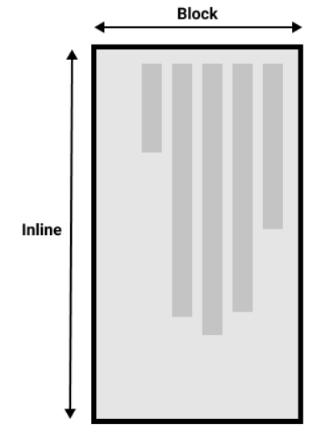

# CSS Text Head Control
테스트 표시 방향 제어 / 쓰기모드  

##쓰기모드 ?
- CSS 쓰기 모드는 텍스트가 가로 도는 세로로 표시되는 여부.
- `writing-mode(en-US)`속성을 사용하면 쓰기 모드에서 다른 쓰기 모드로 전환할 수 있다.
```html
<head>
  <style>
    h1 {
      writing-mode: vertical-rl;
    }
  </style>
</head>
```
`writing-mode: vertical-rl`을 사용하여 표시되는 제목에 대한 코드이다.   

`writing-mode`속성에 가능한 세 가지 값은 다음과 같다.
- `horizontal-tb` : 블록의 표시 방향은 위에서 아래 입니다. 문장은 가로로 표시.
- `vertical-rl` : 블록의 표시 방향은 오른쪽에서 왼쪽이다. 문장은 수직으로 표시.
- `vertical-lr` : 블록의 표시 방향은 왼족에서 오른쪽이다. 문장은 수직으료 표시.

따라서 `writing-mode` 속성은 실제로 페이지에서 블록 수준 요소가 표시되는 방향을 설정한다.  
위에서 아래로 오른쪽에서 왼쪽, 왼쪽에서 오른쪽 그러면 문장의 텍스트 방향이 지시된다.

## 쓰기 모드와 블록 및 인라인 레이아웃
블록과 인라인은 실제 화면이 아니라 문서의 쓰기 모드와 연결되어 있다.  
영어와 같이 텍스트를 가로로 표시하는 쓰기 모드를 사용하는 경우 블록은 페이지의 맨 위에서 아래로만 표시된다.  

예제를 보면 더 명확해진다. 이 다음 예제에서는 제목과 단락을 포함하는 두 개의 박스가 있다.  
첫번째 쓰기 모드는 페이지 상단에서 하단으로 수평으로 표시되는 `writing-mode: horizontal-tb`를 사용한다.  
두번째 쓰기 모드는 세로로 오른쪽에서 왼쪽으로 표시되는 `writing-mode:vertical-rl`을 사용한다.
```html
<head>
  <style>
    .horizontal {
      writing-mode: horizontal-tb;
    }
    .vertical {
      writing-mode: vertical-rl;
    }
  </style>
</head>
<body>
<div class="wrapper">
  <div class="box horizontal">
    <h2>Heading</h2>
    <p>A paragraph. Demostrating Writing modes in Css.</p>
  </div>
  <div class="box vertical">
    <h2>Heading</h2>
    <p> A paragraph. Demonstrating Writing Mdoes in Css</p>
  </div>
</div>
</body>
```

쓰기모드를 전환하면, 블록(block)방향과 인라인(inline) 방향을 변경한다.  
`horizontal-tb` 쓰기 모드에서 블록 방향은 위에서 아래로 진행됩니다.  
`vertical-rl`쓰기모드에서 블록뱡향은 오른쪽에서 왼쪽으로 수평으로 표시된다.  
따라서 ___블록 크기___ 는 항상 쓰기 모드에서 페이지에서 표시되는 방향 블록이다.  
___인라인 크기___ 는 항상 문장이 표시되는 방향이다.  

  
이 아래는 세로쓰기모드에서의 2차원 모양이다.  



## 논리적 속성 및 값
그러나 이 시점의 학습에서 쓰기 모드와 방향에 대해 이야기하는 이유는 이미 화면의 크기와 관련된 많은 속성을 보았고, 수평 쓰기 모드에 있을 때 가장 의미가 있기 때문이라고 한다.  
두 개의 박스를 다시 살펴보겠다.  
하나는 `horizontal-tb`쓰기 모드이고 하나는 `vertical-rl`이다.  
이 두 박스 모두 `width`를 제공한다.  
박스가 세로 쓰기 모드일 때 여전히 너비가 있으며, 이로 인해 텍스트가 overflow 되는 것을 알 수 있다.
```html
<head>
  <style>
    .box {
      width: 150px;
    }
    .horizontal {
      writing-mode : horizontal-tb;
    }
    .vertical{
      writing-mode: vertical-rl;
    }
  </style>
</head>
<body>
<div class="wrapper">
  <div class="box horizontal">
    <h2>Heading</h2>
    <p>A Paragraph. Demonsrating Writing modes In Css</p>
    <p> These Boxes have a width</p>
  </div>
  <div class="box vertical">
    <h2>Heading</h2>
    <p>A paragraph. Demonstraing Writing Modes in Css</p>
    <p>These boxes have a width.</p>
  </div>
</div>
</body>
```

쓰기 모드와 함께 높이와 너비를 본직적으로 변경 하는 것.
세로 쓰기 모드인 경우 박스를 가로 쓰기 모드에서와 같이 블록 크기로 확장하려고 한다.  

이를 쉽게 하기 위해서,CSS 는 최그엔 매핑된 속성 세트를 개발했는데, 이것들은 `width`와 `height`같은 물리적 속성을 논리적 또는 `flow relative`버전으로 대체한다.  

가로 쓰기 모드인 경우 `width`에 매핑된 속성을 `inline-size`라고 한다, 인라인의 크기를 나타낸다.  
`height`의 속성 이름은 `block-size`이며 블록의 크기이다.  `width`가 `inline-size`로 대체된 아래 예에서 이것이 어떻게 작동하는 볼 수 있다.

```html
<div class="wrapper">
  <div class="box horizontal">
    <h2>Heading</h2>
    <p>A paragraph. Demostrating Writing Modes in CSS.</p>
    <p>Theses boxes have inline-size.</p>
  </div>
  <div class="box vertical">
    <h2>Heading</h2>
    <p>A paragraph. Demonstrating Writing Modes In CSS.</p>
    <p>Theses boxes have inline-size</p>
  </div>
</div>
```

## 논리적 마진, 테두리 및 패딩 속성
마진, 테두리 및 패딩 속성에는 `margin-top`,`padding-left` 및 `border-bottom`과 같은 여러 물리적 속성 인스턴트가 있다.  
너비와 높이에 대한 매핑과 같은 방식으로 이러한 속성에 대한 매핑도 있다.

`margin-top` 속성은 `margin-block-start`에 매핑된다. 이것은 항상 블록 크기의 시작에서 마진을 나타낸다.  

`padding-left`속성은 인라인 방향의 시작부분에 적용되는 패딩 `padding-inline-start`에 매핑된다.  
이것은 쓰기 모드에서 문장이 시작되는 곳이다. `border-bottom`속성은 블록 크기의 끝의 경계인 `border-block-end`에 매핑된다.

아래에서 물리적 속성과 논리적 속성을 비교할 수 있다.

.box 의 쓰기 모드 속성을 `vertical-rl`로 전환하여 박스의 `writing-mode`를 변경하면 물리적 속성이 물리적 방향과 연결되어 있는 반면, 논리적 속성은 쓰기 모드로 전환된다.  

또한 `<h2>`에 검은색 `border-bottom`이 있음을 알 수 있다. 아래쪽 테두리가 항상 두 쓰기 모드에서 텍스트 아래로 이동하는 방법은?
```html
<head>
  <style>
    .box{
      inline-size : 200px;
      writing-mode: horizontal-tb;
    }
    .logical{
      margin-block-start: 20px;
      padding-inline-end: 2em;
      padding-block-start: 2px;
      border-block-start: 5px solid pink;
      border-inline-end: 10px dotted rebeccapurple;
      border-block-end: 1em double orange;
      border-inline-start: 1px solid black;
    }
    .physical{
      margin-top: 20px;
      padding-right: 2em;
      padding-top: 5px;
      border-top: 5px solid black;
    }
    h2{
      border-bottom: 5px solid black;
    }
  </style>
</head>
<body>

<div class="wrapper">
  <div class="box physical">
    <h2>Physical Properties</h2>
    <p>A paragraph. Demostrationg Logical Properties in CSS.</p>
  </div>
  <div class="box Logical">
    <h2>Logical Properties</h2>
    <p>A paragraph. Demonstrating Logical Properties In CSS</p>
  </div>
</div>
</body>
```

### 논리적 값
지금까지 논리적 속성 이름을 살펴보았다.  
`top`,`right`,`bottom` 및 `left`의 물리적 값을 취하는 속성도 있다.  
이러한 값에는 `block-start`,`inline-end`,`block-end` 및 `inline-start`와 같은 논리 값에대한 매핑도 있다.

예를 들어, 이미지를 왼족으로 띄워서 텍스트가 이미지를 감싸도록 할 수 있다.
`left`를 `inline-start`로 바꾸어서 가능하다.

### 물리적 또는 논리적 속성을 사용해야 하는가
논리적 속성과 값은 물리적 속성보다 최신이므로, 브라우저에서만 최근에 구형되었다.  
브라우저 지원이 얼마나 돌아가는지 보려면 MDN 의 속성 페이지를 확인 할 수 있다. 여러 쓰기 모드를 사용한지 않는 경우, 지금은 실제 버젼을 사용하는 것이 유리하지만, 궁극적으로 사람들은  `flexbox`및 grid 와 같은 레이아웃 방법을 다루기 시작하면 많은 의미가 있기 때문에 사람들이 대부분의 경우 논리적 버전으로 전환할 것으로 기대한다.  
