# 정보 보안 실사 관련 문서 체크 사항

## 1. 문서의 책임 주체 관련
 ### 1. 정보보호 조직 구성 및 보호 책임자
  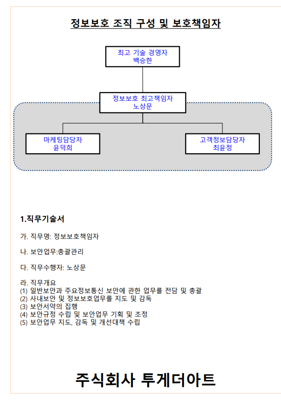  
### 2. 정보 보호 규정
  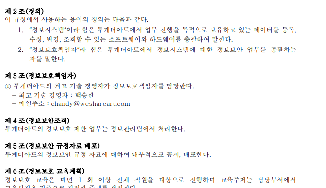  
### 3. 정보보호 침해사고 발생 시 대응처리체계
  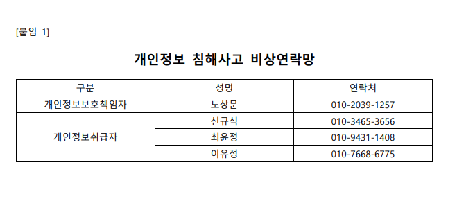  
### 4. 개인 정보 보호 교육 이수증
  - 최근 입사자 등의 경우 추가 여부 (하반기 교육 실시 필요 여부)  
### 5. 정보 보호 교육 계획
  - 최근 입사자 등의 경우 추가 여부 (하반기 교육 실시 필요 여부)  
### 6. 웹 취약점 점검 서비스 신청서
  - 5월 신청 및 결과 보고서 유효 기간 내인가?  
### 7. 개인정보 보호 자가 진단 결과
  - 모든 항목 100%로 확인  
### 8. 자가 진단 미흡 사항 조치 목록
  - 14세 미만 아동의 개인정보를 수집시, 법정대리인에게 동의를 받고 있는가?  
### 9. 개인 정보 처리 방침
  - 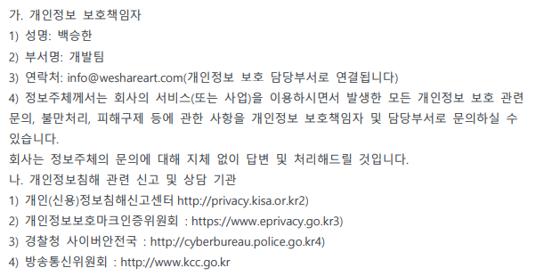  
### 10. 보안 서약서
  - 정보 보호 서약서 최근 입사자 서류 스캔본 포함 X  
  - 생년월일에 서명일자 기재한 직원이 있음.
  - 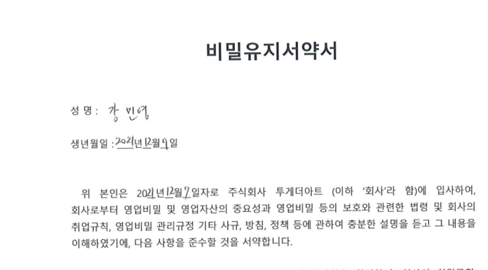
  -   
### 11. 나이스 아이디 본인 인증 신청서
   - 정비 이용 약관에 정보 보호 규정 등이 없음.  
### 12. P.1.1 P.1.2 P.1.3 IDC, UTM 청약서  
### 13. 정보 자산 목록
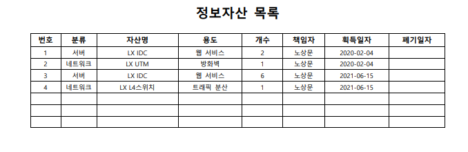  
     - 박진우 -> 노상문  
### 14. 정보 처리 시스템 관리자 현황
  - 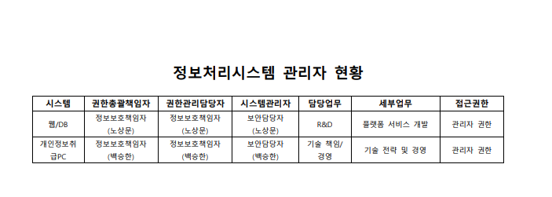  
### 15. 정보 시스템 접근 권한 관리 대장
  - 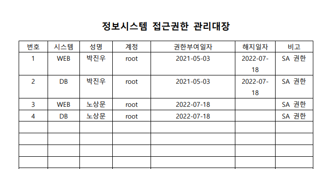
  - 후임자 추가 기재 및 전임자 권한 해지 기재.  
### 16. DB 관리 대장
   - 후임자 추가 기재 및 전임자 해지일자 기재  

### 17. 비밀번호 관리 규정
   - ver 1.0의 의미는? 
   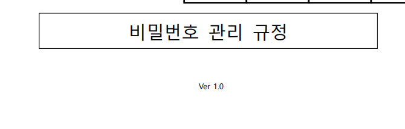  

### 18. 해당건 직책에 해당하는 인원이 되는지 여부   
   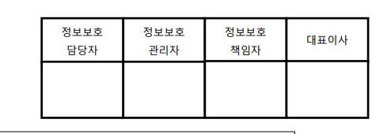  
       - NginX 서버에 정책 걸려있으나 DB 서버에 안걸려 있는 것으로 확인되어 정책 추가 예정.  
### 19. IDC. UTM 청약서
   - 관련 보안 정책 등에는 LX 정보 보호 규정 확인 안내.  
### 20. 백업 및 복구 지침서 
   - V1.0과 복구지침 두 개 필요 여부   
###  21. 키 관리 정책 및 관리대장
   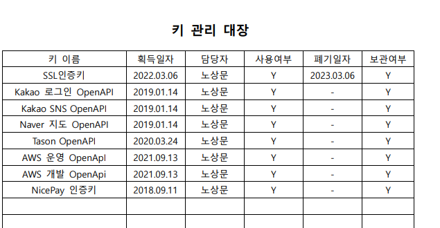

