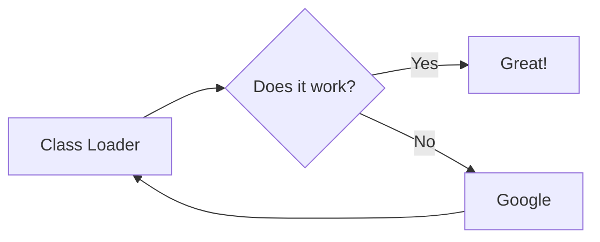
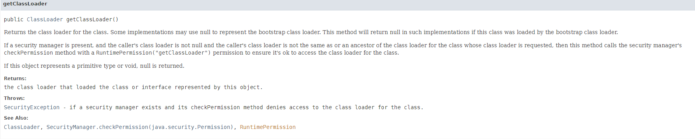

<style>
 strong { color : orange}
</style>

## 자바 클래스로더 알아보기

--------------------

### 클래스로더
- 자바 클래스들은 시작시 한번에 로드되지 않고, 애플리케이션에서 필요할 때 로드된다.
- 클래스 로더는 JRE의 일부로써 런타임에 클래스를 동적으로 JVM에 로드 하는 역할을 수행하는 모듈이다.
- 자바의 클래스들은 자바 프로세스가 새로 초기화되면 클래스로더가 차례차례 로딩되며 작동한다.
- ~~JVM에 로드 해주는 로더~~

----------------
### 부트스트랩 클래스로더 (Bootstrap classloader)
- JVM 시작 시 가장 최초로 실행되는 ***클래스로더*** 이다.
- 부트스트랩 클래스로더는 자바 클래스를 로드하는 것이 아닌,  
자바 클래스를 로드할 수 있는 자바 자체의 클래스 로더와 최소한의 자바 클래스( `java.lang.Object`, `Class`, `Classloader`) 만을 로드한다.

- JAVA8 기준으로 `${JAVA_HOME}/jre/lib`에 위치한 자바 런타임 코어 클래스를 로드한다.  
또한 부트스트랩 클래스 로더는 부모 클래스로더를 갖지 않기 때문에 원시 클래스로더 (Primordial classLoader)라고도 불린다.

- 특히 `rt.jar` 파일에는 `java.lang`, `java.util` 등의 필수 패키지들이 들어 있는 것을 확인할 수 있다.

### 확장 클래스로더 (Extension classLoader)
- 확장 클래스로더는 부트스트랩 클래스로더를 부모로 갖는 클래스로더로써, **확장 자바 클래스들을 로드**한다.  
`java.ext.dirs` 환경 변수에 설정된 디렉토리의 클래스 파일을 로드하고, 이 값이 설정되어 있지 않은 경우 `${JAVA_HOME}/jre/lib/ext`에 있는 클래스 파일을 로드한다.

###  애플리케이션 클래스로더 (Application classLoader)
- 자바 프로그램 실행 시 지정한 **Classpath**에 있는 클래스 파일 혹은 **Jar**에 속한 클래스들을 로드한다.

### 클래스를 로드한 클래스로더 확인해보기
- 우리가 사용하는클래스가 어떤 클래스로더에 의해 로드되었는지 확인 하는 방법
- 클래스 객체의 `getClassLoader` 메서드 ( [getClassLoader ](https://docs.oracle.com/javase/8/docs/api/java/lang/Class.html#getClassLoader--Class)  )
```java
package c;

class tmp {
    private static void printClassloaders(){
        System.out.println("Object's classloader : " + Object.class.getClassLoader());
        System.out.println("BinaryNode's classloader : " + BinaryNode.class.getClassLoader());
        System.out.println("ApplicationContext's classloader : " + ApplicationContext.class.getClassLoader());
    }
}
```
위 메서드 실행시 아래와 같은 결과를 얻을 수 있다.
```
Object's classloader : null
BinaryNode's classloader : sun.misc.Launcher$ExtClassLoader@33909752
ApplicationContext's classloader : sun.misc.Launcher$AppClassLoader@2a139a55 
```

|표시 문구| 해석                                                                                                                                                                                 |
|--------|------------------------------------------------------------------------------------------------------------------------------------------------------------------------------------|
|`Object`| `java.lang` 패키지에 속하는 클래스로써, 부트스트랩 클래스로더에 의해 로드될 것이다. 부트스트랩 클래스로더는 `null`로 표현된다.                                                                                                    |
|`BinaryNode`| `jdk.nashorn.internal.ir` 패키지에 속하는 클래스로써, JAVA8에서 제공하는 확장 기능인 `Nashorn`에 포함되어 있다.</br>이는 자바 코어 클래스는 아니지만 확장 기능에 해당하는 클래스로써 확장 클래스로더 (`sun.misc.Launcher.ExtClassLoader`)에 의해 로드된다. |
|`ApplicationContext`|`org.springframework.context.ApplicationContext` 패키지에 속하는 클래스로써, 위 프로그램 실행 시 Classpath에 넣어준 Spring Library Jar에 포함되어 있다.</br> 때문에 이는 애플리케이션 클래스로더 (`sun.misc.Launcher.AppClassLoader`)에 의해 로드 된다.|

### 클래스 로더가 지켜야할 세가지 원칙
#### Delegation Principle
- 위임 법칙(Delegation Principle)은 클래스 로딩이 필요한 경우 부모 클래스로더 방향으로 클래스 로딩을 위임하는 것이다.
- 새로운 클래스를 로드해야할 때, 다음과 같은 방식으로 클래스 로드를 수행한다.
  1. JVM의 Method Area에 클래스가 로드되어 있는지 확인한다. 만일 로드되어 있는 경우 해당 클래스를 사용한다.
  2. Method Area에 클래스가 로드되어 있지 않은 경우, 애플리케이션 클래스로더에 클래스 로드를 요청한다.
  3. 애플리케이션 클래스로더는 확장 클래스로더에 클래스 로더를 요청한다.
  4. 확장 클래스로더는 부트스트랩 클래스로더에 클래스 로드를 요청한다.
  5. 부트스트랩 클래스로더는 부트스트랩 Classpath(JDK/JRE/LIB)에 해당 클래스가 있는지 확인한다. 클래스가 존재하지 않는 경우 확장 클래스로더가 요청을 수행하도록 한다.
  6. 확장 클래스로더는 확장 ClassPath(JDK/JRE/LIB/EXT)에 해당 클래스가 있는지 확인한다. 클래스가 존재하지 않는 경우 애플리케이션 클래스로더가 요청을 수행하도록 한다.
  7. 어플리케이션 클래스로더는 어플리케이션 ClassPath에 해당 클래스가 있는지 확인한다. 클래스가 존재하지 않는 경우 `ClassNotFoundException`을 발생시킨다.

#### Visibility Principle
- 가시범위 원칙은 ***하위 클래스로더는 상위 클래스로더가 로드한 클래스를 볼 수 있지만, 반대로 상위 클래스로더는 하위 클래스로더가 로드한 클래스를 알 수 없다.*** 는 것이다.</br></br>
때문에 `java.lang.Object` 클래스 등 상위 클래스로더에서 로드한 클래스도 하위 클래스로더인 애플리케이션 클래스로더 등에서 사용할 수 있는 것이다.  
이러한 원칙이 없는 경우 클래스로더 간의 상/하위 개념이 사라지기 때문에 이 원칙은 반드시 지켜져야 한다.

#### Uniqueness Principle
- 유일성의 원칙은 ***하위 클래스로더가 상위 클래스로더에서 로드한 클래스를 다시 로드하지 않아야 한다***는 원칙이다.</br>
이 원칙이 지켜지지 않는다면 JVM에 동일한 클래스가 2개 이상 로드되는 상황이 발생할 수 있다.

### `loadClass`의 동작과 클래스 로더의 세가지 원칙
- 위 클래스로더의 원칙들은 `java.lang.ClassLoader`의 `loadClass`메서드에 포함되어 있다.
- 코드는 [OpenJDK ClassLoader](http://hg.openjdk.java.net/jdk8/jdk8/jdk/file/687fd7c7986d/src/share/classes/java/lang/ClassLoader.java#l401) 링크에 위치해 있다.

### 404 Line의 `getClassLoadingLock`메서드
- `loadClass`코드에서 첫 번째로 실행되는 메서드이다.
- 클래스로더 객체는 여러 스레드 간에 공유되고, `loadClass`의 경우 객체 내부 상태를 변경할 수 있는 구간 (Critical Section)이므로 `Lock`을 통해 보호 받아야 한다.
- 만일 이 구문이 존재하지 않는다면 여러 스레드가 동시에 클래스를 로드하여 내부 상태가 잘못되거나 Uniquness Principle을 위반하게 된다.

### 411 Line에서 부모 클래스로더의 `loadClass` 메서드 호출
- 현재 클래스로더에 클래스가 로드되어 있지 낳다면 부모 클래스로드에서 로드되어 있는지 확인한다.</br>
Visibility Principle을 통해 부모 클래스에 이미 로드된 클래스가 있다면 해당 클래스를 이용할 수 있고, 이미 부모 클래스로더에서 로드한 클래스를 로드하지 않기 때문에 Uniquness Principle을 지키는 과정이라 볼 수 있다.
- 부모 클래스에 클래스 로드 과정을 위임하기 때문에 `Delegation Principle`을 이행한다고 볼 수 있다.

### 413 Line `findBootstrapClassOrNull` 메서드 호출
- 부모 클래스로더가 설정되어 있지 않은 클래스는 부트스트랩 클래스로더로 볼 수 있다.  
따라서 `findBootstrapClassOrNull` 메서드를 통해 부트스트랩 과정에서 로드된 클래스를 로드한다  
`loadClass` 메서드는 자식-> 부모 클래스로더 방향으로 반복적으로 호출되기 때문에 `findBootstrapClassOrNull`은 최종적으로 호출되는 기저사례라 볼 수 있다. <br>
또한 부모 클래스에 클래스 로드 과정을 위임하기 때문에 Delegation Principle 을 이행한다고 볼 수 있다.

### 424 Line에서의 `findClass` 메서드호출
- 현재 클래스에도 로드되어 있지 않고 부모 클래스에서도 로드하지 않았다면 이 클래스로더에서 해당 클래스를 로드해야 한다.</br>
만일 이 클래스로더에서도 로드에 실패했다면 최종적으로 `ClasNotFoundException`이 발생하게 된다.


<details>
<summary>원문 블로그</summary>

[leeyh0216](https://leeyh0216.github.io/posts/java_class_loader/)

</details>

[JavaClassLoader로 가기](../JAVA/추상클래스/인터페이스.md)

