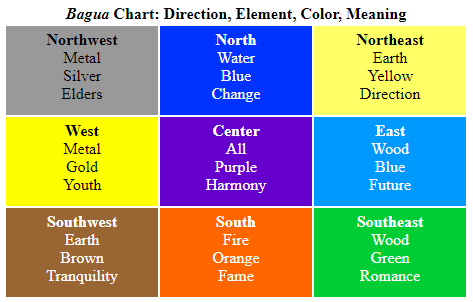
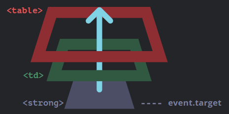

# [JavaScript]

## Delegation

### 이벤트 위임

- 캡처링과 버블링을 활용하면 강력한 이벤트 핸들링 패턴인 '이벤트위임' 을 구현할 수 있다.<br><br>
  이벤트 위임은 비슷한 방식으로 여러 요소를 다뤄야 할 때 사용된다.<br><br>
  이벤트 위임을 사용하면 요소마다 핸들러를 할당하지 않고, 요소의 공통 조상에 이벤트 핸들러를 단 하나만 할당해도 여러 요소를 한꺼번에 다룰 수 있다.<br><br>
  공통 조상에 할당한 핸들러에서 `event.target`을 이용하면 실제 어디서 이벤트가 발생했는지 알 수 있다. 이를 이용해 이벤트를 핸들링 한다.<bR><br>
  아래는 팔괘도 예제이이다.
  

```javascript
<table>
    <tr>
        <th colspan="3">
            <em>Bagua</em>
            Chart: Direction, Element, Color, Meaning
        </th>
    </tr>
    <tr>
        <td class="nw">
            <strong>Northwest</strong>
            <br>Metal
                <br>Silver
                    <br>Elders
        </td>
        <td class="n">...</td>
        <td class="ne">...</td>
    </tr>
    <tr>...2 more lines of this kind...</tr>
    <tr>...2 more lines of this kind...</tr>
</table>
```

지금 보이는 표에는 9개의 칸이 있다. <br>
하지만 칸이 99개이든, 9,999개이든 상관없다.<br><br>
<b>지금 해야할 작업은 `<td>`를 클릭했을때, 그 칸을 강조하는 것이다.</b><br><br>
각 `<td>`마다 `onclick`핸들러를 할당하는 대신, `모든 이벤트를 잡아내는` 핸들러를 `<table>`요소에 할당해보자.<bR><br>
`<table>`요소에 할당하게 될 핸들러는 `event.target`을 이용해 어떤 요소가 클릭되었는지 감지하고, 해당 칸을 강조하게 된다.<br><br>
코드는 아래와 같다.<br><br>

```javascript
let selectedTd;
table.onclick = function (event) {
    let target = event.target; //클릭이 어디서 발생했을까?
    if (target.tagName != 'TD') return; //Td에서 발생한게 아니라면 아무 작업도 하지 않는다.
    highlight(target);//강조함.
};

function highlight(td) {
    if (selectedTd) {// 이미 강조되어있는 칸이 있다면 원상태로 바꿔줌.
        selectedTd.classList.remove('highlight');
    }
    selectedTd = td;
    selectedTd.classList.add('highlight'); // 새로운 td를 강조함.
}
```

이렇게 코드를 작성하면 테이블 내 칸의 개수는 고민거리가 되지 않는다. <bR>
강조기능을 유지하면서 `<td>`를 언제라도 넣고 뺼 수 있게 된다.<br>
하지만 단점도 있다.<br><br>
위와 같이 구현하면 클릭 이벤트가 `<td>`가 아닌 `<td>`안에서 동작할 수 있다.<bR><br>
팔괘도의 `HTML`을 살펴보면 `<td>`안에 중첩 태그 `<strong>`이 있는 것을 확인할 수 있다.<br><br>

```html

<td>
    <string>Northwest</string>
    ...
</td>
```

`<strong>`을 클릭하면 `event.target`에 `<strong>`에 해당하는 요소가 저장된다.<br>
<bR>
따라서 `table.onclick`핸들러에서 `event.target`을 이용해 클릭 이벤트가 `<td>`안쪽에서 일어났는지 아닌지를 알아내야 한다.
<br><br>
이런 단점을 반영하여 기능을 향상한 코드는 아래와 같다.<br><br>

```javascript
table.onclick = function (event) {
    let td = event.target.closest('td');// (1)

    if (!td) return;// (2)

    if (!table.contains(td)) return;//3

    highlight(td);
}
```

1) `elem.closest(selector)`메서드는 `elem`의 상위 요소 중 `selector`와 일치하는 가장 근접한 조상 요소를 반환한다.<br>
   위 코드에선 이벤트가 발생한 요소부터 시작해 위로 올라가며 가장 가까운 `<td>`요소를 찾는다.<br><br>
2) `event.target`이 `<td>` 안에 있지 않으면 그 즉시 `null`을 반환하므로 아무 작업도 일어나지 않는다.<br><br>
3) 중첩 테이블이 있는 경우 `event.target`은 현재 테이블 바깥에 있는 `<td>`가 될 수도 있다. <br>
   이런 경우를 처리하기 위해 `<td>`가 팔괘도 안에 있느닞를 확인한다.
4) 이제 진짜`td`를 강조 해준다.<br><br>

### 이벤트 위임 활용하기

- 이벤트 위임을 다른 식으로도 활용 할 수 있다.<br><br>
  '저장하기', '불러오기', '검색하기' 등의 버튼이 있는 메뉴를 구현해야 한다고 가정했을 때, 각 버튼의 기능과 관련된 메서드 `save`,`load`,`search`가 있는 객체도 이미 구현한
  상태이다.<br><br>
  이럴 때 버튼과 메서드를 어떻게 연결할 수 있을까? <br><br>
  가장먼저 버튼 각각에 독립된 핸들러를 할당하는 방법이 떠오를 것이다.<br> 하지만 이 방법보다 더 우아한 해결책이 있다.<br>
  전체 메뉴에 핸들러를 하나 추가하고, 각 버튼의 `data-action`속성에 호출할 메서드를 할당해 주는 방법이다.<br><br>

```javascript
<button data-action="save">저장하기</button>
```

- 핸들러는 속성 값을 읽고 적절한 메서드를 실행할 것이다.<br>아래 예시를 확인해본다.<br><br>

```html
<div id="menu">
    <button data-action="save">저장하기</button>
    <button data-action="save">저장하기</button>
    <button data-action="save">저장하기</button>
</div>

<script>
    class Menu{
    
    constructor(elem){
    this._elem = elem;
    elem.onclick = this.onClick.bind(this);// (*)
}
    save(){alert('저장하기');}
    load(){alert('불러오기');}
    search(){alert('검색하기');}
    onClick(event){
    let action = event.target.dataset.action;
    if(action){
    this.[action]();
}
};
}
new Menu(menu);
</script>
```
<br>
`(*)` 로 표시한 줄의 `this.onClick`은 `this`에 바인딩했다는 점에 주의해야 한다.<br>
그렇게 하지 않으면 `this`는 `Menu`객체가 아닌 DOM요소 (`elem`)을 참조하게 된다. 이렇게 되면 `this[action]`에서 원하는것을 얻지 못할 수 있다.<br><br>
이런 식으로 이벤트 위임을 활용하면 어떤 이점이 있을까?<br>

> 버튼마다 핸들러를 할당해주는 코드를 작성할 필요가 없어진다. 메서드를 만들고 HTML에 그 메서드를 써주기만 하면 된다.
> 언제든지 버튼을 추가하고 제거할 수 있어, HTML 구조가 유연해진다.

`.action-save`, `.action-load` 같은 클래스를 사용 할 수도 있지만, `data-action`속성이 좀 더 의미론적으로 낫다.<br>
`CSS`규칙을 적용할 수도 있게 된다.<br><br>

### 행동 패턴
- 이벤트 위임은 요소에 선언적 방식으로 '행동(behavior)'를 추가할 때 사용할 수도 있다.<br>이 때는 좀더 특별한 속성과 클래스를 사용한다.<br><br>
행동 패턴은 두 부분으로 구성된다.<br><br>
1) 요소의 행동을 설명하는 커스텀 속성을 요소에 추가한다.
2) 문서 전체를 감지하는 핸들러가 이벤트를 추적하게 한다.<br>
1에서 추가한 속성이 있는 요소에서 이벤트가 발생하면 작업를 수행한다.<br><br>
#### 카운터 구현하기
- 버튼을 '클릭하면 숫자가 증가'하는 행동을 부여해주는 속성인`data-counter`를 살펴보자.<br>
```html
첫 번째 카운터 : <input type="button" value="1" data-counter>
두 번째 카운터 : <input type="button" value="2" data-counter>

<script>
  document.addEventListener('click',function (event) {
    if (event.target.dataset.counter != undefined){//속성이 존재할 경우
        event.target.value++
    }
  })
  
</script>
```
- 버튼을 클릭하면 숫자가 증가한다. 이 예시에서 집중해야할 것은 버튼이 아니고 접근방식이다.<br><br>
`data-counter`속성이 있는 요소는 원하는 만큼 만들 수 있다.<bR>
필요할 때마다 HTMl에 추가해주면 된다. 예시에선 이벤트 위임을 사용해 새로운 행동을 선언해주는 속성을 추가해서 HTML을 확장하였다.<br><br>
> 문서 레벨의 핸들러를 만들 땐 항상 `addEventListener`를 사용해라.
> `document` 객체에 핸들러를 할당할 대는 `document.onclick`을 사용해선 안된다.
> `document.onclick`은 충돌을 일으킬 가능성이 있기 때문에 무조건 `addEventListener`를 사용해야 한다.<br>
> `document.onlclick`은 새로운 핸들러가 이전의 핸들러를 덮어쓸 수 있다.<br><br>
> 코드 곳곳에서 `document`에 다수의 핸들러를 할당할 수 있다.<br>실제 프로젝트에서는 자연스러운 일이다.<br><br>
#### 토글러 구현하기
- 행동 패턴에 관한 예시를 하나 더 살펴보자.  이번엔 `data-toggle-id`속성이 있는 요소를 클릭하면 속성 값이 `id`인 요소가 나타나거나 사라지게 해보겠다.<br><br>
```html
<button data-toggle-id="subscribe-mail">
  구독 폼 보여주기
</button>
<form id="subcribe-mail" hidden>
메일 주소 : <input type="email">
</form>

<script>
  document.addEventListener('click',function (event) {
    let id = event.target.dataset.toggleId;
    if(!id) return;
    let elem = document.getElementById(id);
    
    elem.hidden =!elem.hidden;
  });
</script>
```
- 자바스크립트를 사용하지 않고도 요소에 토글 기능을 추가할 수 있다는 점에 주목해야한다. 태그에 `data-toggle-id`속성만 추가하면 요소를 토글 할 수 있다.<br><br>
행동 패컨을 응용하면 토글 기능이 필요한 요소 전체에 자바스크립트로 해당 기능을 해당 기능을 구현해 주지 않아도 되기 때문에 매우 편리하다.<br>
행동을 선언해주기만 하면 되기 때문이다.문서 레벨에 적절한 핸들러를 구현해주기만 하면 되기 때문이다.<br>
문서 레벨의 적절한 핸들러를 구현해주기만 하면 페이지 내 모든 모든 요소에 쉽게 적응할 수 있다<br><br>
한 요소에 여러 개의 행동을 조합해 적용하는 것도 가능하다.<br>
이런 '행동'패턴은 자바스크립트 미니 프래그먼트의 대안이 될 수 있다.<br><br>

#### 요약
- 이벤트 위임은 상당히 멋진 패턴이다. DOM 이벤트에 적용할 수 있는 아주 유용한 패턴이다.<br>
이벤트 위임은 유사한 요소에 동일한 핸들러를 적용할 때 주로 사용하지만 꼭 이런 경우에만 사용할 수 있는 것은 아니다.<br><br>
이벤트 위임은 다음과 같은 알고리즘으로 동작한다.<br><br>
1) 컨테이너에 하나의 핸들러를 할당한다.
2) 핸들러의 `event.target`을 사용해 이벤트가 발생한 요소가 어디인지 알아낸다.
3) 원하는 요소에서 이벤트가 발생했다고 확인되면 이벤트를 핸들링한다.<br><br>
- 이벤트 위임의 장점은 다음과 같다.
  - 많은 핸들러를 할당하지 않아도 되기 때문에 초기화가 단순해지고 메모리가 절약된다.
  - 요소를 추가하거나 제거할 때 해당 요소에 할당된 핸들러를 추가하거나 제거할 필요가 없기 때문에 코드가 짧아진다.
  - `innerHTML`이나 유사한 기능을 하는 스크립트로 요소 덩어리를 더하거나 뺄 수 있기 때문에 DOM 수정이 쉬워진다.<br><br>
- 이벤트 위임의 단점
  - 이벤트 위임을 사용하려면 이벤트가 반드시 버블링 되어야한다.<bR>
  하지만 몇몇 이벤트는 버블링되지 않는다.그리고 낮은 레벨에 할당한 핸들러엔 `event.stopPropagation()`을 쓸 수 없다.
  - 컨테이너 수준에 할당된 핸들러가 응답할 필요가 있는 이벤트이든 아니든 상관없이 모든 하위 컨테이너에서 발생하는 이벤트에 응답해야 하므로 CPU작업 부하가 늘어날 수 있다.<bR>
  그런데 이런 부하는 무시할만한 수준이므로 실제로는 잘 고려하지 않는다.<bR>
  - 