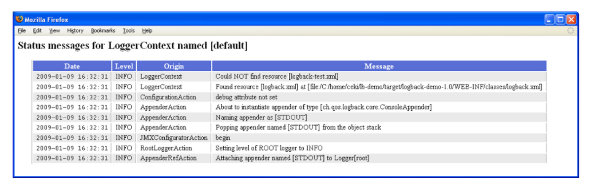

# LogBack Configuration 메커니즘과 자동 설정

## LogBack에서의 설정

> Logback configuration 설명에 앞서, `Joran` 이라는 이름이 자주 나오게 되던데, 
> Jorand은 Logback이 사용하는 configuration 프레임 워크이다.

Log에 대한 설정을 Application Code로 작성하는 많은 시간과 노력이 필요하다.  
Application Code 중 4%정도의 코드가 일반적으로 로깅에 사용되는 것을 확인 된다고 하는데,  
중간 정도 크기의 애플리케이션이라도 코드에 수천 개의 로깅문을 포함하기에 이것들을 간편하고 효율적이게 관리하기 위한 도구가 필요했기에 시작되었다고 한다.


`Logback`은 프로그래밍으로 또는 `XMl`이나 `Groovy` 포맷의 설정 스크립트 파일을 통해서 설정할 수 있습니다.  
`LogBack`이 스스로 설정을 찾는 스텝은 다음과 같다.

1. `classpath`에서 `logback-test.xml` 파일을 찾는다.
2. (1)과정에서 파일을 찾지 못했다면, `classpath`에서 `logback.groovy` 파일을 찾는다.
3. (2)과정에서 파일을 찾지 못했다면, `classpath`에서 `logback.xml` 파일을 찾는다.
4. (3)과정에서 파일을 찾지 못했다면, `JDK 1.6`의 `service-provider loading facility (Server Loader)에 의해 `com.qos.logback.classic.spi.Configurator` 인터페이스의 구현체`를 찾는다. 탐색 위치는 `classpath`에서 `META-INF\services\ch.qis.logback.classic.spi.Configurator`이다.
5. 위 과정에서 성공한 경우가 없다면, `logback`은 콘솔에 출력하는 `BasicConfigrator`로 설정 된다.

만약 사용자가 특별한 LogBack 설정을 하지 않는다면 자동으로 (5)번의 `BasicConfigurator`로 설정이 된다.  
하지만, `Joran`이 `Logback Configuration` 파일을 파싱하는데 100 ms 정도 의 소요 된다.  
이 정도의 몇 ms 라도 줄여서 application을 더 빠르게 시작하길 바란다면, 위의 (1)~(4)를 생략할 수 있도록 직접 `BasicConfiguration`을 작성 할 수도 있다.


## LogBack 자동설정

---
logback을 설정하는 가장 쉬운 방법은 그냥 아무 설정 없이 `BasicConfigurator`에게 맡기는 것인데, 이렇게 지정할 경우 `console` 에 로그 메시지가 출력됨을 알 수 있다. `BasicConfigurator` 를 통해 설정할 경우 최소한으로 설정된 `ConsoleAppender` 가 루트 로거에 부착되게 된다. 출력 포맷은 아래와 같이 지정되었으며 `PatternLayOutEncoder`에 등록되어 있고, 루트 로거의 레벨은 `DEBUG`로 지정된다.

```regexp
%d{HH:mm:ss.SSS}[%thread] %-5level %logger{36} - %msg%n.
```
예시)
```java
package chapters.configuration;
import org.slf4j.Logger;
import org.slf4j.LoggerFactory;

public class Foo{
    static final Logger logger = LoggerFactory.getLogger(Foo.class);
    
    public void doIt() {
        logger.debug("Did it again");
    }
}
```
```java
16:06:09.046 [main] DEBUG chapters.configuration.Foo - Did it again!
```

## logback-test.xml / logback.xml을 이용한 Logback 자동설정

---
위에서 설명한 설정 과정을 봐서 알 수 있듯이, logback은 설정 파일을 찾는 순서가 존재한다.  
이번에는 `classpath` 에 `logback.xml` 파일을 생성하고 아래와 같이 `Logback` 설정을 작성을 해서 확인해본다.
아래의 설정은 `BasicConfigurator` 와 동일한 설정이다. 이후 실행을 시킨다면 위의 결과와 같은 결과를 보인다는 것을 알수 있다고 한다.

```xml

<configuration xmlns="http://www.jboss.org/jbossws-tools">
  <appender name="STDOUT" class="ch.qos.logback.core.ConsoleAppender">
    <!-- encoders are assigned the type
         ch.qos.logback.classic.encoder.PatternLayoutEncoder by default-->
    <encoder>
      <pattern>%d{HH:mm:ss.SSS} [%thread] %-5level %logger{36} - %msg%n</pattern>
    </encoder>
  </appender>
  
  <root level="debug">
    <appender-ref ref="STDOUT" />
  </root>
</configuration>
```

`Configuration`파일을 분석하는 동안 경고 또는 에러가 발생하면, Logback은 내장 상태 시스템에 의해 콘솔에 내부 상태데이터(Status Data)를 자동으로 출력하게 된다.  
만약 사용자가 상태 수신 코드를 명시적으로 등록할 경우 중복을 제거하기 위해 Logback의 자동 상태 출력 기능은 비활성화 된다.

상태 데이터는 `StatusPrinter` 를 이용해서 출력하는 방법이 있는 반면,logback.xml 파일을 통해 설정할 수 할수도 있다.  
방법은 `configuration` 디렉티브에 `debug="true"` 속성을 추가하는 방법이다.

```xml

<configuration debug="ture"><!-- 상태 데이터 출력-->
  <appender name="STDOUT" class="ch.qos.logback.core.ConsoleAppender">
    <!-- encoders are by default assigned the type 
         ch.qos.logback.classic.encoder.PatternLayoutEncoder -->
    <encoder>
      <pattern>%d{HH:mm:ss.SSS} [%thread] %-5level %logger{36} - %msg%n</pattern>
    </encoder>
  </appender>
  
  <root level="debug">
    <appender-ref ref="STDOUT"/>
  </root>
</configuration>
```
다른 방법은 `StatusListener`를 등록하는 방법이다.  
`debug="true"` 속성은 `OnConsoleStatusListener`를 등록하는 것과 완전히 동일하게 동작한다.

```xml

<configuration>
  <statusListener class="ch.qos.logback.core.status.OnConsoleStatusListener" />

   ... the rest of the configuration file
</configuration>
```
## 시스템 변수를 통한 Logback Configuration 경로 지정

---
Logback이 스텝에 따라 설정을 찾는 방법 이외 `logback.configuration` 이름의 시스템 변수로 경로를 지정해 줄 수 있다.  
경로의 logback 설정 파일의 확장자는 항상 `.xml` 혹은 `.groovy` 이어야만 한다. 이 시스템 설정은 java 실행 `command` 옵션으로 지정할 수 있으며 또한 `Application Code`에서 추가해 줄 수 있다.

```xml
java -Dlogback.configurationFile=/path/to/config.xml chapters.configuration.MyApp1
```
```java
import ch.qos.logback.classic.util.ContextInitializer;

public class ServerMain{
    public static void main(String args[]) throws IOException, InterruptedException{
        // must be set before the first call to LoogerFactory.getLogger();
        //ContextInitializer.CONFIG_FILE_PROPERTY is set to "logback.configurationFile"
        System.setProperty(ContextInitializer.CONFIG_FILE_PROPERTY, "/path/to/config.xml");
        ...
    }
}
```

## 자동 Configuration 재구성

---
`logback-classic` 모듈은 주기적으로 `configuration` 파일을 읽어 `Logback`의 설정을 재구성할 수 있습니다. 이는 `Application`이 동작 중일때 재시작 없이 설정 파일을 수정하고 적용할 수 있는 장점이 있습니다. 
자동으로 Logback 설정 재구성을 위해 `configuration` 디렉티브에 `scan="true"`속성을 추가합니다.  
기본으로 적용되는 scan 주기는 1분 이고 scan 주기는 `scanPerioid`속성을 이용하여 지정해 줄 수 있다.

```xml
<configuration scan="true" scanPeriod="30 seconds">
    ...
</configuration>
```
scanPeriod의 값은 ___시간과 시간의 단위("milliseconds","seconds","minute","hours")___ 를 조합하여 기술한다.

## 패키지 데이터 로깅

---
logback을 이용하여 사용하는 패키지 데이터를 로깅할 수 있다.  
1.1.4 버젼 이후 이 설정은 기본값이 disable 되었기 때문 패키지 데이터 로깅을 위해서는 `configuration` 디렉티브에 `packagingData ="true"` 속성을 추가해야 한다. 
이는 versioning 이슈에 대한 문제를 파악하는데 큰 도움이 된다. 하지만 패키징 데이터를 검사하고 로깅하는 과정은 비교적 큰 비용을 갖고 있기 때문에 성능에 따라 사용 여부를 결정해야 한다.  
이 설정은 LoggerContext에서도 지정 가능하다.

```xml

<configuration packagingData="true">
    ...
</configuration>
```

```java
LoggerContext lc = (LoggerContext) LoggerFactory.getILoggerFactory();
lc.setPackagingDataEnabled(true);
```

## JoranConfigurator 직접 이용하기

---
Logback은 `logback-core`모듈 내 존재하는 `joran`이라는 `configuration` 라이브러리에 의존한다.  
기본 `Configuration` 메커니즘으로 Logback은 classpath에서 찾은 기본 configuration 파일에서 `JoranConfiguration`를 호출합니다.  
만약 어떠한 이유로 기본 로그백의 `configuration` 메커니즘을 ___오버라이드___ 하고 싶다면 직접 `joranConfigurator`를 직접 호출하여 사용해야 합니다.

```java
package chapters.configuration;

import org.slf4j.Logger;
import org.slf4j.LoggerFactory;

import ch.qos.logback.classic.LoggerContext;
import ch.qos.logback.classic.JoranConfigurator;
import ch.qos.logback.core.joran.spi.JoranException;
import ch.qos.logback.core.util.StastusPrinter;

public class myApp3 {
    final static Logger logger = LoggerFactory.getLogger(MyApp3.class);
    
    public static void main(String[] args){
        //assume SLF4J is bound to logback in the current enviroment
        LoggerContext context = (LoggerContext) LoggerFactory.getILoggerFactory();
        
        try {
            JoranConfigurator configurator = new JoranConfigrator();
            configurator.setContext(context);
            //Call context.reset() to clear any previous configuration, e.g. default
            //configuration. For multi-step  configuration, omit calling context.rest().
            context.reset();
            configurator.doConfigure(args[0]);
        }catch (JoranException je){
            //StatusPrinter will handle this
        }
        StatusPrinter.printerInCaseofErrosOrWarnings(context);
        
        logger.info("Entering apllication");
        
        Foo foo = new Foo();
        foo.doIt();
        logger.info("Exiting application.");
    }
}
```

위 예시코드를 보면 `LoggerContext` 를 직접 가져오고, `JoranConfigurator` 를 생성한다. `JoranConfigurator` 의 `context` 로 이전 줄에서 가져온 `LoggerContext`를 지정한다.  
`context`는 `configuration` 파일을 읽고 파싱 하는 동작을 위해 지정해야 한다.  
이후 `LoggerContext` 를 초기화하고 `main` 메서드로 전달받은 `configuration file` 이름을 통해 설정하도록 한다.  
`JoranConfigurator`에 `context`를 세팅한 후 `StatusPrinter`를 통해 내부 상태 또한 출력하도록 설정했다. 

`LoggerContext` 초기화는 `multi-step configuration`과정을 위해 반드시 호출되어야 하는 과정이다.

## Logger의 상태 메시지 화면 설정

---
Logback은 `LoggerContext`를 통해 `StatusManager`라는 객체에 내부 상태 데이터들을 수집한다.  Logback에 지정된 `default StatusManager`는 메모리 적인 측면에서 필요한 정도의 양만 갖도록 하기 위해 두 (Head와 Tail)부분으로 상태 데이터를 관리한다.  
글자 그대로 Header는 로그의 첫 부분을 의미하여 Tail은 끝(최신) 부분을 의미한다. Default 설정된 메모리에 유지할 로그의 개수는 150개이다. (이는 추후 release에 따라 달라 질수 있는 간과하지말자).

`logback-classic`에서는 이러한 상태 데이터를 시각화하여 볼 수 있도록 `ViewStatusMessageServlet` 을 제공한다.
`ViewStatusMessageServlet`은 현재 사용 중인 `LoggerContext`에 해당하는 `StatusManager` 내용들을 HTML 테이블로 출력해줍니다.
사용을 위해 `WEB-INF/web.xml`파일에 `ViewStatusMesassageServlet` 을 설정하여야 합니다.

```xml
<servlet>
    <servlet-name>ViewStatusMessages</servlet-name>
    <servlet-class>ch.qos.logback.classic.ViewStatusMessageServlet</servlet-class>
</servlet>

<servlet-mapping>
    <servlet-name>ViewStatusMessage</servlet-name>
    <url-pattern>/lbClassicStatus</url-pattern>
</servlet-mapping>
```
`ViewStatusMessage` 서블릿의 동작을 확인하기 위해서 `http://{host}/lbClassicStatus`로 접속한다.
(host는 동작한 Application의 host 주소로 입력한다.)
  
http://logback.qos.ch/manual/configuration.html - ViewStatusMessageServlet 에서 뜨워주는 상태 데이터 메시지 화면

## 상태 메시지 리스너

---
`StatusManager`에`StatusListener`를 붙여 상태 메시지에 대한 응답을 가져올 수 있다.  
Logback은 `StatusListener`의 구현체로 콘솔에 새로 들어오는 상태 메시지를 출력하는 `OnColsoleStatusListener`를 제공한다.
```java
LoggerContext lc = (LoggerContext) LoggerFactory.getILoggerFactory();
StatusManager statusManager = lc.getStatusManager();
OnConsoleStatusListener onConsoleListener = new OnConsoleStatusListener();
statusManager.add(onConsoleListener);
```

`StatusListener`는 등록된 후 새로 들어오는 상태 이벤트에 대한 메시지를 수신합니다. 하지만 리스너 등록 이전에 발송된 메시지들을 수신하지 않기에, ___`Configuration` 과정 중 `StatusListener`의 등록을 가장 앞에 두는 것이 좋은 등록 방법이다.___

`Configuration` 파일에 하나 혹은 이상의 `StatusListener`를 지정할 수 있습니다. `logback.xml`에 StatusListener`를 지정하는 방법은 다음과 같습니다.

```xml

<configuration>
    <statusListener class="ch.qos.logback.core.status.OnConsoleStatusListener"/>
    
    ... the rest of the configuration file
</configuration>
```

StatusListener는 시스템 변수로써 전달할 수도 있습니다. 변수의 `logback.statusListenerClass`으로 지정합니다.  
기본으로 제공 되는 StatusListener의 종류는 OnConsoleStatusListener, OnErrorConsoleStatusListener, NopStatusListener가 존재한다.

```java
java- Dlogback.statusListenerClass=ch.qos.logback.core.status.OnConsoleStatusListener...
```
`StatusListener`가 지정되지 않으면 기본적으로 상태 메시지는 출력하지 않습니다. 이는 `NonStatusListener` 를 리스너로 지정했을 때와 동일하게 작동한다.

## logback-classic 중지시키기

---
`logback-classic` 모듈에 의해 사용되던 리소스를 해제시킬 가장 좋은 방법은 logback context를 중지시키는 것 입니다.
`context`를 중지시키면 `logger`부착되었던 모든 `appender`들이 `close`되며, ___active상태의 스레드를 차례로 대로 중지시킨다.___
```java
import ofg.sflf4j.LoggerFactory;
import ch.qos.logback.classic.LoggerContext;
...
//assume SLF4J is bound to logback-classic in the current enviroment
LoggerContext loggerContext = (LoggerContext) LoggerFactory.getILoggerFactory();
loggerContext.stop();
```

위으 코드는 `LoggerContext`를 중지시키는 방법을 보여준다. `loogerContext.stop()`메서드는 `ServletContextListener`의 `contextDestroyed` 메서드를 호출한다.  
그로 인해 `logback-classic`이 정지되며 사용하던 리소스들을 해제합니다.

다른방법으로는 `JVM shutdown hook`을 이용해서 `logback-classic`을 중지시킬 수 있다, 우선 `configuratuon`파일에 `shutdownHook`디렉티브를 추가해준다.  
`shutdownHook`디렉티브에 `class`속성으로 지정할 `shutdown hook` 클래스를 지정할 수 있다, 만약 아무 속성을 지정하지 않는다면 기본으로 `DefaultShutDown` 클래스로 설정된다..

```xml

<configuration debug="true"">
    <!-- in the absence of the class attribute, assume
    ch.qos.logback.core.hook.DefaultshutdownHook-->
<shutdownHook/>
...
</configuration>
```
`DefaultShutDown`은 `hook` 발생 곧바로 (delay 0 by default) logback context를 중지시킨다.  
context 중지에는 백그라운드에서 로그 파일 압출 작업이 일어나는 것을 대비해 최대 30초의 delay를 지정할 수 있다고 한다.  
JVM 종료 후에도 백그라운드로 동작하는 압출 작업등을 완료할 수 있또록 하기 위해 단순히 `<shutdownHook>` 디렉티브를 지정해주기 때문에 설정을 하지 않도록 해야한다고 한다.(설정 중복 발생 가능).

`servlet-api 3.x`이후에는 `logback-classic`이 자동으로 웹 서버에게 `ServletContainerInitializer`를 ___implement___ 하는 `LogbackServiceContainerInitializer`를 설치한다.  
`LogbackServletContainerInitializer`는 `LogbackServletContextListener`를 자동으로 등록하는데 이 리스너를 통해 웹 서버가 stop 혹은 reload 될 때 자동으로 `logback-classic context`를 중지시켜준다.

만약 자동으로 리스너를 등록하는 것을 원치 않는다면 `web.xml`파일에 `logbackDisableServletContainerInitializer`를 세팅함으로써 자동 등록을 방지할 수 있다.

```xml
<web-app>
    <context-param>
        <param-name>logbackDisableServletContainerInitializer</param-name>
        <param-value>true</param-value>
    </context-param>
    ...
</web-app>
```

