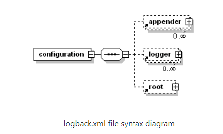
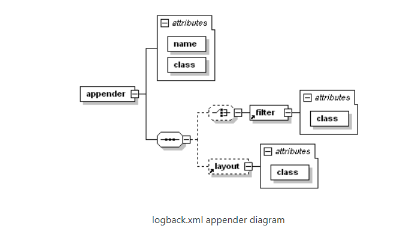

# LogBack Configuration 파일 구성

## Configuration 파일 문법

---
Logback은 코드를 재 컴파일 하지 않고도 logging에 대하여 재구성할 수 있다.  
Logback의 configuration 파일은 매우 유연한 문법을 갖고 있다.





기본적인 구조는 위의 사진과 같다. `configuration`태그는 내부에 최대 1개의 root 태그를 갖고, 0개 이상의 `appender` 와 `logger`태그를 가질 수 있다.  
태그 명명 규칙은 조금 복잡하지만 일반적으로 대소문자를 구분하며 camelCase를 따르도록 한다.

`Logger`와 같이 keyword로 지정된 태그 이름은 대소문자를 구분하지 않고 선언할 수 있다. (logger= Logger = LOGGER)  
하지만, `여는 태그`와 `닫는 태그`에서 대소문자는 기존 xml 규칙을 따른다. (`<xyz>`는 `<xyz>`로 닫을 수 없다.)

- 문서에서는 camelCase를 따라서 태그의 이름을 짓는 것을 권장한다.

### <Logger> 로거 구성

Logger는 `<logger>`태그를 통하여 구성된다. ___`<logger>`는 필수 `name` 속성, 선택적으로 `level` 속성과 `additivity` 속성을 가진다.___  
level 속성은 대소문자를 구분하지 않으면 `TRACE`,`DEBUG`,`INFO`,`ERROR`,`ALL`,`OFF` 중 하나의 값으로 지정할 수 있다.  
특별한 level 값으로는 `INHERITED` 또는 `NULL` (같다)이 존재한다, 이는 자신이 상속하는 상위 로거의 level을 그대로 따른다.  
`additivity` 속성은 `true`와 `false`의 값을 가질 수 있다. 이는 `appender`의 `cumuative`속성에 대하여 설정한다.

`<logger>` 태그는 0개 이상의 `<appender-ref>` 태그를 포함할 수 있다. 각 `<appender-ref>` 태그로 포함된 `appender` 는 명명된 로거에 추가된다.

### <root> 루트 로거 구성

루트 로거는 `<root>`태그를 통하여 구성된다. ___루트 로거의 속성으로는 오직 단 하나의 `level`속성만 허용된다.  
루트 로거의 이름은 이미 "ROOT"로 정해져 있기에 `name`속성도 포함하지 않는다. `level`속성으로는 기존 `logger`와 동일하게 `level` 값들을 가질 수 있습니다.  
하지만, 가장 최상단의 로거이기 때문에 `INHERITED` 혹은 `Null`값은 `level`값으로 가질 수 없습니다.

```xml

<configuration>
    <appender name="STDOUT" class="ch.qos.logback.core.ConsoleAppender">
        <encoder>
            <pattern>
                %d{HH:mm:ss.SSS} [%thread] %-5level %logger{36} -%msg%n
            </pattern>
        </encoder>
    </appender>

    <logger name="chapters.configuration" level="INFO"/>
    <logger name="chapters.configuration.Foo" level="DEBUG"/>

    <!-- turn Off all logging (children can override) -->
    <root level="OFF">
        <appender-ref ref="STDOUT"/>
    </root>

</configuration>
```

위의 logback.xml파일을 확인해보면, 루트 로거는 OFF레벨로 지정되어 아무런 로그를 출력하지 않도록 지정되었다.  
하지만, 하위 로거인 `chapters.configuration` 로거에서 `level`을 오버라이드 하여 INFO레벨로 지정하였다.  
그렇기 때문에 `chapters.configuration` 로거의 하위 로거들의 `level`은 모두 `INFO`레벨로 지정된다.
`chapters.configuration.Foo` 로거는 `chapters.configuration`로거의 하위 로거로 level을 다시 오버라이드 하고 있다.  
그렇기에 `chapters.configuration.Foo`로거의 하위 로거들은 모두 DEBUG 레벨을 갖게 된다.

|LoggerName|Assigned Level|Effective Level|
|:--------:|:--------------:|:---------------:|
|root      |OFF             |OFF              |
|chapters.configuration|INFO|INFO|
|chapters.configuration.ExampleApp|null|INFO|
|chapters.configuration.Foo|DEBUG|DEBUG|
|chapters.configuration.Foo.Bar|null|DEBUG|

### Appender 구성

___Appender는 `<appender>` 태그를 통하여 구성되며 `name`과 `class`속성을 필수로적으로 가져가야만 한다.___  
`name`속성은 `appender`의 이름을 명시하며, `class`속성은 인스턴스화 시킬 `appender` 클래스를 명시하여야한다.  
`<appender>`태그는 0개 또는 1개의 `<layout>` 태그와 0개 이상의 `<encoder>`,`<filter>` 태그를 가질 수 있다.  
`<appender>`태그는 `JavaBean`으로 등록된 `appender` 클새르를 다수 포함할 수 있다.



`<layout>`태그는 `class`속성으로 인스턴스화 시킬 `layout`클래스를 명시하여야 한다.  
마찬가지로 `<encoder>`태그도 `class`속성으로 인스턴스화 시킬 `encoder`클래스를 명시하여야 한다.  
일반적으로 `PatternLayout`과 `PatternLayoutEncoder`클래스가 연결되며 이러한 클래스 속성은 `JoranConfigurator`의 `default class mapping`규칙을 따른다.

|Parent class|property name|default nested class|
---|-----|-----|
|ch.qos.logback.core.AppenderBase|encoder|ch.qos.logback.classic.encoder.PatternLayoutEncoder|
|ch.qos.logback.core.UnsynchronizedAppenderBase|encoder|ch.qos.logback.classic.encoder.PatternLayoutEncoder|
|ch.qos.logback.core.AppenderBase|layout|ch.qos.logback.classic.PatternLayout|
|ch.qos.logback.core.UnsynchronizedAppenderBase|layout|ch.qos.logback.classic.PatternLayout|
|ch.qos.logback.core.filter.EvaluatorFilter|evaluator|ch.qos.logback.classic.boolex.JaninoEventEvaluator|

```xml

<configuration>

    <appender name="FILE" clas="ch.qos.logback.core.FileAppender">
        <file>myApp.log</file>

        <encoder>
            <pattern>%date %level [%thread] %logger{10} [%file:%line] %msg%n</pattern>
        </encoder>
    </appender>

    <appender name="STDOUT" clas="ch.qos.logback.core.ConsoleAppender">
        <encoder>
            <pattern>%msg%n</pattern>
        </encoder>
    </appender>

    <root level="debug">
        <appender-ref ref="FILE" />
        <appender-ref ref="STDOUT" />
    </root>
</configuration>
```
위의 코드에는 `FILE`과 `STDOUT`이라는 `appender`를 확인할 수 있다. `FILE appender`는 `myApp.log` 라는 파일에 로그를 출력하고 `encoder`로 `PatternLayoutEncdoer`를 사용합니다.  
`STDOUT appender`는 콘솔에 로그를 출력합니다. 두 개의 `appender`는 `<appender-ref>`를 통해 루트 로거에 등록된다.

### Appenders accumlate

기본적으로 `appender`는 누적되는 성질을 갖고 있다, ___`logger` 는 자신에게 부착된 `appender` 이외에 자신의 상위 `logger`의 `appender`에게 로그를 전달한다.  
그렇기에 같은 `appender`를 다른 `logger`에 등록한다면 로그의 중복 출력에 주의하여야 한다.

```xml

<configuration>
    
    <appender name="STDOUT" class="ch.qos.logback.core.ConsoleAppender">
        <encoder>
            <pattern>%d{HH:mm:ss.SSS} [%thread] %-5level %logger{36} - %msg%n</pattern>
        </encoder>
    </appender>
    
    <logger name="chapters.configuration">
        <appender-ref ref="STDOUT" />
    </logger>
    
    <root level="debug">
        <appender-ref ref="STDOUT" />
    </root>
</configuration>
```
```java
14:25:36.343 [main] INFO  chapters.configuration.MyApp3 - Entering application.
14:25:36.343 [main] INFO  chapters.configuration.MyApp3 - Entering application.
14:25:36.359 [main] DEBUG chapters.configuration.Foo - Did it again!
14:25:36.359 [main] DEBUG chapters.configuration.Foo - Did it again!
14:25:36.359 [main] INFO  chapters.configuration.MyApp3 - Exiting application.
14:25:36.359 [main] INFO  chapters.configuration.MyApp3 - Exiting application.
```

앞서 `logger`에는 `additivity`속성이 존재하는데, 이 속성은 `appender accumlate`를 컨트롤 하기 위한 속성이다.  
`additivity='false'`로 설정돤 경우 로깅이 발생할 때 상위 로거의 `appender`로 전달되지 않는다.  
이 맡의 경우 `chapters.configuration,Foo` 로거에서 발생한 로그는 루트 로거로로 전달되지 않기에 오직 `foog.log`파일에만 출력된다.

```xml

<configuration>
    <appender name="FILE" class="ch.qos.logback.core.FileAppender">
        <file>foo.log</file>
        <encoder>
            <pattern>%date %level [%thread] %logger{10} [%file : %line] %msg%b</pattern>
        </encoder>
    </appender>
    
    <appender name="STDOUT" class="ch.qos.logback.core.ConsoleAppender">
        <encoder>
            <pattern>%msg%n</pattern>
        </encoder>
    </appender>
    
    <logger name="chapters.configuration.Foo" additivity="false">  <!-- 상위로거로 전달 방지-->
        <appender-ref ref="FILE"/>
    </logger>
    
    <root level="debug">
        <appender-ref ref="STDOUT"/>
    </root>
</configuration>
```

### Context Name 설정

모든 로거는 `LoggerContext`에 부착된다. 그리고 이 LoogerContext 의 기본 이름은 `default`이다.  
a 만약에 LoggerContext의 이름을 다르게 지정하고 싶다면 `<contextName>` 태그를 이용하여 지정해줄 수 있다.  
`LoggerContext`의 이름은 하나의 `target`에 대하여 다수의 `Application` 로그를 수집할 때 `Application`구분을 위해 사용될 수 있다.  
그렇기에 이름을 수정한다면 간단하고 명확한 이름으로 명명하는 것을 권장한다고 되어있다.

```xml
<configuration>
    <contextName>myAppName</contextName>
    <appender name="STDOUT" class="ch.qos.logback.core.ConsoleAppender">
        <encoder>
            <pattern>%d %contextName [%t] %level %logger{36} - %msg%n</pattern>
        </encoder>
    </appender>
    
    <root level="debug">
        <appender-ref ref="STDOUT"/>
    </root>
</configuration>
```
`LoggerContext` 이름을 출력하기 위해 `%contextName` 을 사용한다.

### 변수 선언 및 치환 (Variable substitution)  
configuration 파일에 변수를 선언하고 이를 태그 구성에 사용할 수 있습니다. 사용할 수 있는 정의된 변수들이 많이 존재하지만,  
일반적인 변수를 선언하고 이를 설정에 치환하는 방법이 표현되어었는데,  
추가적인 변수 사용 방법은 [Logback manual:Variable substitution](http://logback.qos.ch/manual/configuration.html#variableSubstitution) 을 참고.

변수는 `<property>` 태그를 이용하여 선언 가능하다, logback 1.0.7 이후로는 `<property>` 대신 `<variable>`이라는 이름으로 키워드가 대체되었지만 현재 둘 다 태그명으로 사용가능하다.

선언한 변수 `${variable_name}`으로 사용할 수 있다. `${`과 `}`사이에 선언한 문자열은 같은 이름의 변수 값으로 치환된다.

```xml
<configuration>
    <property name="USER_HOME" value="/home/sangmoon"/>
    
    <appender name="FILE" class="ch.qos.logback.core.FileAppender">
        <file>${USER_HOME}/myApp.log</file>
        <encoder>
            <pattern>%msg%n</pattern>
        </encoder>
    </appender>
    
    <root level="debug">
        <appender-ref ref="FILe"/>
    </root>
</configuration>
```

위의 코드를 보면, `<property>` 태그를 이용하여 `USER_HOME`이라는 변수에 `/home/sangmoon`값을 넣어주었다.  
`FILE appender`에서 `<file>`태그에 `${USER_HOME}/myApp.log`의 값을 전달하는데, 이때 `${`과 `}`사이 선언된 문자열 `USER_HOME`이 같은 이름의 변수의 값으로 치환되어 `/home/sangmoon/myApp.log`파일에 로그가 쌓이게 된다.

변수는 `<property>` 태그 대신 시스템 변수로써 전달해도 위의 `configuration`과 동일하게 설정할 수 있다.
```java
java -DUSER_HOME="/home/sangmoon" MyApp
```