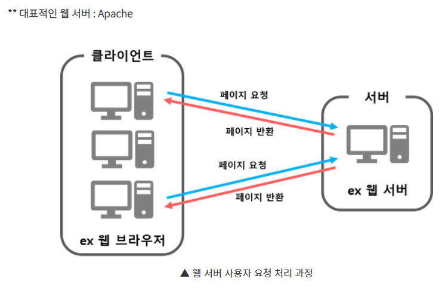

## 웹서버와 WAS의 차이점
### 웹서버
> 사전적 정의 "웹 브라우저 클라이언트로부터 `HTTP`요청을 받아들이고 `HTML`문서와 같은 웹 페이지를 반환하는 컴퓨터 프로그램"  
- 웹 서버란 클라이어트(사용자)가 웹브라우저에서 어떠한 페이지 요청을 하면 웹 서버에서 그 요청을 받아 <b style="color:orange">정적 컨텐츠를 제공하는 서버</b>이다.  
- 여기서 정적 컨텐츠란 단순`HTML`, `CSS`, `javaScript`, `이미지`, `파일` 등 즉시 응답다능한 컨텐츠이다.  
그렇다면 웹 서버는 정적 컨텐츠만 제공하느냐? 그것은 아니다. 웹 서버가 동작 컨텐츠를 요청 받으면 `WAS`에게 해당 요청을 넘겨주고, `WAS`에서 처리한 결과를 클아이언트(사용자)에게 전달해주는 역할 있다<b>
- 
 
### WAS
> 사전적 정의
> "인터넷 상에서 HTTP 프로토콜을 통해 사용자 컴퓨터나 장치에 어플리케이션을 수행해주는 미들웨어로서,
> 주로 동적 서버 컨텐츠를 수행하는 것으로 웹 서버와 구별이 되며, 주로 데이터베이스 서버와 같이 수행"
- WAS는 웹 서버와 웹 컨테이너가 합쳐진 형태로써, 웹 서버 단독으로는 처리할 수 없는 <b style="color:orange">데이터베이스의 조회나 다양한 로직 처리가 필요한 동적 컨텐츠를 제공</b>한다. 
덕분에 사용자의 다양한 요구에 맞추어 웹 서비스를 제공할 수 있다. WAS는 JSP,Servlet 구동환경을 제공 해주기 때문에 웹 컨테이너 혹은 서블릿 컨테이너 라고도 불린다.  
  - 대표적은 WAS 종류 : TOmCat
  - 웹 컨테이너 : 웹 서버가 보낸 JSP,PHP 등의 파일을 수행한결과를 다시 웹 서버로 보내주는 역할을 함.
  - 

### Web Service Architecture
- 웹 어플리케이션은 요청 처리 방식에 따라 다양한 구조를 가질 수 있다.
1. 클라이언트(사용자) ==> WebServer--> DB.
2. 클라이언트(사용자) ==> WAS--> DB.
3. 클라이언트(사용자) ==> WebServer --> WAS--> DB.  
  
### [클라이언트(사용자) -> Web Server -> WAS -> DB] 구조의 동작 과정 !!
 1. `WebServer`는 웹 브라우저 클라이언트(사용자)로부터 HTTP 요청을 받는다.
 2. `WebServer`는 클라이언트의 요청(Request)을 `WAS` 보낸다.
 3. `WAS` 는 관련된 `Servlet`을 메모리에 올린다.
 4. `WAS`는 `web.xml`을 참조하여 해당 `Servlet`에 대한 `Thread`를 생성한다. (Thread Pool 이용)
 5. `HttpServletRequest`와 `HttpServletResponse`객체를 생성하여 `Servlet`에 전달한다.
    1. `Thread`는 `Servlet`의 `service()` 메서드를 호출한다.
    2. service() 메서드는 요청에 맞게 `doGet()`또는 `doPost()`메서드를 호출한다.
 6. `protected doGet(HttpServletRequest request, HttpServletResponse resonse)`
 7. `doGet()` 또는 `doPost()` 메서드는 인자에 맞게 생성된 적절한 동적 페이지를 `Response`객체에 담아 `WAS`에 전달한다.
 8. `WAS`는 `Response`객체를 `HttpResponse` 형태로 바꾸어 `Web Server`에 전달한다.
 9. 생성된 `Thread`를 종료하고, `HttpServletRequest`와 `HttpServletResponse` 객체를 제거한다.

### WAS 만 써도 되겠네? 답은 x 
- `WAS`는 DB 조회 및 다양한 로직을 처리하는데 집중해야한다. 
따라서 단순한 정적 컨텐츠는 웹 서버에게 맡기며 기능을 분리시켜 <b> 서버 부하를 방지</b>한다 .  
- 만약 `WAS`가 정적 컨턴츠 요청까지 처리하면, 부하가 커지고 동적 컨텐츠 처리가 지연 되면서 수행 속도가 느려지고 이로 인해 페이지 노출 시간이 늘어나는 문제가 발상해여 효율성이 크게 떨어진다.
> 웹 서버를 WAS 앞에 두고 필요한 WAS 들들 WebServer에 플러그인 형태러 설정하면 더욱 효율적인 분산 처리가 가능하다.  
### 근데 왜 Tomcat이 아닌 ApacheTomcat이야?
- 앞에서 언급한대로 정적 컨텐츠를 처리하는 웹서버에는 Apache가 있고, 동적 컨텐츠를 처리하는 WAS 서버는 Tomcat서버가 있는데 Tomcat은 Apache Tomcat이라는 이름으로 많이 사용되어 혼란스러울 것이다. 
붙여서 쓰는 이유는 2008년에 릴리즈 된 Tomcat 5.5 버젼부터 정적 컨텐츠를 처리하는 기능이 추가되었는데, 이 기능이 순수 Apache를  사용하는것에 비해 성능적 차이가 전혀 없으며 Apache기능을 포함하고 있기 때문에 붙여쓴다.
