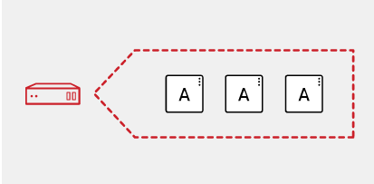
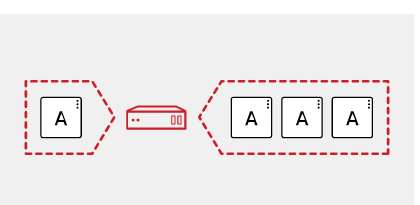
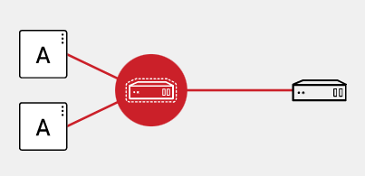
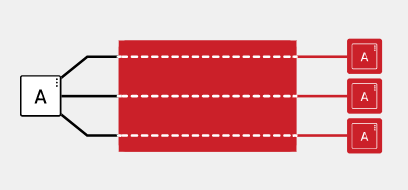
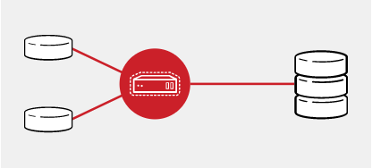

## MiddleWare
### 미들웨어란?
- 미들웨어는 운영 체제와 해당 운영 체제에서 실행되는 응용 프로그램 사이에 존재하는 소프트웨어이다. 
기본적으로 숨겨진 변환 계층으로 기능하는 미들웨어는 분산 응용 프로그램의 통신 및 데이터 관리를 가능하게 한다.  
데이터와 데이터베이스가 "파이프"사이를 쉽게 통과할 수 있도록 두 가지 응용 프로그램을 함께 연결하기 때문에 배관이라고도 한다.  
미들웨어를 사용하면 사용자가 웹 브라우저에서 양식을 제출하거나 웹 서버가 사용자의 프로필을 기반으로 동적 웹 페이지를 반환하도록 요청할 수 있다.   
- 일반적인 미들웨어 예로는 데이터베이스 미들웨어, 어플리에키션 서버 미들웨어, 메시지 지향 미들웨어 , 웹 미들웨어 및 트랜잭션 처리 모니터가 있다.  
각 프로그램은 일반적으로  
  - SOAP(`Simple Object Access Protocol`)
  - 웹 서비스
  - REST(`Representational State Transfer`)
  - JSON(`JavaScript Object Notation`)  
- 과 같은 메시징 프레임워크를 사용하여 서로 다른 응용프로그램이 통신할 수 있도록 메시지 서비스를 제공한다.  
모든 미들 웨어가 통신 기능을 수행하지만 회사가 사용하기로 선택한 형식은 사용 중인 서비스와 통신해야 할 정보 형식에 따라 다르다.  
여기에는 보안 인증, 트랜잭션 관리, 메시지 큐, 응용 프로그램 서버, 웹 서버 및 디렉터리가 포함될 수 있다. 
미들웨어는 데이터를 앞뒤로 보내지 않고 실시간으로 발생하는 작업으로 분산 처리에도 사용할 수 있다.   
- 미들웨어는 요청과 응답의 중간에 위치에 기능을 추가하거나 원치 않는 요청을 걸러내는 등 매우 다양하다.
- 라우터나 에러 핸들러 또한 미들웨어의 일종이다. 사실 핸들러 중 미들웨어와 컨트롤러 등을 구분하는 기준은 문법적인 것보다는 의미적인 것이 크다.   

#### 위키
- 미들웨어는 컴퓨터 제작 회사가 사용자의 특정한 요구대로 만들어 제공하는 프로그램으로, 
운영체제와 응용 소프트웨어의 중간에서 조정과 중개의 역할을 수행하는 소프트웨어이다.  
- 응용 소프트웨어가 운영 체제로부터 제공받는 서비스 이외에 추가적으로 이용할 수 있는 서비스를 제공하는 컴퓨터 소프트웨어이다. 
"소프트웨어 글루(software glue)"로 이야기되기도 한다. 
응용 소프트 웨어는 유연하고 확장, 축소가 편리하여야 하며, 이러한 장점을 충족하기에 개발자의 다른 기종 간 플랫폼을 다시 구축할 필요가 없어야 한다. 
이를테면 데이터베이스 시스템, 전자 통신 소프트웨어, 메시지 및 쿼리 처리 소프트웨어를 들 수 있다.  
미들웨어는 양 쪽을 연결하여 데이터를 주고 받을 수 있도록 중간에서 매겨 역할을 하는 소프트웨어, 네트워크를 통해서 연결된 여러 개의 컴퓨터에 있는 많은 프로세스들에게 어떤 서비스를
사용할 수 있도록 연결해 주는 소프트웨어를 말한다. 3계층 클라이언트/서버 구조에서 미들웨어가 존재한다.  
웹 브라우저에서 데이터베이스로부터 데이터를 저장하거나 읽어올 수 있게 중간에 미들웨어가 존재하게 된다.  
------
#### 예시
- TP 모니터(`TP Monitor`: `Transaction Processing Monitor`)는 가장 대표적인 미들웨어라 할 수 있다. 
이러한 미들웨어는 메인 프레임 소프트웨어에서 분산 컴퓨팅으로 전환되는 과정에서 나타나게 된다.  
- 미들웨어를 이용하는 분산 컴퓨팅은 2-tier 형태를 벗어나서 3-tier와 N-tier형태로 ㅂ라전하게 된다.  
- 대부분 3-tier 혹은 N-tier 분산 컴퓨팅에서 모든 비즈니스 로직은 서버 컴퓨터에 존재하게 되고, 개인용 컴퓨터는 오직 프레젠테이션을 위해서 사용된다.  
이러한 방법은 여러 가지 장점들을 제공한다. 
  1. 첫째로 모든 비즈니스 로직을 서버에서 관리하기 때문에 관리와 유지 보수가 간편해진다. 
  만약 변경 사항이 잇는 경우에 오직 서버 측만 변경하기 때문에 유지보수가 간편해진다.  
  2. 둘째로 확장성이 좋아진다. 3-tier는 씬 클라이언트(thin-client)형태를 사용하기 때문에 클라이언트의 컴퓨터 성능이 약간 떨어져도 프로그램을 실행 시키는데 문제가 없다. 
  이러한 형태는 서버 측에 약간의 무리가 있을 수 있지만, 서버 측은 멀티프로세서 시스템이나 클러스터링을 이용함으로써 문제를 해결할 수 있다.
#### 이점
  1. 표준화된 인터페이스 제공 가능
  2. 다양한 환경 지원, 체계가 다른 업무와 상호 연동이 가능
  3. 분산된 업무를 동시에 처리 가능하여 자료의 일관성이 유지
  4. 부하의 분산이 가능
-----------------------
  ### REDHAT - 미들웨어란?
#### 개요
- 미들웨어는 운영 체제에서 제공하지 않는 일반적인 서비스와 기능을 어플리케이션에 제공하는 소프트웨어이다. 
데이터 관리, 어플리케이션 서비스, 메시징, 인증 및 API 관리는 주로 미들웨어를 통해 처리된다.  
- 미들웨어는 개발자들이 애플리케이션을 보다 효율적으로 구축할 수 있도록 지원하며 애플리케이션, 데이터 및 사용자 사이를 연결하는 요소처럼 작동한다.  
- 멀티 클라우드 및 컨테이너화된 환경을 갖춘 조직의 경우 미들웨어를 사용하면 스케일에 따라 비용 효율적으로 어플리케이션을 개발하고 실행할 수 있다.  

#### 미들웨어의 기원
- 미들웨어라는 용어는 1968년에 독일의 가르미슈파르텐키르헨에서 "NATO소프트웨어" 공학 학회가 개최된 후 발표된 리포트에 처음 등장했다. 
이 학회는 소프트웨어 설계, 프로덕션, 배포 등을 포함한 소프트웨어 공학 분야를 정의하고자 했다.  

#### 미들웨어에는 어떤 종류가 있는가?
- 광범위한 범주로서 미들웨어는 웹 서버에서 인증 시스템 및 메시징 툴에 이르는 모든 요소를 포함할 수 있다.

||||
|----|----|----|
|신규 어플리케이션|미들웨어는 다양한 활용 사례에 널리 사용되는 현대적인 런타임을 지원한다. 개발자 및 아키텍트는 기반 런타임,프레임워크 및 프로그래밍 언어 세트를 준수하는 다양한 플랫폼 전반에서  민첩하게 작업할 수 있다.  미들웨어는 웹 서버,SSO(Single-Sign-On), 메시징 및 인메모리 캐싱과 같이 일반적으로 사용되는 기느옫 제공한다.||
|기존 어플리케이션 최적화 | 미들웨어는 향상된 서능과 이식성을 지원하여 개발자들이 유용한 툴을 활용하면서 레거리 모놀리식 애플리케이션으로 트랜스폼 하도록 도와준다.||
|포괄적인 통합| 미들웨어 통합 툴은 중요한 내부 및 외부 시스템을 연결한다. 트랜스포메이션, 연결성, 결합성 및 엔터프라이즈 메시징과 같은 통합 기능이 SSO 인증과 결합되어 개발자들이 다양한 어플리케이션 전체에 기능을 보다 손쉽게 확장할 수 있다.||
|어플리케이션 프로그래밍 안티인터페이스|많은 미들웨어 서비스는 어플리케이션 간 통신을 지원하는 툴, 정의 및 프로토콜 세트인 API를 통해 엑세스 할 수 있다.  API를 활용하면 공통레이어를 통해 완전히 다른 제품 및 서비스를 연결할 수 있다.||
|데이터 스트리밍 |API가 어플리케이션 간에 데이터를 공유하는 한 가지 방법이라면, 또 다른 접근 방식으로 비동기 데이터 스트리밍을 들 수 있다   비동기 데이터 스트리밍은 데이터가 여러 어플리케이션 간에 공유될 수 있는 중간 저장소에 데이터 세트를 복제한다.  실시간 데이터 스트리밍을 위해 널리 사용되는  오픈소스 미들웨어 툴 중 하나로 `Apache Kafka`가 있다.||
|지능형 비즈니스 자동화 | 미들웨어는 개발자, 아키텍트, IT 팀 및 비즈니스 리더들이 수동 의사 결정을 자동화하도록 지원하며 자동화를 통해 리소스 관리와 전반적인 효율성을 개선할 수 있다. ||
#### 클라우드 컴퓨팅에서 미들웨어가 중요한 이유는 무엇인가?
- 클라우드 네이티브 개발은 다양한 이점을 제공하지만 동시에 복잡성도 증가한다. 
애플리케이션은 온프레미스 시스템에서 퍼블릭 클라우드에 이르는 여러 인프라 전반에 배포될 수 있고, 아키텍처는 매우 다양하다. 
개발자들은 다양한 툴, 언어 및 프레임워크를 균형 있게 다룰 수 있어야 하고, 낮은 비용으로 짧은 시간에 더 많은 작업을 수행해야 하는 부담을 안고 있다.  
조직들은 이러한 복잡성을 관리하고 어플리케이션 개발을 신속하고 비용 효율적으로 유지하기 위해 미들웨어로 전환한다. 
미들웨어는 고도로 분산된 플래폿 전반에서 원활하고 일관되게 작동하는 어플리케이션 환경을 지원할 수 있다.  
한 곳에서 구축하고 다른 곳에 배포할 수 있으며, 어플리케이션의 기반인 미들웨어의 이점을 활용하여 동일하게 작동한다.  
#### 어플리케이션 개발에서 미들웨어의 역할은 무엇일까요.
- 현대적인 비즈니스 어플리케이션은 스케일에 따라 온프레미스 및 클라우드 전반에서 실행되도록 설계된다. 
이를 구축하기 위해 개발자들은 통합 기반 기능을 갖춘 애플리케이션 환경을 필요로 한다. 
미들웨어는 바로 이러한 환경을 조합하는 핵심 요소이다.  
이러한 기능은 4개의 레이어와 툴링으로 구성된다.  
- 컨테이너 레이어 
  - 이 미들웨어 레이어는 일관된 방식으로 어플리케이션 라이프사이클 제공 측면을 관리하며, CI/CD, 컨테이너 관리 및 서비스 메쉬 기능과 함께 DevOps기능을 제공한다.  
- 런타임 레이어
  - 이 레이어는 사용자 지정 코드에 대한 실행 환경을 포함한다. 미들웨어는 마이크로 서비스, 빠른 데이터 액세스를 위한 인메모리 캐싱, 빠른 데이터 전송용 메시징 등 고도로 분산된 클라우드 환경에 대해 경량화된 런타임 및 프레임워크를 제공할 수 있다.  
- 통합 레이어
  - 통합 미들웨어는 커스텀 어플리케이션 및 구매한 어플리케이션을 연결하는 서비스를 제공하는 것은 물론, 가동 시스템을 구축하기 위해 메시징, 통합 및 API를 통해 SaaS(서비스로서의 소프트웨어) 자산을 제공한다. 또한 인메묄 데이터베이스 및 데이터 캐시 서비스, 데이터/이벤트 스트리밍 및 API 관리도 제공한다.  
- 프로세스 자동화 및 의사 결정 관리 레이어
  - 이 마지막 개발 미들웨어 레이어는 중요 인텔리전스, 최적화 및 자동화, 의사 결정 관리를 추가한다.  
- 툴링
  - 미들웨어 레이어 4가지와 더불어 어플리케이션 개발 툴링이 있다. 
  - 툴링을 통해 개발팀은 미리 설정된 템플릿 및 컨테이너를 사용하여 어플리케이션을 구축하고, 효율적인 코드  공유 및 공동 개발을 지원한다.  
  - 틀링은 온프레미스 및 클라우드에서 지속적이고 일관된 어플리케이션 개발 및 제공 경험을 지원했
