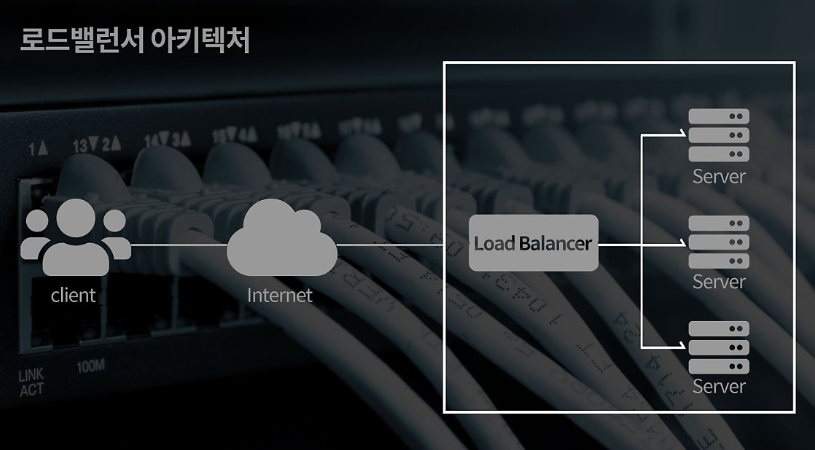
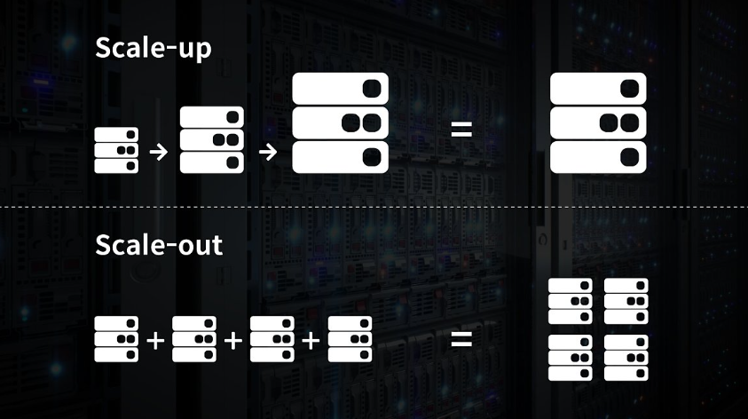
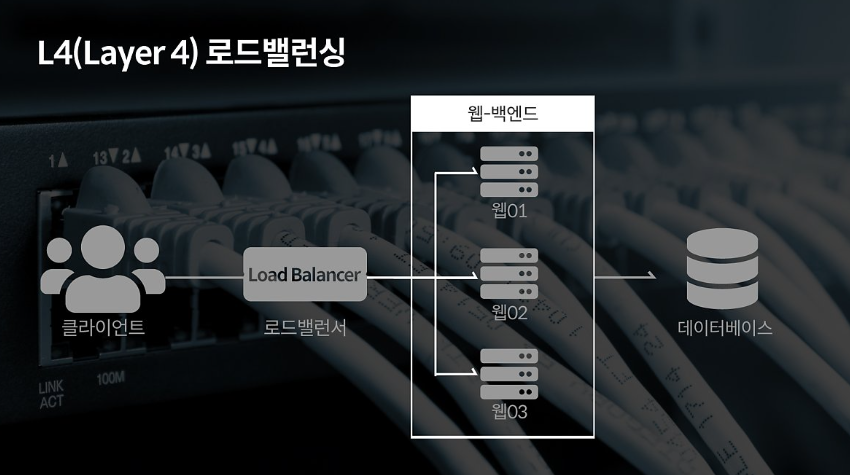
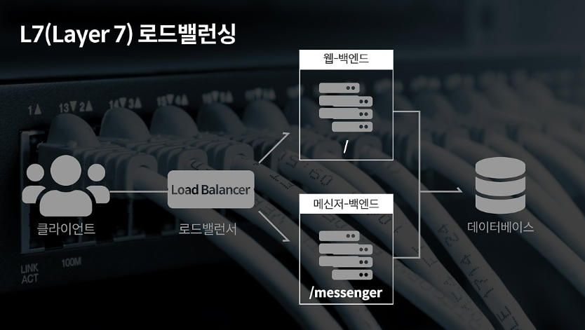
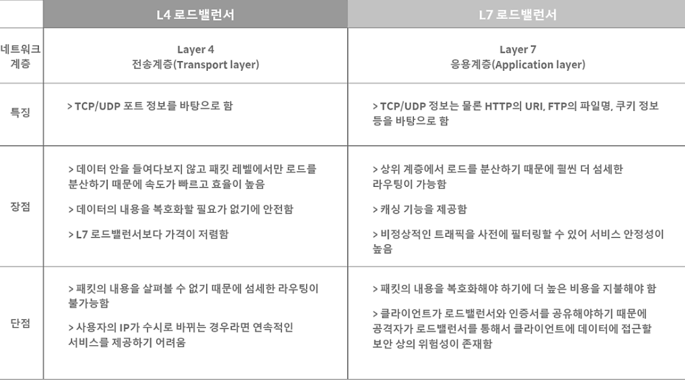

# Load Balancer
## 로드 밸런서란? 
- 현대의 모든 정보는 인터넷을 통해 연결되어 있다. 
인터넷의 발달은 데이터 통신을 보다 활발하게 만들었고 이는 트래픽의 폭발적인 증가로 이어졌다.  
  그 결과 아무리 성능이 뛰어난 서버라고 해도 모든 트래픽을 감당해낼 수 없게 된다. 
  이에 기업들은 서버를 추가로 구비하고 여러 대의 서버에 동일한 데이터를 저장해 수많은 트랙픽을 효과적으로 분산하게 된다.  
  그런데 단순히 다수의 서버를 구축해 운영한다고 해서 모든 클라이언트의 요청에 일관성 있게 응답할 수 있을까?  
  쏟아지는 트래픽을 여러 대의 서버로 분산해주는 기술이 없다면 한 곳의 서버에 모든 트래픽이 몰리는 상황이 발생하게 된다.  
  이때 필요한 기술이 <b style="color:orange">로드 밸런싱</b>이다.
  
### 로드밸런서가 정확히 무엇인가요 ?

- 로드 밸런서는 서버에 가해지는 부하(=로드)를 분산(=밸런싱)해주는 장치 또는 기술을 통칭한다. 
클라이언트와 서버풀(server Pool, 분산 네트워크를 구성하는 서버들의 그룹) 사이에 위치하며,  
  한 대의 서버로 부하가 집중되지 않도록 트래픽을 관리해 각각의 서버가 최적의 퍼포먼스를 보일 수 있도록 한다.  
  
### 그렇다면 로드밸런싱은 모든 경우에 항상 필요할까? 

- 로드밸런싱은 여러 대의 서버를 두고 서비스를 제공하는 분산 처리 시스템에서 필요한 기술이다.  
서비스의 제공 초기 단계라면 적은 수의 클라이언트로 인해 서버 한대로 요청에 응답하는 것이 가능하지만,  
  사업의 규모가 확장되고, 클라이언트의 수가 늘어나게 되면 기존 서버만으로는 정상적인 서비스가 불가능하게 된다. 
   이처럼 증가한 트래픽에 대처할 수 있는 방법은 크게 두 가지이다. 
  
#### Scale-up 또는 Scale-out
  
- <b style="color:green">Scale-up </b>의 경우 서버 자체의 성능을 확장하는 것을 의미한다. 
비유 하자면 'CPU'가 'i3'인 컴퓨터를 'i7'으로 업그레이드 하는 것과 같다.  
- <b style="color:orange">Scale-out </b>의 경우 기존의 서버와 동일하거나 낮은 성능의 서버를 두 대 이상 증설하여 운영하는 것을 의미한다. 
'CPU'가 'i3'인 컴퓨터를 여러 대 추가 구입해 운영하는 것에 비유할 수 있을 것이다.  
  Scale-out의 방식으로 서버를 증설하기로 결정했다면 여러 대의 서버로 트래픽을 균등하게 분산해주는 <b>로드밸런싱</b>이 반드시 필요하다.  
  클라이언트의 요청을 특정 서버에 분배하는 로드밸런싱 기법은 여러 가지가 있다.  
  활용할 수 있는 부하 분산 방식(로드밸런싱 알고리즘)에 대해 알아보자.  
  
--------
### 다양한 로드밸런싱 알고리즘
- 라운드로빈 방식(Round Robin Method) 
서버에 들어온 요청을 순서대로 돌아가며 배정하는 방식이다. 
  클라이언트의 요청을 순서대로 배분하기 때문에 여러 대의 서버가 동일한 스펙을 갖고 있고, 서버와의 연결(세션)이 오래 지속 되지 않는 경우에 활용하기 적합하다.  
- 가중 라운드로빈 방식(Weighted Round Robib Method) 
각각의 서버마다 가중치를 매기고 가중치가 높은 서버에 클라이언트를 우선적으로 배분해준다. 
  주로 서버의 트래픽 처리 능력이 상이한 경우 사용되는 부하 분산 방식이다. 
  예를 들어 A 라는 서버가 5라는 가중치를 갖고 B라는 서버가 2라는 가중치를 갖는다면, 
  로드밸런서는 라운드로빈 방식으로 A 서버에 5개 B 서버에 2개의 요청을 전달한다.  
- IP 해시 방식(IP Hash Method) 
클라이언트의 IP 주소를 특정 서버로 매핑하여 요청을 처리하는 방식이다. 
사용자의 IP를 해싱해(Hashing, 임의의 길이를 지닌 데이터를 고정된 길이의 데이터로 매핑하는 것, 또한 그러한 함수) 로드 분배하기 때문에 사용자가 항상 동일한 서버로 연결되는 것을 보장 한다.  
  
- 최소 연결 방식(Least Connection Method) 
요청이 들어온 시점에 가장 적은 연결상태를 보이는 서버에 우선적으로 트래픽을 배분한다. 
  자주 세션이 길어지거나, 서버에 분배된 트래픽들이 일정하지 않은 경우에 적합한 방식이다.  
  
- 최소 리스폰 타임(Least Response Time Method) 
서버의 현재 연결 상태와 응답시간(ResponseTime, 서버에 요청을 보내고 최초 응답을 받을때까지 소요되는 시간)을 모두 고려하여 트래픽을 배분한다. 
  가장 적은 연결 상태와 가장 짧은 응답시간을 보이는 서버에 우선적으로 로드를 배분하는 방식이다.  
  부하 분산에는 L4 로드밸런서와 L7로드 밸런서가 가장 많이 활용 된다. 
  이유는 L4  로드밸런서부터 포트(Port)정보를 바탕으로 로드를 분산하는 것이 가능하기 때문이다. 
  한 대의 서버에 각기 다른 포트 번호를 부여하여 다수의 서버 프로그램을 운영하는 경우라면 최소 L4 로드 밸런서 이상을 사용해야만 한다.  
  
* L4? L7 ?  
네트워크 통신 시스템은 크게 일곱 가지의 계층 (OSI 7 layers, 개방형 통신을 위한 국제 표준 모델)으로 나뉜다. 
  각각의 계층(Layer)이 L1,L2,L3...L7에 해당 한다. 
  상위 계층에서 사용되는 장비는 하위 계층의 장비가 갖고 있는 기능을 모두 가지고 있으며, 상위 계층으로 갈 수록 더욱 정교한 로드밸런싱이 가능하다.  
  
#### L4 로드 밸런싱과 L7 로드밸런싱

  
  

- L4 로드밸런서는 네트워크 계층(IP, IPX)이나 트랜스포트 계층(TCP, UDP)의 정보를 바탕으로 로드를 분산한다. 
IP주소나 포트번호, MAC주소 , 전송 프로토콜에 따라 트래픽을 나누는 것이 가능하다.  
  
- L7 로드밸런서는의 경우 애플리케이션 계층(HTTP, FTP,SMTP)에서 로드를 분산하기 때문에 HTTP 헤더, 쿠키 등과 같은 사용자의 요청을 기준으로 특정 서버에 트래픽을 분산하는 것이 가능하다.  
쉽게 말해 패킷의 내용을 확인하고 그 내용에 따라 로드를 특정 서버에 분배하는 것이 가능하다. 
  쉽게 말해 패킷의 내용을 확인하고 그 내용에 따라 로드를 특정 서버에 분배하는 것이 가능하다. 
  위 그림과 같이 URL에 따라 부하를 분산시키거나, HTTP 헤더의 쿠키값에 따라 부하를 분산하는 등 클라이언트의 요청을 보다 세분화해 서버에 전달할 수 있다. 
  또한 L7 로드밸런서의 경우 특정한 패턴을 지닌 바이러스를 감지해 네트워크를 보호할 수 있으며, Dos/DDos와 같은 비정상적인 트래픽을 필터링 할 수 있어 보안에도 활용된다.
  
-------

