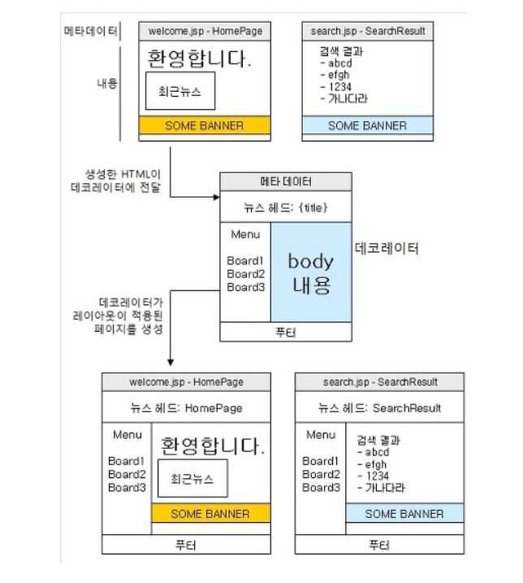

# SiteMesh

## SiteMesh 란?

- 웹페이지를 구성하는 레이아웃을 효율적으로 만들 수 있게 도와주는 프레임워크이다.  
  보통 웹페이지들은 `top`,`left menu`, `contents`, `right menu`, `footer` 등으로 구성되어서 메뉴 이동시에도 그 구성을 유지한채로 `Contents`만 바뀌는 형태가 대부분인데 모든 페이지를
  중복으로 구성하게 되면 매우 비효율적이고 관리도 하기 힘들기 때문에 <b>공통된 부분들을 한 곳에 집중 해서 처리하고 변경되는 부분만 변경될 수 있도록 해주는 프레임 워크이다 .</b>

### SiteMesh를 이용하여 웹 페이지의 레이아웃을 처리하는 방법

#### SiteMesh의 동작 방식과 설치

- 웹 어플리케이션을 구성하고 있는 웹 페이지들은 대부분은 페이지 레이아웃이 동일하게 구성되어 있다. 예를 들어, 미디어의 다음의 스포츠 게시판을 보면 아래와 같다.  
  

위 그림에서 내용 부분을 제외한 나머지 헤더, 풋터, 좌측 메뉴 그리고 우측 주요 기사는 해당 사이트 안에서 어떤 페이지를 간다고 해도 동일한 위치에 구성되어 있다. 즉, 게시글 목록 페이지와 게시글 쓰기 페이지,
수정 창 등 모든 어떤 기능의 페이지던간에 모두 동일한 레이아웃을 갖게 되는 것이다.

이렇게 동일한 레이아웃을 여러 페이지에 적용해야 할 때, 가장 쉽게 사용할 수 있는 방법이 `<jsp:include>` 나 `<%@ include%>` 를 사용하는 것이다.  
하지만 이는 중복된 코드를 발생시킬 가능성이 높기 때문에, `Tiels`나 `Velocity`가 제공하는 레이아웃 기능을 사용하여 구현하게 된다. 추가적으로 `SiteMesh`를 사용하여 레이아웃을 여러 페이지에 적용할
수 있다.

`Tiles`나 `Velocity` 또는 `<jsp:include>`를 사용하는 방식이 전체 페이지 중에서 내용 부분에 해당하는 코드만을 생성하는 , ``SiteMesh``는 완전한 `HTML`페이지를 생성한
뒤 `Decorator` 패턴을 사용하여 HTML 페이지에 레이아웃을 입히는 방식이다. 본 글에서는 `SiteMesh`의 동작방식에 대해서 살펴보고, `SiteMesh`를 사용하여 여러 웹 페이지에 레이아웃을 동일하게
적용하는 방법을 확인할 수 있따.

#### SiteMesh의 동작 방식

``SiteMesh``는 `Tiles`와 같은 프레임워크와 달리 완전한 `HTMl` 코드로부터 레이아웃이 적용된 새로운 HTML코드를 생성해낸다. 아래 그림은 ``SiteMesh``의 동작방식을 설명한 것 이다.



위 그림에서 데코레이터에 전달되는 HTML페이지는 `<HTML>`,`<HEAD>`,`<BODY>` 등을 포함한 완전한 HTML페이지이다. 이 때 데코레이터에 전달되는 `HTML` 페이지는 레이아웃과 관련된 내용은 포함되지 않는다.
데코레이터는 레이아웃 정보를 담고 있는 JSP페이지로서, 앞서 생성한 `HTML`페이지에 저장된 (<title>등의) 메타 정보와 <body> 태그에 포함된 내용을 추출한 뒤, 레이아웃의 알맞은 위치에 추출한 내용을
삽입하여 최종 결과를 생성하게 된다.

예를 들어, 앞서 그림에서 Welcome.jsp의 경우를 살펴보자 , `Welcome.Jsp`는 레이아웃과 관련된 코드를 생성하지 않고 단지 메타 정보와 내용 부분에 들어가는 정보만을 생성하게 된다.
`Welcome.jsp`가 생성한 HTML페이지는 데코레이터에 전달된다. 데코레이터는 `welcome.jsp`가 생성한 내용으로부터 메타 정보와 `BODY` 부분을 추출한 뒤 데코레이터의 알맞은 위치에 삽입하여 최종결과를
생성한다.

#### SiteMesh 설치

``SiteMesh``는 서블릿 환경에서 동작하며, `http://www.opensymphony.com/`SiteMesh`/download.action` 사이트에서 최신 버젼을 다운로드 받을 수 있다.
`stieMesh-2.3.jar`등의 파일을 다운 받아서, 웹 어플리케이션 콘텍스트의 `WEB-INF/lib` 디렉토리에 복사하면 설치가 완료된다.

##### SiteMesh를 이용한 레이아웃 적용

`SitemMesh`로 위 페이지에 레이아웃을 적용하려고한다면 두가지가 필요하다.

- ``SiteMesh`` 설정 파일
- 데코레이터

##### SiteMesh 설정 1. WEB.XML
```html
<?xml version="1.0" encoding="UTF-8"?>

<web-app id="WebApp_ID" version="2.4"
xmlns="http://java.sun.com/xml/ns/j2ee"
xmlns:xsi="http://www.w3.org/2001/XMLSchema-instance"
xsi:schemaLocation="http://java.sun.com/xml/ns/j2ee
http://java.sun.com/xml/ns/j2ee/web-app_2_4.xsd">

    <filter>
        <filter-name>SiteMesh</filter-name>
        <filter-class>
            com.opensymphony.module.SiteMesh.filter.PageFilter
        </filter-class>
    </filter>

    <filter-mapping>
        <filter-name>SiteMesh</filter-name>
        <url-pattern>/*</url-pattern>
    </filter-mapping>

        </web-app>
```
위 코드는 `/`로 들어오는 모든 요청에 대해서 `PageFilter`를 적용한다고 설정하였다. `PageFilter`는 요청 `URL`과 매칭되는 데코레이터를 검색한 뒤, 데코레이터가 발견될 경우 결과 `HTML`에 매칭되는
데코레이터를 적용한다. 따라서, 데코레이터가 적용되어야 하는 `URL`의 경우 반드시 `PageFilter`에 매핑 시켜줘야 한다.

#### SiteMesh 설정 2 decorators.xml 작성

`web.xml` 파일에 `PageFilter` 매핑을 설정한 다음에는, 실제 데코레이터에 대한 정보를 담고 있는 `decorator.xml` 파일을 작성해주어야 한다. `decorators.xml` 파일은 데코레이터에 대한 설정
정보를 담게 된다.

`decorators.xml `파일은 다음과 같은 형태로 데코레이터 목록을 기술한다.

```html
<decorator defaultdir="/decorator">
  <decorator name="submenu" page="submenu_decorator.jsp">
  <pattern>/sub/*<.pattern>
  </decorator>

  <decorator name="main" page="main_decorator.jsp">
    <pattern>/*</pattern>
  </decorator>
</decorator>
```

위 코드에서 `<decorators>`태그의 `defaultdir` 속성은 데코레이터 `JSP`의 위치될 경로를 의미한다. 이 경로는 `웹 어플리케이션 콘텍스트` 내에서의 경로를 의미한다.

`<decorator>`태그는 한 개의 데코레이터를 설정한다. `<decorator>`태그의 두 속성은 다음과 같다.

- name - 데코레이터의 이름
- page - 데코레이터로 사용될 JSP 페이지

`<pattern>`태그는 데코레이터를 적용할 패턴을 의미한다. 이 패턴은 서블릿 매핑에서의 패턴과 비슷하다. 예를 들어, `/sub/submain1.jsp`나 `/sub/menu/submenu1.jsp`로 요청이
들어올 경우 `submenu'데코레이터`가 적용되며 , 그 외 `/main.jsp`나 `/another/another1.jsp`와 같이 `/sub/*`에 포함되지 않는 요청의 경우는 `main`데코레이터가 적용된다.

만약 정확하게 일치하는 `<pattern>`값이 존재할 경우 해당 데코레이터를 사용한다. 예를 들어, 아래의 설정을 보자.

```html
<decoraotr name="submenu" page="submenu_decorator.jsp">
  <pattern>/sub/*</pattern>
</decorator>

<decorator name ="submain" page="submain_decorator.jsp>
  <pattern>/sub/submain1.jsp</pattern>
</decorator>
```

이 경우 `/sub/submain1.jsp`는 `submenu` 데코레이터와 `submain`데코레이터에 모두 매핑 되지만, 좀 더 정확하게 일치하는 `submain`데코레이터가 사용된다.

한 개의 `<decorator>`태그는 0 개 이상의 `<pattern>`태그를 포함할 수 있다.

#### 서블릿 매핑 시 주의사항

서블릿 매핑을 사용할 경우 `<pattern>` 값은 서블릿의 경로를 따른다. 예를 들어, 다음과 같이 서블릿매핑을 설정했다고 하면

```html
<sevlet-mapping>
  <servlet-name> content</servlet-name>
  <url-pattern>/catalog/*</url-pattern>
</servlet-mapping,>
```

이 경우 ,지정한 서블리 매핑에 해당되는 요청에 데코레이터를 적용하고자 한다면, 다음과 같이 `decorator.xml`의 `<Pattern>`태그의 값으로 서블릿 경로명을 지정해주어야한다.

```html
<decorator name ="catalog" page ="catalog_decorator.jsp">
  <pattern>/catalog</pattern>
<decorator>
```

만약 서블릿 경로명이 아닌 `/catalog/*`를 `<pattern>`태그의 값으로 지정할 경우 해당 데코레이터가 적용되지 않는다.

#### 데코레이터 작성

``SiteMesh``의 데코레이터는 `JSP`페이지로서, ``SiteMesh``가 제공하는 커스텀 태그를 사용하여 결과 HTML페이지를 데코레이션하게 된다. 아래 코드는 간단하게 작성해본 `SiteMesh`의 데코레이터
코드이다.

```html
  <%@ page contentType="text/html; chaset=UTF-8" %>
  <%@ taglib prefix="decorator" uri="http://www.opensymphony.com/`SiteMesh`/decorator" %>
  <html>
    <head>
      <title><decorator:title default="테크리포트"/> </title>
      <decorator:head/ >
      </head>
      <body>
      <div>헤더</div>
      <hr/>
      
      <decorator:body />
      
      <hr/>
      <div>푸터></div>
      </body>
   </html>
```
위 코드에서 눈여결 볼 부분은 `decorator`로 시작하는 `커스텀 태그`이다. 사용자의 요청을 처리한 결과 페이지는 `데코레이터`에 전달되는데, 이때 `커스텀 태그`를 사용하여 전달된 페에지의 내용을 사용할 수 있게 된다. 예를 들어,`<decorator:title>` `커스텀 태그`는 전달된 페이지의 `<title>`태그의 값을 구하게 된다. 사용가능한 커스텀 태그는 다음과 같다.

`<decorator:head/>`

HTML의 <head>태그의 내용을 삽입한다.

`<decorator:body/>`

`<body>`태그의 내용을 삽입한다.  
`<body>`태그에 명시된 프로퍼티의 값을 데코레이터 JSP에 삽입하고 싶다면 다음과 같이 `<decorator:getProperty>` 커스텀 태그를 사용하면 된다.

```HTmL
  <body onload="<decorator:getProperty property="body.onload"/>">
...
  <decorator:body/>
...
</body>
```

`<decorator:title[ default="..."]/>`
`<title>`태그에 명시도니 타이틀을 삽입한다. 만약 `<title>` 태그의 값이 발견되지 않을 경우 `default`속성에 명시한 값을 삽입한다.

`<decorator:getProperty property="." [default="."] [writeEntireProperty="."]/>`

원본 HTML페이지의 프로퍼티를 삽입한다. 이 때 사용가능한 프로퍼티는 다음과 같이 생성된다.

- `HTML Tag`:  
`<html>`태그의 모든 속성이 프로퍼티에 추가된다.

\
- `Title tag`:  
`<title>`태그의 내용이 `title`프로퍼티로 추가된다.


- ` META tags`:
이름과 내용을 갖는 모든 `<meta>`태그는 `meta.이름`프로퍼티로 추가된다
 
- `<decorator:getProperty>` 커스텀 태그에서 사용가능한 속성은 다음과 같다.

  - `property`(필수) - 사입할 프로퍼티의 이름(키)
  - `default`(선택) - 프로퍼티가 존재하지 않을 경우 삽입할 값
  - `writeEntireProperty` (선택) - 프로퍼티의 이름 및 이름 앞에 공백을 함께 삽입할 지의 여부를 지정한다. `true',`yes`, 또는 `1`이다 .

  예를 들어,원본페이지에서 다음과 같이 `<body>`태그를 작성했다고 하자.

`<body onload-"document.someform.somefield.focus();">`

 그리고 데코레이터 JSP에서 다음과 같이 `<decorator:getProperty/>`커스텀 태그를 사용했다고 하면
``` html
  <body bgcolor="White" <dcorator:getProperty property="body.onload"
    writeEntireProperty="true"/>>
```
이 경우  최종적으로 생성되는 코드는 다음과 같다.
```html
<body bgcolor="white" onload="document.someform.somefield.focus();">
```
### 테스트 코드 
#### 데코레이션 될 JSP코드
간단하게 ``SiteMesh``의 데코레이터를 통해 레이아웃이 적용될 HTML 페이지를 생성하는 JSP페이지를 다음과 같이 작성해보자, 이 `JSP`의 경로는 `/sub/submain1.jsp`라고 하자.

```HTML
<%@ page contentType="text/html; charset=UTF-8" %>
<html>
<head>
  <title>서브 메인 1</title>
  <script type="text/javascript">
    window.onload=function () {
      
    }
    
  </script>
</head>
<body>
    서브 메인 1
</body>
</html>
```
#### 데코레이터 JSP

데코레이터 JSP인 `/decorators/submenu_decorator.jsp`를 아래와 같이 작성한다.

```html
<%@ page contentType="text/html; charset=UTF-8 %>
<%@ taglib prefix="decorator" uri="http://www.opensymphony.com/`SiteMesh`/decorator" %>
<html>
<head>
    <title><decorator:title default="테크리포트"/></title>
  <decorator:head/>
</head>
<body>
<div>공통 헤더</div>
<hr/>
<hr/>
<decorator:body />
<hr/>
<div>공통 푸터</div>
</body>
</html>
```
데코레이터 JSP를 작성으면 decorator.xml파일에 등록해야한다. 아래 코드는 동록 예이다. 앞서 원본 JSP경로를 `sub/submain1.jsp`로 지정하엿으므로, 아래 코드에서 `<pattern>`의 값을 `/sub/*`로 지정하였다.

```html
<decorators defaultdir="/decorators">
  <decorator name="submenu" page="submenu_decorator.jsp">
    <pattern>/sub/*</pattern>
  </decorator>
</decorators>
```
#### 테스트 결과
이제 웹 브라우저에서 실제로 출력 결과를 확인해보면, 웹브라우저에서 `http://.../[contextPath]/sub/submain1.jsp를 입력한 뒤, 출력된 결과의 소스 코드는 다음과 같을 것이다.

```html
<html>
    <head>
      <title>서브메인1</title>
    <script type="text/javascript">
      window.onload = function () {
      }
    </script>
      
    </head>
<body>
<div>공통 헤더</div>
<hr/>

서브 메인1

<hr/>
<div> 공통 푸터</div>
</body>
</html>
```
위 코드를 확인해보면 원본 JSP가 출력한 결과가 데코레이터를 통해 알맞은 위치에 삽입된 것을 확인할 수 있다.