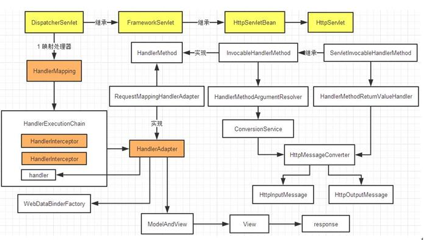

## resolver란?

### Spring
``
### HandlerMethodArgumentResolver
- HandlerMethodArgumentResolver 사용 이유 :  
매개변수로 사용되는 인자에 대해 공통적으로 처리해야할 로직 등이 있을 경우,  
중복 코드를 줄이고 공통 기능을 추출하여 사용할 수 있다.
  
### 동작 방식  

1. Client Request 요청  
2. Dispatcher Servlet 에서 해당 요청 처리
3. Client Request 에 대한 Handler Mapping
    - RequestMapping 에 대한 매칭 (RequestMappingHandlerAdapter 가 수행)
    - Interceptor 처리
    - Argument Resolver 처리 <-- Argument Resolver 실행 지점
    - Message Converter 처리
4. Controller Method invoke  
특정 `Request`가 `Handler`로 `Mapping` 되는 과정에서 `invoke` 되기 전,  
   `Interceptor` > `Resolver` > `MessageCOnverter` 순으로 처리된 후,  
   `Controller`의 `Method`가 `invoke` 된다.
---- 
### Resolver 구현
먼저`HandlerMethodArguemntResolver`를 `implements` 하는 `Class`를 생성한다.  
이때 구현해야 하는 `method`는 `supportsParameter` `resolveArgument` 두 가지 이다. 
--- 
#### Public boolean supportsParameter (MethodParameter parameter)  
`Parameter` 가 해당 `Resolver`에 의해 수행 되는 `Type`인지 체크하여 `boolean`을 `return`한다.  
`true`로 리턴될 경우 `resolveArgument method`를 실행한다.  
이때 `Type` 체크를 위해 `Class`를 `.isAssignableFrom()`을 이용해 비교 할 수도 `Annotation`을 새로 생성하여 체크 할 수도 있다.

