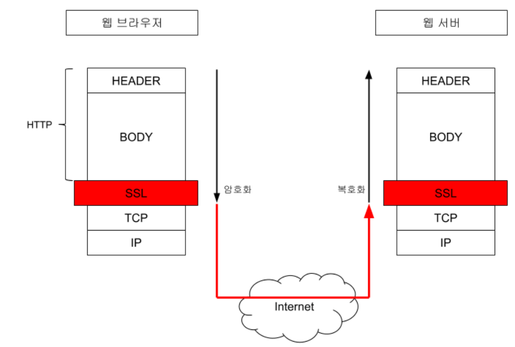
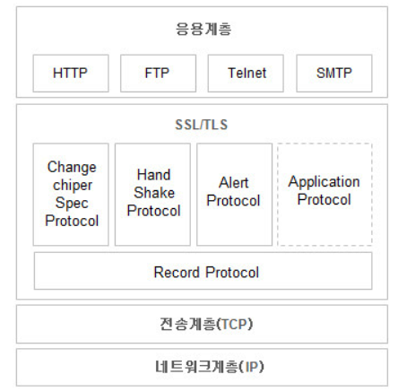
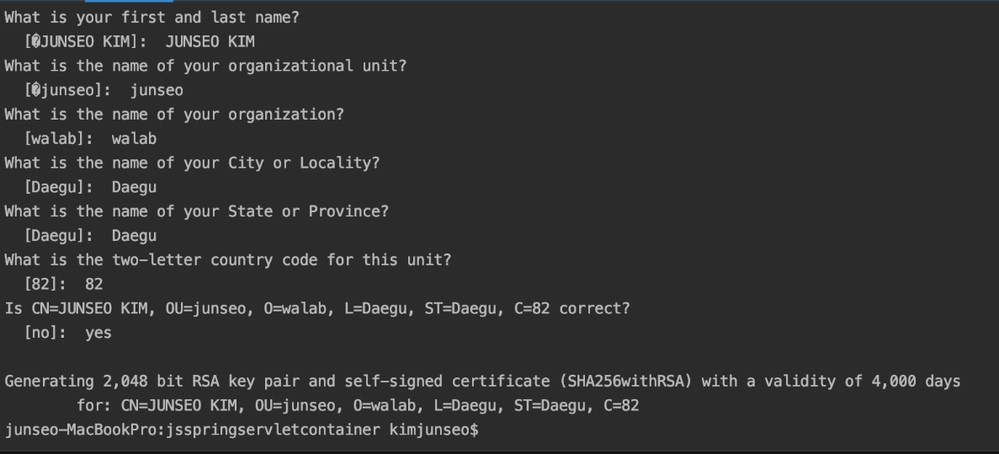
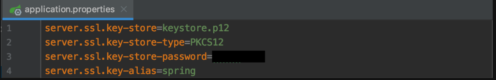
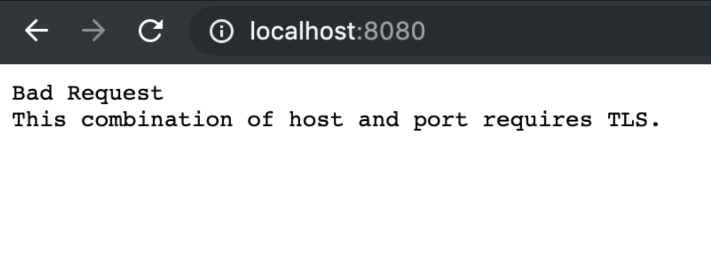
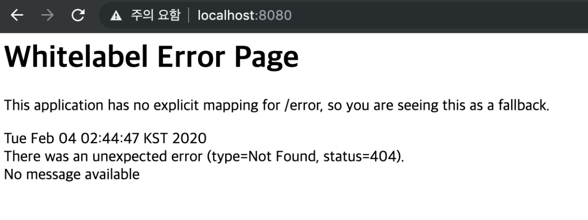
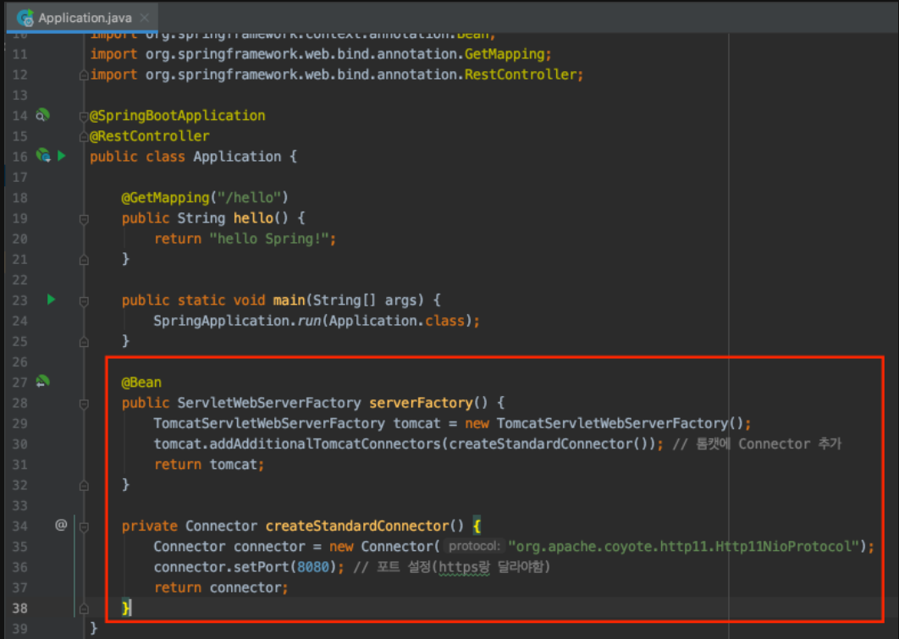
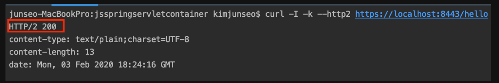

## HTTPS

- HTTPS(SSL 프로토콜 위에서 돌아가는 프로토콜)을 사용하려면 키스토어(인증서)를 만들어야 한다.

<details>
<summary> SSL? 접기 /펼치기</summary>
<div markdown ="1">

> <h5>SSL (Secure Socket Layer) 이란 ? </h5><br>
> SSL이란 보안 소켓 계층을 이르는 것으로, 인터넷 상에서 데이터를 안전하게 전송하기 위한 인터넷 암호화 통신 프로토콜이며 데이터 보안을 위해서 개발한 통신 레이어다.<br>
> SSL은 표현계층의 프로토콜로 응용 계층 아래에 있기 때문에, 어떤 응용 계층의 데이터라도 암호화해서 보낼 수 있다.<br>
> HTTP는 기본적으로 평문 데이터 전송을 원칙으로 하기 때문에 개인의 프라이버시가
> 오가는 서비들 (전자상거래, 전자메일, 사내문서)에 사용하기 힘들다.<br>
> 따라서 HTTPS를 이용하게 되고 HTTPS는 SSL 레이어 위에 HTTP를 통과 시키게 된다.<br>
> 즉 평문의 HTTP 문서는 SSL 레이어를 통과하면서 암호화 돼서 목적지에 도착하고, <br>
> 목적지에서는 SSL 레이어를 통과하면서 복호화 돼서 웹 브라우저에 전달된다.
>
>  <b style="color:orange">SSL 프로토콜은 OSI 7계층 모델의 어느 한 계층에 속해서 동작하는 것이 아니라,</b><br>
> 응용계층과 전송계층 사이에 독립적인 프로토콜 계층을 만들어서 동작하며,<br>
> 이 때, 응용계층의 프로토콜들은 외부로 보내는 데이터를 TCP가 아닌 SSL에 보내게 되고, SSL은 받은 데이터를 암호화하여 TCP에 보내어 외부 인터넷으로 전달하게 된다.<br>
> 전달 받을 때 역시, TCP로부터 받은 데이터를 복호화하여 응용계층에 전달하게 되는데, 이 과정에서 `Application`은 `SSL`을 `TCP`로 인식하고, <br>
> TCP는 SSL을 `Application`으로 인식하기 때문에, `Application`과 `TCP`사이의 데이터 전달 방식은 기존 전달 방식을 그대로 사용하게 된다.
>
> 
> 
> HTTP와 다른 점

1. HTTP URL은 "<b style="color:orange">https://</b>"로 시작한다. <b style="color:orange">기본 포트번호는 443</b>이다. HTTP URL은 "HTTP:
   //"로 시작한다. 기본 포트 번호는 80이다.<bR>
2. <b style="color:orange">HTTP는 평문 데이터를 기반</b>으로 하기 때문에, 유저정보와 같은 민감한 정보가 인터넷 상에 그대로 노출된다. 이 정보는 수집되거나 변조될 수 있다.<br>

> HTTPS는 이러한 공격을 견딜 수 있도록 설계되어 있다.

3. HTTPS는 인증서를 이용해서, 접속 사이트를 신뢰할 수 있는지 평가할 수 있다.
4. 일반적으로 HTTPS는 HTTP에 비해서 (매우 많이 )느리다. 많은 양의 데이터를 처리할 경우 성능의 차이를 체감할 수 있다.<br>

> 많은 웹 사이트들이 민간함 정보를 다루는 페이지(로그인 혹은 유저정보) 페이지를 HTTPS로 전송하고, 기타 페이지는 HTTP로 전송하는 방법을 사용한다.<br>
> 하드웨어 SSL 가속기를 이용해서 암/복호화 성능을 높이는 방법을 사용하기도 한다.
> SSL (Secure Socket Layer)통신 원리
> 1. 클라이언트가 서버에 접속하면 <b style="color:orange">서버 인증서</b>(서버의 공개키를 인증기관이 전자서명으로 인증한 것) <b style="color:orange">를 전송 받는다.</b>
     > (이때, 클라이언트 인증을 필요로 할 경우 클라이언트의 인증서를 전송하게 된다.)
> 2. 클라이언트는 받은 서버 인증서를 분석하여 신뢰할 수 있는 인증서인지를 검토한 후, <b style="color:orange">서버의 공개키를 추출</b>한다.
> 3. 클라이언트가 세션키로 사용할 임의의 메세지를 서버의 <b style="color:orange">공개키로 암호화하여 서버에 전송</b> 한다.
> 4. 서버에서는 자신의 <b style="color:orange"> 개인키로 세션키를 복호화 </b> 하여 그 키를 사용하여 대칭키 암호방식으로 메시지를 암호화하여 클라이언트와 통신하게 된다. (https://)
     > 즉, 비대칭키 암호 방식은 대칭키 암호방식보다 상당히 느리다.
     > 따라서 SSL은 암호화된 데이터를 전송하기 위해 대칭키/비대칭키 암호화 방식을 혼합하게 한다.
     > 채널을 수립할 때는 공개키, 비공개키를 통해 안전한 채널을 설립하고 그 이후에는 대칭키를 통해 데이터를 암호화하여 주고 받는다.
     > 
</div>
</details>

터미널을 열어 프로젝트 위치에서 아래의 명령어를 입력한다.<br>
`keytool -genkey -alias spring -storetype PKCS12 -keyalg RSA -keysize 2048 -keystore keystore.p12 -validity 4000`<br>
그런 다음 비밀번호와, 이름 등등 부가정보를 입력해야하는데 로컬에 저장하는 인증서기 때문에 임의로 알아서 입력해도 된다. <br>
모든 정보를 입력하고 마지막에 yes를 입력하면 키스토어가 생성된다.


키스토어가 생성되었으면 `application.properties`에 터미널 명령어로 설정해준 내용들을 적어준다.<br><br>
`servlet.ssl.key-store` 명령어는 만들어진 키스토어 파일의 이름을 적는 것이다.(`root`에 있을 경우, 아래와 같이 이름만 적어줘도 되지만, `main` 안에 있는 경우
앞에 `classpath:`를 붙여 줘야 한다.)<br>
<br><br>
이렇게 하고 실행하면, 스프링부트는 기본적으로 톰캣이 사용하는 `connector`가 하나만 등록이 된다.<br><br>
그 `connector`에 `SSL`을 적용해준다. 그래서 앞으로 모든 요청은 `HTTPS`를 거쳐서 하게 된다.<br><br>
브라우저에 원래대로 `localhost:8080`을 입력하여 접속하면 `Bad Request`가 발생한다.<br><br>
<br><br>

`https://localhost:8080`으로 접속하면 접속이 됨을 볼 수 있다.<br>
(`https`로 접속하면 신뢰하지 못한다고 뜬다. 그 이유는, 브라우저에 주소를 입력하면 서버로 요청을 보내는데, 서버는, `https` 이므로 인증서를 보낸다. 그 인증서는 아까 만들어준 keystore안에
들어있는데, 브라우저는 그 인증서의 pubkey를 모르는 상태 이므로 발생하는 현상이다.<br><br>
공인된 인증서에서 발급 받은 `pubkey`는 대부분의 브라우저가 이미 알고 있기 때문에 신뢰하지 못한다고 뜨지 않는 것이다.)<br>


### Hhttps 적용한 상태에서 http 받는 방법

- 이렇게 https를 적용하면, 이제 http는 사용하지 못한다. (왜냐하면 connector가 하나인데, 거기서 https를 적용했기 때문에 더이상 http를 받을 수 있는 connector가 없다.)<br>
  그러나 아래의 방법으로 http를 받을 수 있다.<br><br>
  바로 새로운 connector를 생성해주는 것이다. 이때 새로운 connector와 기존 https의 connector의 포트번호는 겹치면 안된다.<br><br>
  (`application.yml`에 `server.port=`로 https의 포트를 8080말고 다른 것으로 바꿔주도록 하겠다.)
- 

### HTTP2

- HTTP2를 활성화 하려면, 기본적으로 SSL은 기본적으로 적용되어 있어야하며, `Application.yml`에 `server.http2.enabled=true`를 추가해줘야 한다.<br><br>
- 서버마다 제약사항이 있다.<br><br>
- Undertow인 경우 https만 적용이 되어 있으면 아무런 추가설정을 하지 않아도 된다.<br><br>
- tomcat 9.0.x & JDK9를 사용할 경우 아무런 추가 설정을 하지 않아도 된다.<br><br>
- 만약 tomcat과 JDK 버전을 바꾸고 싶으면 pom.xml에 아래 코드를 추가해준다.
    - ```xml
        <properties>
            <java.version>9</java.version>
            <tomcat.version>9.0.10</tomcat.version>
        </properties>
    ```
    - (jdk는 추가적으로 `file` -> `project structure` -> [`Platform Settings`] `SDKs`에서 `+` 버튼 -> `JDK` 선택 -> `pom.xml`에 적어준 jdk버전 선택 -> `apply 버튼` <bR>
        -> `[Project Settings] Modules`에서 `Dependencies`탭을 눌러 -> `Module SDK`를 추가해준  -> `apply` 버튼 해주면 된다.)
    터미널에 `curl -I -k --http2 https://localhost:8443/hello` 명령어로 확인해보면 HTTP2로 응답이 오는 것을 볼 수 있다.<br><br>
   