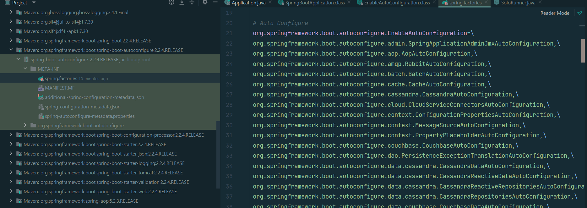
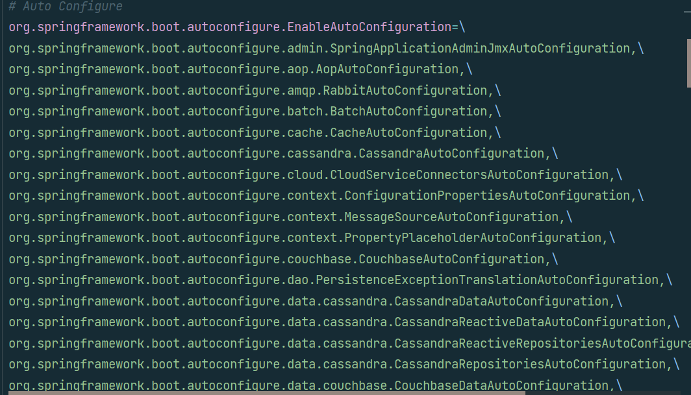
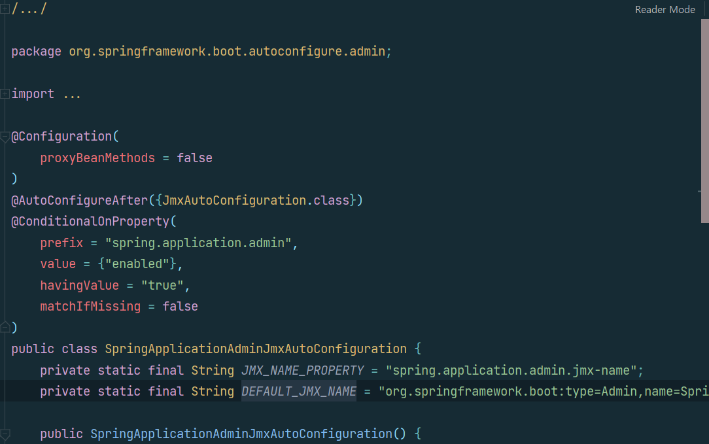
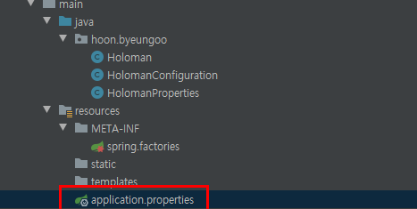
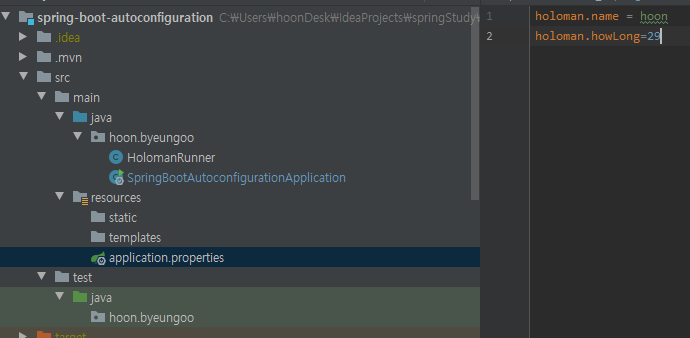
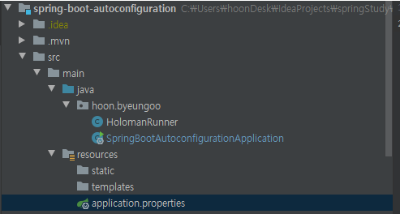
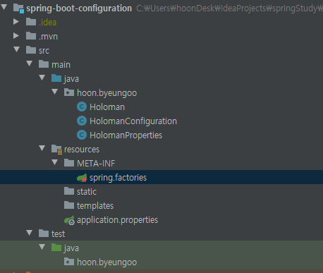

#[SpringBoot]
## SpringBoot  자동설정
- 스프링 부트를 시자하면 `@SpringBootApplication`어노테이션을 볼 수 있다. <br><br>
이 어노테이션을 ctrl+마우스클릭 하면
```java
package org.springframework.boot.autoconfigure;

import java.lang.annotation.Documented;
import java.lang.annotation.ElementType;
import java.lang.annotation.Inherited;
import java.lang.annotation.Retention;
import java.lang.annotation.RetentionPolicy;
import java.lang.annotation.Target;
import org.springframework.boot.SpringBootConfiguration;
import org.springframework.boot.context.TypeExcludeFilter;
import org.springframework.context.annotation.ComponentScan;
import org.springframework.context.annotation.Configuration;
import org.springframework.context.annotation.FilterType;
import org.springframework.context.annotation.ComponentScan.Filter;
import org.springframework.core.annotation.AliasFor;

@Target({ElementType.TYPE})
@Retention(RetentionPolicy.RUNTIME)
@Documented
@Inherited
@SpringBootConfiguration
@EnableAutoConfiguration
@ComponentScan(
    excludeFilters = {@Filter(
    type = FilterType.CUSTOM,
    classes = {TypeExcludeFilter.class}
), @Filter(
    type = FilterType.CUSTOM,
    classes = {AutoConfigurationExcludeFilter.class}
)}
)
public @interface SpringBootApplication {
    @AliasFor(
        annotation = EnableAutoConfiguration.class
    )
    Class<?>[] exclude() default {};

    @AliasFor(
        annotation = EnableAutoConfiguration.class
    )
    String[] excludeName() default {};

    @AliasFor(
        annotation = ComponentScan.class,
        attribute = "basePackages"
    )
    String[] scanBasePackages() default {};

    @AliasFor(
        annotation = ComponentScan.class,
        attribute = "basePackageClasses"
    )
    Class<?>[] scanBasePackageClasses() default {};

    @AliasFor(
        annotation = Configuration.class
    )
    boolean proxyBeanMethods() default true;
}

```

여기서 자세히 봐야할 어노테이션은 총 3가지이다. 
`@SpringBootConfiguration`<br>
`@EnableAutoConfiguration`<br>
`@componentScan`<br>
이 3가지이다.<br><br>

스프링부트는 Bean 2번에 걸쳐서 등록을 한다.<bR><br>
`@ComponentScan`에 의해 `@Component` 어노테이션이 붙어있는 클래스를 `Bean`으로 등록하고,<br>
두번째로, `@EnableAutoConfiguration`에 의해 `Bean`을 등록한다.

```java
//@SpringBootConfiguration
@Configuration
@ComponentScan
//@EnableAutoConfiguration
public class Application{
    public static void main(String[] args) {
        
        SpringApplcation application = new SpringApplication(Application.class);
        application.setWebApplicationType(WebApplcationType.NONE);
        application.run(args);
        
        SpringApplication.run(Application.class, args);
    }
}
```
위의 코드와 같이 `@EnableAutoConfiguration`을 주석처리하고 앱을 실행하면 다음과 같은 에러메시지를 볼 수 있다.<bR><br>

<br><br>
`ServletWebServerFactory Bean`은 `@EnableAutoConfiguration`이 `Bean`으로 등록해주기 때문에 웹 어플리케이션을 실행할 수 없다.

### @EnavleAutoConfiguration
<br><br>
`@EnableAutoConfiguration`은 스프링부트의 `meta`파일을 읽어서, 미리 정의 되어 있는 자바 설정파일(`@Configuration`)들을 빈으로 등록하는 역할을 수행한다.<br><br>
`spring-boot-autoconfigure`라이브러리 안에 `META-INF`폴더를 보면 `spring factories`파일을 볼 수 있다.<br><br>이 파일에서 키 값에 대응되는 `value`에 클래스들을 다 읽어서 `Bean`으로 등록한다.<br><br>
또한 파일안에 `EnableAutoConfiguration`에 해당하는 설정들이 선언되어 있다. 이 설정도 타고 들어가서 보면 `@Configuration`으로 설정되어 있는 것을 알 수 있다.<br><br>
<br><br>
`@ConditionalOn`으로 시작되는 어노테이션들을 볼 수 있는데 조건에 따라 Bean을 등록하기도 하고, 등록하지 않기도 한다.<br><br>

바로 이렇게 `@EnableAutoConfiguration`을 통해 수많은 설정 파일들이 `Bean`으로 등록되서 웹 어플리케이션이 동작하게 된다.<br><br>

### 자동설정 만들기 
- xxx-Spring-Boot-Autoconfigure 모듈 : 자동 설정
- xxx-Spring-Boot-Starter 모듈 : 필요한 의존성 정의
- xx-Spring-Boot-Stater 하나로 만들기도 한다.<br><br>
#### 의존성 추가
```xml
<dependencies>
    <dependency>
        <groupId>org.springframeworkd.boot</groupId>
        <artifactId>spring-boot-autoconfigure</artifactId>
    </dependency>
    <dependency>
        <groupId>org.springframework.boot</groupId>
        <artifactId>spring-boot-autoconfigure-processor</artifactId>
        <optional>true</optional>
    </dependency>
</dependencies>
```
`pom.xml`에 다음과 같은 의존성을 추가해준다.<bR><br>

다중 프로젝트를 사용할 경우 디펜던시의 버전 번호를 각각의 `pom.xml`파일에 정의하여 설정하여, 새로운 버전으로 업그레이드가 이루어질 경우 모든 `pom.xml`을 변경해야한다.<br><br>
메이븐에서는 `dependencyManagement`를 통해 디펜던시 버전 번호를 병합 할 수 잇는 방안을 제공한다. 부모 POM에서 `dependencyManagement` 정의를 통해 자식 `POM`에서 버전을 명시하지 않아도,<br>
`dependency`를 참조할 수 있다.
```XML
<dependencyManagement>
    <dependencies>
        <groupId>org.springframework.boot</groupId>
        <artifactId>spring-boot-dependencies</artifactId>
        <version>2.0.3. RELEASE</version>
        <type>pom</type>
        <scope>import</scope>
    </dependencies>
</dependencyManagement>
```
### `@Configuration` 파일 작성
- 다음과 같이 `Holoman`클래스와 `Holomanconfigration`클래스를 만들어준다.<br><br>

```java
public class Holoman {

    String name;
    int howLong;

    public String getName() {
        return name;
    }

    public void setName(String name) {
        this.name = name;
    }

    public int getHowLong() {
        return howLong;
    }

    public void setHowLong(int howLong) {
        this.howLong = howLong;
    }
    @Override
    public String toString(){
        return "Holoman {"+ "name"+ name + "\"" + ",howLong= "+  howLong +"}";
    }
}
```
<bR><br>
#### `@ConditionalOnMissingBean`어노테이션을 통해 `Bean`이 없을 경우만 이 `Bean`을 등록시켜줄 수 있다.<br><br>
```java
import org.springframework.boot.autoconfigure.condition.ConditionalOnMissingBean;
import org.springframework.boot.context.properties.EnableConfigrationProperties;
import org.springframework.context.annotation.Bean;
import org.springframework.context.annotation.Configuration;

@Configuration
@EnableConfigurationProperties(HoloManProperties.class)
public class HolomanConfigration{
    
    @Bean
    @ConditionalOnMissingBean
    public Holoman holoman(HolomanProperties holomanProperties){// holo man이라는 Bean을 return하는 설정파일 만듬.
        Holoman holoman = new Holoman();
        holoman.setHowLong(holomanProperties.getHowLong());
        holoman.setName(holomanProperties.getName());
        return holoman;
    }
}
```
<br><br>
다음과 같이 resouces/META-INF 폴더 아래에 spring.factories 파일을 만들고 내가 만든 파일을 선언해준다.<br><br>
```
이후 다른 프로젝트에서 사용할 수 있도록 `install`해준다. `install`하면 `jar`파일이 생성될것이고 다른 `Maven`프로젝트에서도 사용할 수 있도록 로컬메이븐 저장소에 설치를 한다.
```
<br><br>
이제 다른 프로젝트를 생성하고 이 프로젝트에서 `Bean`을 `Autowired`하고 console에 값이 찍히는것이 보일 것이다.

```java
import org.springframework.beans.factory.annotation.Autowired;
import org.springframework.boot.ApplicationArguments;
import org.springframework.boot.ApplicationRunner;
import org.springframework.stereotype.Component;

@Component
public class HolomanRunner implements ApplicationRunner{
    @Autowired
    Holoman holoman;
    
    @Override
    public void run (ApplicationArguments args)throws Exception{
        System.out.print(holoman);
    }
}

```

```java
@SpringBootApplication
public class SpringbootAutoconfigurationApplication{

    public static void main(String[] args) {
        SpringApplcation applcation = new SpringApplication(SpringbootAutoconfigurationApplication.class);
        applcation.setWebApplication(WebApplictationType.NONE);
        applcation.run(agrs);
    }
    @Bean
    public Holoman holoman(){
    Holoman holoman = new Holoman();
    holoman.setName("hoon");
    holoman.setHowLong(60);
    return holoman;
    }
}
```
위와 같이 `holoman`을 `main`에서 `Bean`으로 등록할 경우 자동 설정에 의해 2번째 스캔될 때 덮어씌워질 수 있다.<bR>
그래서 `@ConditionalOnMissingBean` 어노테이션을 통해 `Bean`이 없을 경우만 이 `Bean`을 등록시켜준 것이다.<br><br>

하지만 매번 이렇게 빈을 정의하는 것은 귀찮을 수 있다. `application.properties`에 값을 지정하고


<br><br>
`@EnableConfigurationProperties(HolomanProperties.class)` 어노테이션을 `HolomanConfigration` 클래스에 붙여주고<br><br>

```java
import org.springframework.boot.context.properties.ConfigurationProperties;

@ConfigurationProperties("holoman")
public class HolomanProperties {

    private String name;

    private int howLong;

    public String getName() {
        return name;
    }

    public void setName(String name) {
        this.name = name;
    }

    public int getHowLong() {
        return howLong;
    }

    public void setHowLong(int howLong) {
        this.howLong = howLong;
    }
}
```
<br>

`properties`로 부터 `holoman`의 값을 받아 올 수 있도록 해준다. `HolomanRunner`클래스에서 실행시 `application.properties`를 읽어 올 것이다.<bR><br>
<br><br>
2가지 프로젝트의 패키지 구조를 보면 다음과 같다. `spring-boot-configuration` 프로젝트에서 `spring-boot-autoconfiguration`프로젝트 설정을 주입해주었다.

 <br><br>
<br><br>
