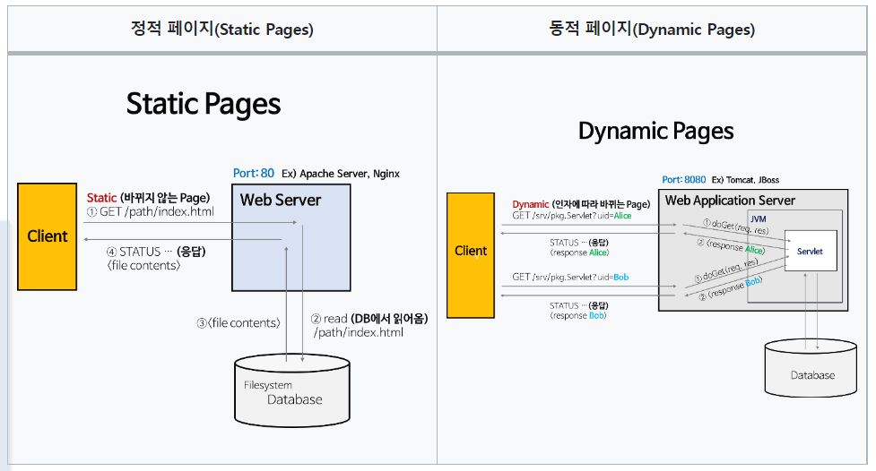

# 스프링 부트 동작 원리
## HTTP
- 소켓 통신은 계속 연결되어 있기 때문에 사용자가 늘어남에 따라 부하가 커진다.  
그래서 HTTP 통신은 연결을 지속시키지 않고 끊어버리는 Stateless 방식을 사용한다.
  - 연결이 끊기기 때문에 부하가 적지만, 이전에 보냈던 요청이 되돌려준 응답에 대해서는 기억하지 못하는 단점이 있다.
  - 이러한 단점을 보완하기 위해 만들어진 것이 <b style="color:orange;">웹서버</b>이다.
## 톰캣 (Apache Tomcat)
- 웹서버와 WAS의 차이
  - 정적 페이지와 동적 페이지
  - 
  - 정적 페이지란 서버에 미리 저장된 파일 (HTML 파일 , 이미지, javaScript 파일 등)이 그대로 전달되는 웹페이지  
  서버에서 저장된 데이터가 수정되지 않는 한 항상 동일한 페이지를 반환한다.
  - 동적 페이지란 서버에 있는 데이터들을 스크립트에 의해 