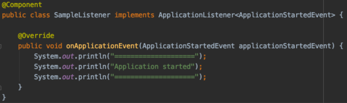
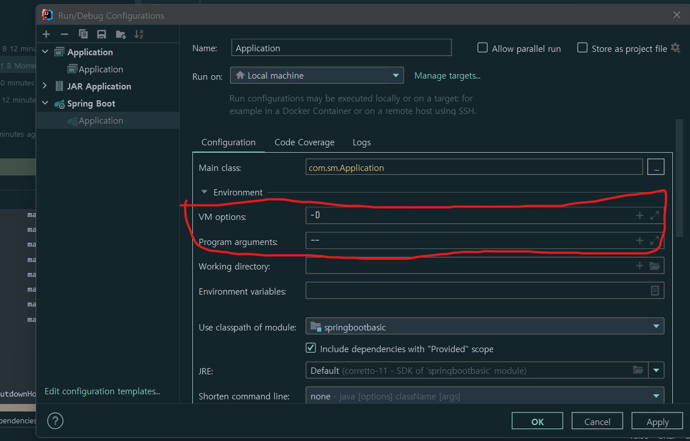
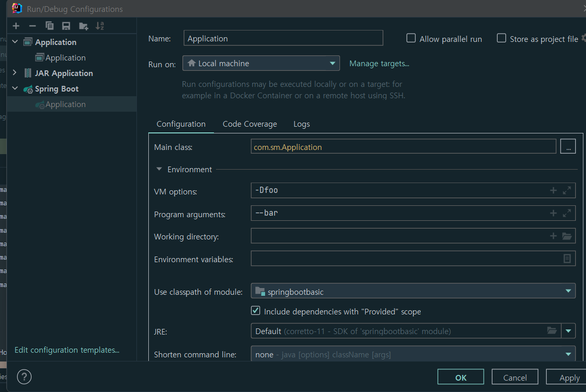
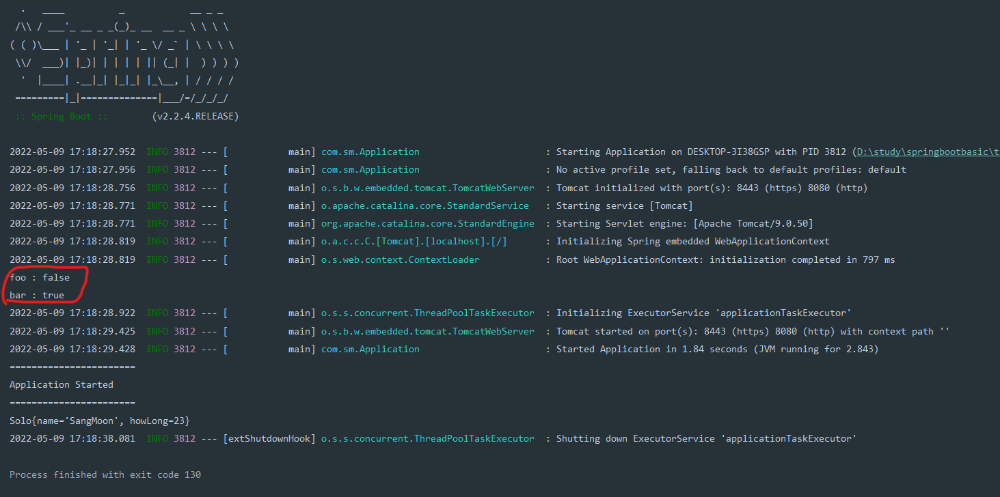
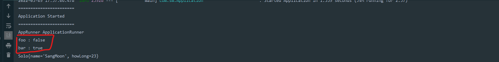
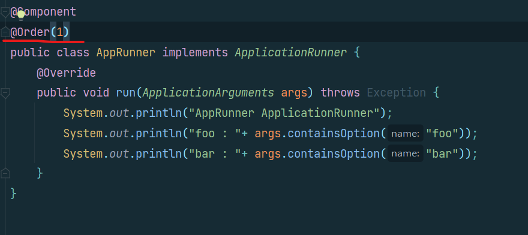

#[Spring Boot]
## SpringApplication이 제공하는 기능들
### [Spring Boot ] 스프링 부트 기초 
### 스프링부트 프로젝트 실행하는 방법
1. static 메서드를 쓰는 방법
   - 커스터마이징을 할 수 없다.
```java
@SpringBootApplication
public class SpringInitApplication{

   public static void main(String[] args) {
      SpringInitApplication.run(SpringInitApplication.class,args);
   }
}
```
2. SpringApplication
   - 위의 코드와 같지만, 분해하여 커스터마이징 가능하게 해준다.
```java
@SpringBootApplication
public class SpringInitApplication {
   public static void main(String[] args) {
      SpringInitApplication app = new SpringInitApplication(SpringInitApplication.class);
      app.run(args);
   }
    
}
```
3. SpringApplicationVBuilder
   - 커스터마이징이 가능하다 .
```java
@SpringBootApplication
public class SpringInit{
   public static void main(String[] args) {
      new SpringApplicationBuilder()
              .sources(SpringInit.class)
              .run(args);
   }
}
```

### Application Event
- `spring`과 `spring boot`에서 기본적으로 제공해주는 이벤트들이 있다.<br><br>
이 이벤트들에는 어플리케이션이 시작될 때 , 어플리케이션 컨텍스트를 만들었을 때 등과 같은 다양한 시점이 있다.<br><br>
`Event` 리스너를 만들때는 `ApplicationListener<Type>`을 `implement`해서 만든다.<br><br>
이 때 타입을 `ApplicationStartingEvent`로 주면 이 이벤트가 발생하면(어플리케이션이 시작될 때) 해당 리스너가 실행된다.
```java
import org.springframework.boot.context.event.ApplicationStartingEvent;
import org.springframework.context.ApplicationListerner;

public class SampleListener implements ApplicationListener<ApplicationStartingEvent>{
    @Override
   public void onApplicationEvent(ApplicationStartingEvent applicationStartingEvent){
        System.out.println("====================");
        System.out.println("Application starting");
        System.out.println("====================");
    }
}
```
이 때 리스너가 `Bean`이면, 등록되어 있는 `Bean`중에 해당하는 이벤트에 대한 리스너는 알아서 실행을 해준다.<bR><br>
이 때 주의할 것이 있다. 이 이벤트가 언제 발생하는 것인지가 중요한 기점이 된다.<br><br>
`application context`가 만들어졌느냐 안 만들어졌느냐를 기준으로 `application context`가 만들어진 다음에 발생하는 이벤트들은 그 이벤트들의 리스너가 `Bean`이면 알아서 호출해줄 수 있는데,<br>
`application context`가 만들어지기 이전에 발생한 이벤트(ex. ApplicationStartingEvent 같은 이벤트 )는 `Bean`으로 등록한다 하더라도 리스너가 동작하지 않는다.<br><br>
그래서 이런 경우는 직접 등록 해줘야한다.
이 때, `SpringApplcation`의 `addListeners`를 사용해서 어플리케이션에 리스너를 등록한다.

```java
@SpringBootApplication
public class SpringInit{

   public static void main(String[] args) {
      SpringApplication app = new SpringApplication(SpringInit.class);
      app.addListeners(new SampleListener());
      app.run(args);      
   }
}
```
만약, 리스너의 타입이 `ApplicationStartedEvent`인 경우 `application context`가 만들어진 이후이기 때문에 `Bean`으로만 등록해주면 리스너가 동작한다.<br><br>
<br><br>

### Application의 타입 지정
- Application의 타입은 3가지가 있다.
  1. NONE 타입 
  2. REACTIVE 타입
  3. SERVLET 타입<br><br>
  만약, `Spring MVC`가 들어있으면, 기본적으로 `SERVLET`타입으로 돈다.<br>
  만약, `Spring WebFlux`가 들어있으면, 기본적으로 `REACTIVE` 타입으로 돈다 .(`servlet`이 있는 경우 `SERVLET`타입으로 돈다.)
  만약 , 둘다 없는 경우는 `NONE` 타입으로 돈다.

### Application Argument
- Edit configuration 으로 들어간다.
  - `-D`로 시작하는 옵션은 `JVM 옵션`이고, 
  - `--`로 시작하는 옵션이 `Application Argument`이다.
  <bR><br>
    - JVM 옵션에 `-Dfoo` 를 `Application argument`에 `--bar`를 설정해준다.
  <br><br>
    - 그리고 `Argument`를 출력해 볼 컴포넌트를 만들어준다.
    - `spring` 은 만약 어떤 `Bean`에 생성자가 하니고, 그 생성자의 파라미터가 `Bean`일 경우에는 그 `Bean`을 `spring`이 알아서 주입해준다.<br><br>
    - 그래서, 그냥 어플리케이션을 실해애주면 `Bean`이 생성 되므로, 생성자에 아까 설정한 `foo`와 `bar`를 찍어볼 수 있다.
```java
@Component
public class ArgrumentTestComponent {
    public ArgrumentTestComponent(ApplicationArguments applicationArguments){
        System.out.println("foo : "+ applicationArguments.containsOption("foo"));
        System.out.println("bar : "+ applicationArguments.containsOption("bar"));
    }
}
```
<br><br>
    - bar만 들어있음을 볼수 있다.
<br><br>
즉, `--`로 들어오는 옵션만 `argument`로 사용하는 것이다.(`JVM`옵션은 `Application argument`가 아니다.)
<bR><br>
`ApplicationRunner`는 `ApplicationArguments`라는 타입으로 메서드를 만들어준다.

### ApplicationRunner
`Application` 을 실행하고 난 후, 뭔가를 실행하고 싶을 때 사용한다.<br>
클래스를 만들어주고 `ApplicationRunner`를 `implements`한다.<bR><br>
```java
@Component
public class AppRunner implements ApplicationRunner {
    @Override
   public void run(ApplicationArguments args) throws Exception{
        
    }
}
```
<br>
`ApplicationRunner` 는 `ApplicationArguments`라는 타입으로 메서드를 만들어준다.<br><br>
따라서 아까 사용한 `containsOption`같은 유용한 메서드들을 바로 사용해볼 수 있다.<br>

```java
@Component
public class AppRunner implements ApplicationRunner {
    @Override
    public void run(ApplicationArguments args) throws Exception {
        System.out.println("AppRunner ApplicationRunner");
        System.out.println("foo : "+ args.containsOption("foo"));
        System.out.println("bar : "+ args.containsOption("bar"));
    }
}
```

<br>
- 만약 `ApplicationRunner`가 여러개인 경우 ,`@Order`어노테이션을 붙여 순서를 지정해줄 수 있다.(숫자가 낮을수록 높은 우선순위)
- 
<br><br>