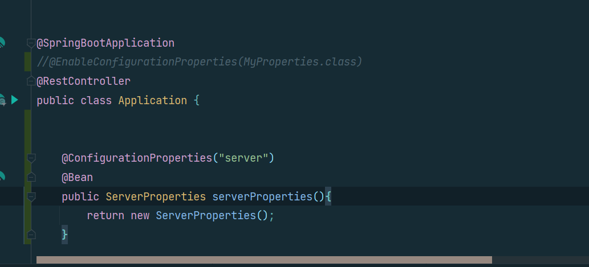

#[SpringBoot]
## 외부설정2- @ConfigurationProperties
### @ConfigurationProperties
- `properties ` 파일의 `key`값이 아래와 같이 같은 값으로 시작할 때 그것을 묶어서 `Bean`으로 등록할 수 있다.
- 
- 먼저 `@ConfigruationProperties` 어노테이션을 붙여 클래스를 만들어 준다.`key`값이 `my`로 시작했기 때문에 값은 `my`로준다.
```java
import org.springframework.boot.context.properties.ConfigurationProperties;

@ConfigurationProperties("my")
public class MyProperties {

}
  ```
<br>
`@ConfigurationProperties` 어노테이션을 붙여주면,<br>
메타데이터를 생성해 자동완성 기능을 가능하게 해주는 의존성을 추가하라고 뜨는데, 의존성은 아래와 같다.<br><br>

```XML
<dependency>
            <groupId>org.springframework.boot</groupId>
            <artifactId>spring-boot-configuration-processor</artifactId>
            <optional>true</optional>
        </dependency>
```
그 후, `properties`파일에 있던 `name`, `age`,`fullName`과 같은 받을 변수를 정의하고 `getter`,`setter`를 만들어준다.<br><br>
```java
package com.sm;

import org.springframework.boot.context.properties.ConfigurationProperties;

@ConfigurationProperties("your")
public class MyProperties {
private String name;

private int age;

private String fullName;

    public String getName() {
        return name;
    }

    public void setName(String name) {
        this.name = name;
    }

    public int getAge() {
        return age;
    }

    public void setAge(int age) {
        this.age = age;
    }

    public String getFullName() {
        return fullName;
    }

    public void setFullName(String fullName) {
        this.fullName = fullName;
    }
}
```
- 이렇게 하면 `@ConfigurationProperties` 어노테이션을 처리하는 애가 멤버 변수에 값을 바인딩 받을 수 있는 상태로 만들 수 있게 한것이고, 아직 사용은 할 수 없다.<br><br>
  (만약 `.properties`에 `your.fullName`을 `your.full-name`이나 `your.full_name`으로 한다고 해도 융통성있게 바이딩 해준다.)<br><br>
- 이것을 사용하려면, `main`에 `@EnableConfigurationProperties` 어노테이션을 사용하여 사용할 프로퍼티 클래스를 값으로 줘서 사용해야한다.<br><br>
그렇게하면, 만들어준 프로퍼티 클래스도 `Bean`으로 등록해주고 `@ConfigurationProperties` 어노테이션도 처리해준다.<br><br>
```java
@SpringBootApplication
@EnableConfigurationProperties(MyProperties.class)
@RestController
public class Application {

    @GetMapping("/hello")
    public String hello(){
        return "hello Spring!";
    }
```
- 스프링부트에서는 이것이 자동으로 등록 되어있기 때문에 필요없지만, 아까 만등러준 프로퍼티 파일만 `Bean`으로 등록하면 된다.
```java
import org.springframework.boot.context.properties.ConfigurationProperties;
import org.springframework.stereotype.Component;

@Component  // <<<<
@ConfigurationProperties("your")
public class MyProperties {
  private String name;

  private int age;

  private String fullName;
}
```
`.properties`에 있는 값들은 기본적으로 모두 문자열이다. 따라서 숫자를 써도 문자열이지만,<br><br>
문자가 `int` 로 자동 컨버팅 되어서 들어간다.<br>
이 값을 사용하기 위해서는 `@Autowired`로 주입받아 `getter`를 이용해 사용하면 된다.
```java
public class AppRunner implements ApplicationRunner {

  @Autowired
  MyProperties myProperties;

  @Value("${my.name}")
  String name;

  @Value("${my.age}")
  int age;

  @Value("${my.fullName}")
  String fullName;

  @Override
  public void run(ApplicationArguments args) throws Exception {
    System.out.println("AppRunner ApplicationRunner");
    System.out.println("foo : " + args.containsOption("foo"));
    System.out.println("bar : " + args.containsOption("bar"));
    System.out.println(name);
    System.out.println(age);//-493660209
    System.out.println(fullName);
    System.out.println("\n\n\n =================================>");
    System.out.println(myProperties.getName());
    System.out.println(myProperties.getAge());
    System.out.println(myProperties.getFullName());
  }
}
```
### Third-party Configuration 
- `properties`가 애플리케이션 안에 있지 않고, `jar` 파일에 있거나 다른 곳에 있는 경우에는 클래스 위에 `@Component`를 붙여 `Bean`으로 만들어 줄 수 가 없다.<br><br>
- 이런 경우는 `@Bean`(개발자가 직접 제어가 불가능한 외부 라이브러리를 `Bean`으로 등록하는 어노테이션)어노테이션에다가도 `ConfigurationProperties("prefix값")` 어노테이션을 사용할 수 있다.<br><br>
-  
### 프로퍼티 값 유효성 검사
`@Vaildated` 어노테이션을 붙여준다.<br>

```java
import org.springframework.boot.context.properties.ConfigurationProperties;
import org.springframework.stereotype.Component;
import org.springframework.validation.annotation.Validated;

@Component
@ConfigurationProperties("your")
@Validated //<<<<<
public class MyProperties {
  private String name;

  private int age;

  private String fullName;
}
```
그러면 `@NotEmpty`, `@Size`등의 여러 검사 어노테이션을 붙여서 유효성을 체크를 해줄 수 있다.<br><br>

```java
@Component
@ConfigurationProperties("your")
@Validated
public class MyProperties {

  @NotEmpty
  private String name;

  private int age;

  private String fullName;
}
```
- `@Value` 어노테이션으로 프로퍼티 값을 쓰는 것보다, 이런식으로 `prefix`값으로 프로퍼티를 구분하여,<br>
클래스를 만들어 `@ConfigurationProperties`어노테이션을 사용하여 프로퍼티 값을 사용하는 것이 매핑도 유연하게 할 수 있다는 장점이 있다.<br><br>
- `@Value`는 SpEl을 사용할 수 있지만, 위의 방식은 SpEL을 사용할 수 없다.
<details> <summary>SpEL?</summary>

>  SpEL은 Spring Expression Language로 스프링에서 지원하는 일종의 표현식이다.
> ### 1) 예시 
>예를 들면 아래 같이 사용된다.
```java
@Value("#{1+1}")
int value;
```
> 결과적으로 `1 + 1`의 결과가 `int value`에 담긴다.
```java
@Value("#{`hello` + `world` ")
String greeting;
```
> `String greeting` 에는 `hello world`가 담긴다.
> 즉, 코드 내에서 `#{...}`으로 표현되는 부분등를 SpEL 이라고 보면 된다.
> 
> ### 2) 문법
> 사용 문법은 다음과 같다.<br><br>
- `#{"표현식"}`
- `${"프로퍼티"}`  
- <span style="color:orange">표현식은 프로퍼티를 가질 수 있지만, 반대는 안된다.</span><br>
`@Value`를 사용하는 다양한 예시를 보자.
```java
package com.sm;

import org.springframework.beans.factory.annotation.Value;
import org.springframework.boot.ApplicationArguments;
import org.springframework.boot.ApplicationRunner;
import org.springframework.stereotype.Component;

@Component
public class AppRunner2 implements ApplicationRunner {

  // 일반적인 표현식 사용 예
  @Value("#{1+1}")
  int value;

  @Value("#{ 'hello' + 'world'}")
  String greeting;

  @Value("#{1 eq 1 }")
  boolean trueOrFalse;

  //프로퍼티 사용 예
  @Value("${my.value}")
  String myValue;

  @Value("#{${my.value} eq 100}")
  boolean isMyValue100;

  //빈 속성 사용 예 (여기서는 Sample 이라는 빈을 사전에 정의 했음.)
//    @Value("#{sample.value}")
//    int sampleValue;

  @Override
  public void run(ApplicationArguments args) throws Exception {
    System.out.println(value);
    System.out.println(greeting);
    System.out.println(trueOrFalse);
    System.out.println(myValue);
    System.out.println(isMyValue100);
//    System.out.println(sampleValue);
  }
}

```
</details>