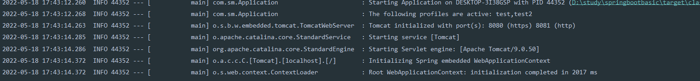
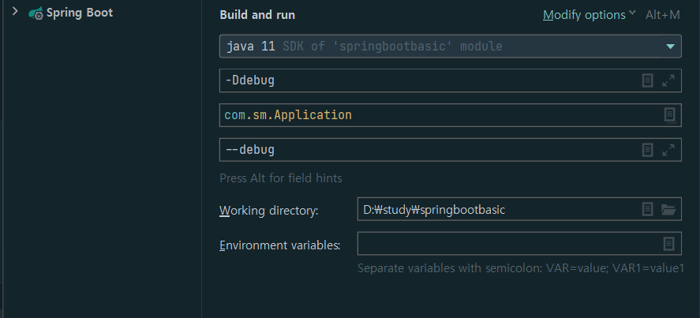
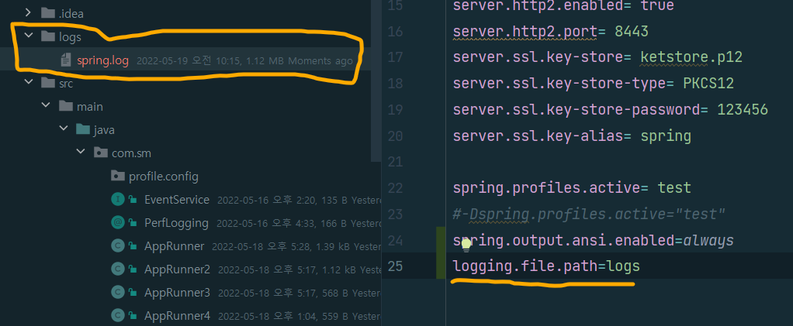
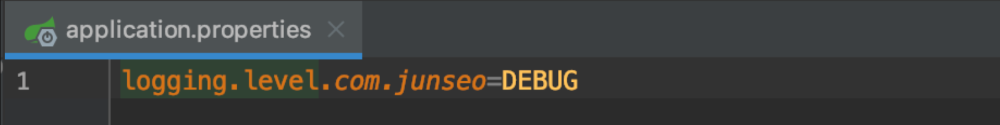
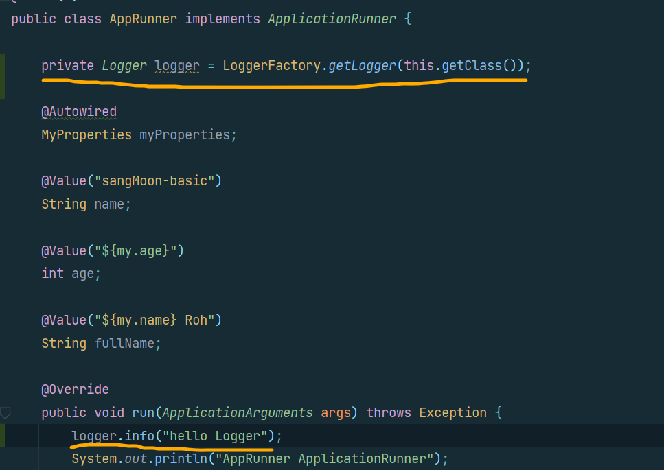
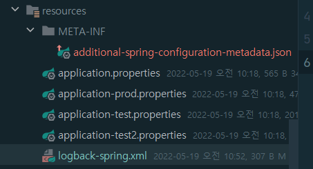

#[SpringBoot]
## 로깅
### 스프링 부트 로깅 원리
- 스프링 부트는 기본적으로 `commons logging`을 사용한다. 그렇지만 보통 `SLF4J`를 사용한다.<br>
- (리소스 코드에서도 마찬가지로 `SLF4J`를 쓰면 된다.)<br><br>
- `Commons Loggin`과 `SLF4`는 로거 퍼시드이다. 실제로 로깅을 하는 것이 아니라, 로거`API`들을 추상화 해놓은 인터페이스이다.<br><br>
- 이런 로거 퍼서드를 사용하면, 로거를 바꾸어 낄 수 있다는 장점이 있다.<br><br>
- 스프링5 부터는 `SLF4J`를 사용하기 위해서 `Spring-JCL`이라는 모듈을 만들었다.<bR>
`Spring-JCL`은 `Commons Logging`을 컴파일 시점에 `SLF4j`나 `Log4j2`로 변경하는 기능을 가진 모듈이다.<br>
`SLF4j`는 최종 로거를 위존성에 근거하여 고르게 된다.<br><br>
- 결국 우리는 `Commons Logging`이나, `SLF4j`를 쓰면 되는데, `Commons Logging`을 쓰더라도 어차피 `SLF4j`로 바뀌고 `SLF4j`가 `Logback`로거를 선택한다.<bR>
<b>최종적으로는 `Logback`을 쓰게 되는 것이다.</b><br><br>
  1. 스프링5=> `Spring-JCL` <br><br>
  2. `Spring-JCL` `Commons Logging`을 컴파일시점에 `SLF4j` / `Log4j2`로 변경 <br><br>
  3. `SLF4j`는 최종로거를 의존성에 근거 결정 <br><br>
  4. `Commons Logging`/ `SLF4j` 둘중 택하여 사용 <br><br>
  5. 하지만 `Commons Logging`를 사용해도 `SLF4j`로 변경되고, `SLF4j`가 `logback`을 선택
  
`logback`이 `SLF4j`의 구현체이다.<br><br>
### 로깅 특성
#### 로그 포맷
- 로깅의 기본 포맷은<br>
[<b style="color:orange">날짜</b> | <b style="color:blue">시간</b> | <b style="color:purple">로그레벨 </b>|<b style="color:"> PID </b>|<b style="color:Yellow"> 쓰레드이름</b> |<b style="color:green"> 풀 패키지 경로 & 클래스 이름 </b>|<b style="color:"> 메세지</b>]이다.<br><br>
- <br><br>
#### 디버그 레벨 로그
- 실행시, `--debug`나, `-Ddebug`명령을 주면, 디버그레벨의 로그도 직힌다.(`embedded container`,`Hibernate`,`SpringBoot`만 해당)<br><br>

- 모든 메세지를 전부 디버그 모드로 하고 싶으면 `--trace` 명령어를 주면 된다.

### 컬러 로그
- 컬러로 로그를 찍고 싶으면 `application.properties`에 `spring.output.ansi.enabled=always`를 적어준다.
<br><br>

### 로그 파일로 출력
- 로그를 파일로 출력받고 싶다면 `application.properties`에 `logging.file.path=경로`(지정된 경로에 로그남김)을 사용하면 된다.<br>
지정된 경로에 적어준 디렉토리가 생성되고 `spring.log`라는 파일이 생긴다.<br><br>
- 기본적으로 10M를 저장하고, 아카이빙 해주지만, 설정을 변경 해줄 수 있다.
- 
### 패키지마다 로그 레벨 조정
- 패키지마다 로그 레벨을 설정해 줄 수도 있다. `application.properties`에 `logging.level.` `패키지경로=로그레벨`을 줘서 사용한다.<br><br>
- 
### 로거 만들기
- `slf4j`로 로거를만들어 찍어줄 수도 있다.<br>
- 
### 로그 커스터마이징
- 로그 컨트롤을 하고 싶다면 로그 파일을 생성해주면 된다.<br>
`resources`에 `logback.xml`이나 `logback-spring.xml`로 만들어준다.<br><br>
- 
- `logback-spring.xml`로 만들어 줄 경우, 스프링부트가 추가기능을 제공해준다. <br>
`logback`설정 파일안에서 프로파일이나 `Environment` 변수를 사용할 수 있게 해준다.<br><br>
```xml
<?xml version="1.0" encoding="UTF-8"?>
<configuration>
  <include resource="org/springframework/boot/logging/logback/defaults.xml"/>
  <include resource="org/springframework/boot/logging/logback/console-appender.xml"/>
  <root level="INFO">
    <appender-ref ref="CONSOLE"/>
  </root>
  <looger name="org.springframework.web" level="DEBUG"/>
</configuration>
```
이 부분에 아까 프로퍼티에서 `logging.level.패키지경로=로그레벨`해준 것처럼 패키지이름과 로그레벨을 설정해주면 된다.<br><br>
```xml
<?xml version="1.0" encoding="UTF-8"?>
<configuration>
    <include resource="org/springframework/boot/logging/logback/defaults.xml"/>
    <include resource="org/springframework/boot/logging/logback/console-appender.xml"/>
    <root level="INFO">
        <appender-ref ref="CONSOLE"/>
    </root>
<!--    <looger name="org.springframework.web" level="DEBUG"/>-->
    <logger name="com.sm" level="DEBUG"/> <!-- <<<<<<<<-->
</configuration>
```

### LogBack 대신 Log4j2로 로거 바꾸기
- 톰캣을 뺐을 때 처럼 `spring-boot-starter-web`에서 `logging`을 빼고 `log4j2`를 넣어주면 된다.<br><br>
```xml
  <dependency>
  <groupId>org.springframework.boot</groupId>
  <artifactId>spring-boot-starter-web</artifactId>
  <exclusions>
    <exclusion>
      <groupId>org.springframework.boot</groupId>
      <artifactId>spring-boot-starter-logging</artifactId>
    </exclusion>
  </exclusions>
</dependency>
<dependency>
<groupId>org.springframework.boot</groupId>
<artifactId>spring-boot-starter-log4j2</artifactId>
</dependency>
<dependency>
<groupId>org.springframework.boot</groupId>
<artifactId>spring-boot-starter-log4j2</artifactId>
</dependency>
```
- `log4j2`도 `SLF4j`를 상요해서 쓰게 되는 것이다.<br><br>
- `Log4j2`를 커스터마이징 하고 싶다면 `log4j2-spring.xml`로 만들어주면 된다.