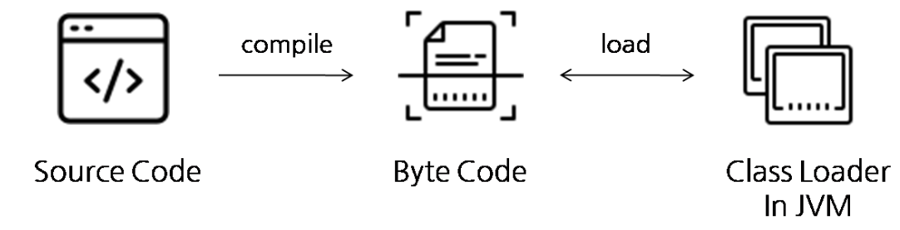
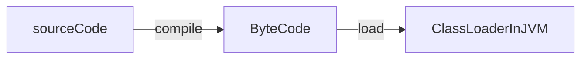

## Retention
- `@Retention` 어노테이션은 어노테이션의 **라이프 사이클**  
즉, **어노테이션이 언제까지 살아 남아 있을지를 정하는 것** 이다.

```java
@Target({ElementType.METHOD})
@Retention(value = RetentionPolicy.RUNTIME)
public @interface ValidateBankCheckingHour {

}
```

- `@Retention` 어노테이션의 속성 `RetentionPolicy`
  - `RetentionPolicy.SOURCE` : 소스코드(.java)까지 남아있는다.
  - `RetentionPolicy.CLASS` : 클래스 파일(.class)까지 남아있는다. (=바이트코드)
  - `RetentionPolicy.RUNTIME` : 런타임까지 남아있는다.(=사실상 사라지지 않음.)



- LOMBOK의 `@Getter`, `@Setter`같은 것을 보면 `RetentionPolicy.SOURCE`로 되어 있는 것을 확인할 수 있다.
- LOMBOK의 `@NonNull` 을 살펴보면 `RetentionPolicy.CLASS`로 되어 있는 것을 확인할 수 있다.
- 대부분의 annotation은 RUNTIME 정책이다.
  - 메모리에 올라왓을 때에도 어노테이션이 남아있어야 하는 것들이다.
  - `@Autowired` 같은 걸로 적절하게 스프링 빈을 주입할 때 등록해놓은 빈들을 찾아야한다.
    - Policy가 CLASS 였다면 스프링 빈으로써 메모리에 올라온건지 그냥 new 생성해서 올라온건지 모를 수 있다.